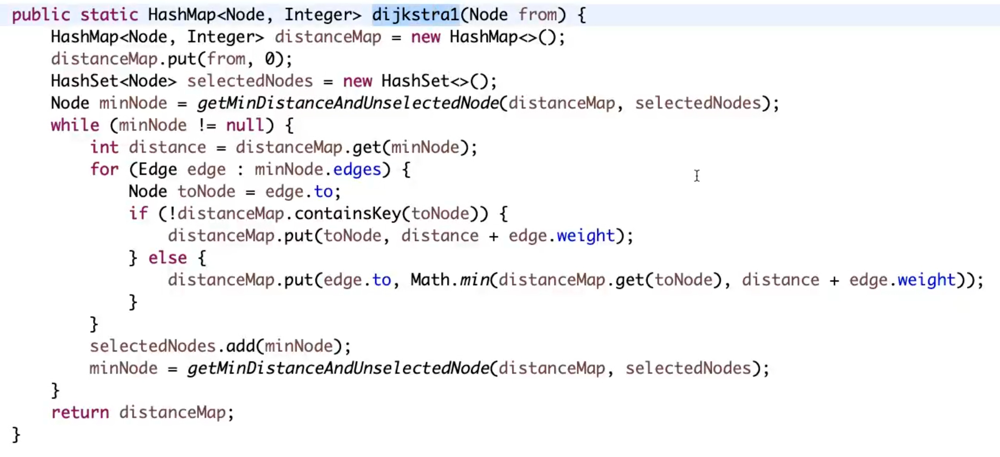

## 图
	BFS
	DFS
	拓扑排序BFS
	拓扑排序DFS1、DFS2
	Kruskal最小生成树(并查集，无向图)
	P
	D单源最短路径(加强堆)

## 图的表达
- 邻接表
- 邻接矩阵
- 边的描述(src,des,val) 面试最常见的

一般要转换成点的描述，nexts, val, in, out，edges类似邻接表。

## BFS
  

## DFS

入栈就打印，可以在栈中保留整条路径，但是需要重复入栈一些节点！！！
  

## 拓扑排序

- for 查找入度为0的，进队列
- while 遍历队列，减入度，进队列
  

另一种思路，点次越高，排序越前（点次：子路径的点数和）；同理，还可以利用深度，深度越大，排序越前。

## Kruskal
核心思想：
- 贪心，从小到大对边排序
- 依次留下连完之后不会形成环的边

判断是否有环时，使用并查集！！！ 而不是map，因为两个点可能都是旧点！

  

## Prim

  

最小生成树是无向图

- 点解锁边
- 边解锁点

代码里的break注释掉以后，可以解决森林的情况

不需要使用并查集，因为每次都是新点连旧点，set里判断就行。

## Dijkstra
- 有向
- 可以有环
- 无负权重

步骤：
- 一个距离表、一个visited表
- 从距离最近的点开始，通过边更新到每个点的距离；
- 更新完后，这个点添加到visited表中，不再变化；
- 重新找距离最近的点，循环。

某点能到其它所有点的最短路径，单源最短路径

### 可以使用加强堆，来优化每次找最小值的步骤

加强堆需要反向索引表 来找每次更新的节点。已经固定的节点，用-1表示

需要 distance表，来通过node找距离。

swap方法中，需要同步更改反向索引表。