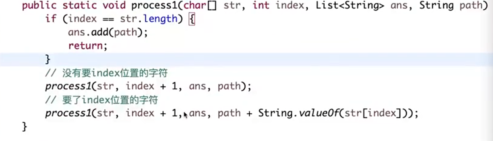
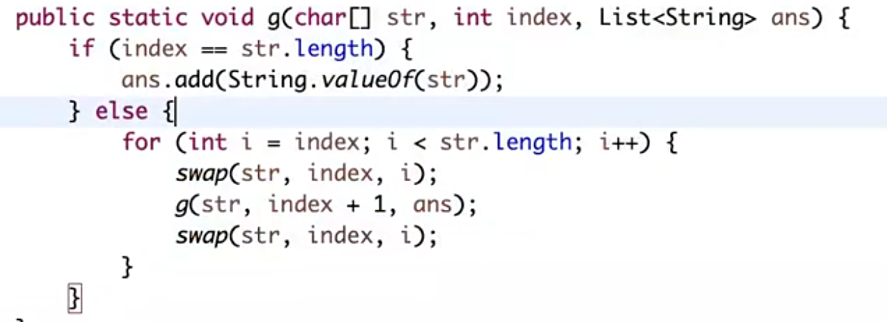
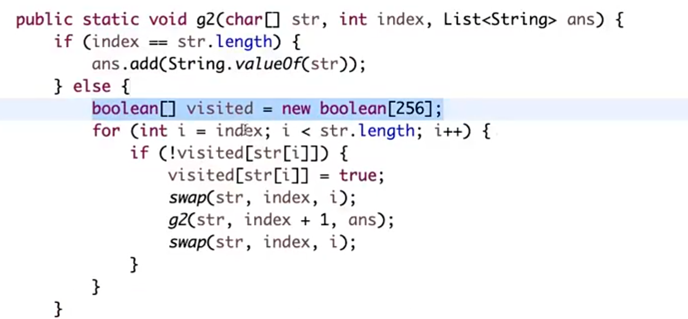

## 汉诺塔问题

关键是要找好递归

```golang
func move(n, from, to, other):
    if n==1 {
        //出口
        // form => to move 1
    }else{
        move(n-1, from, other, to)
        // from => to move 1
        move(n-1, other, to, from)
    }
```
需要2^n-1 次
## 打印字符串全部子序列

子序列是可以不连续！！！
例如 1,2,3 => 1,3

要和不要，是个二叉树


## 打印字符串全部子序列，要求不重复

放入set

## 打印字符串全排列

方法一： 
- n*n-1*n-2 ...1
- 每次从rest集合中挑选一个加入path，更新rest集合
- 循环直到rest集合为空
- 记得恢复现场

**方法二：**
- 原数组循环，每次确定哪个字符可以放到index位置。
- 使用swap直接在原数组上操作。
- 记得恢复现场


### 打印字符串不重复的全排列

在某个位置确定某个字符后，下次再遇到这个字符，就直接跳过，不看了！


