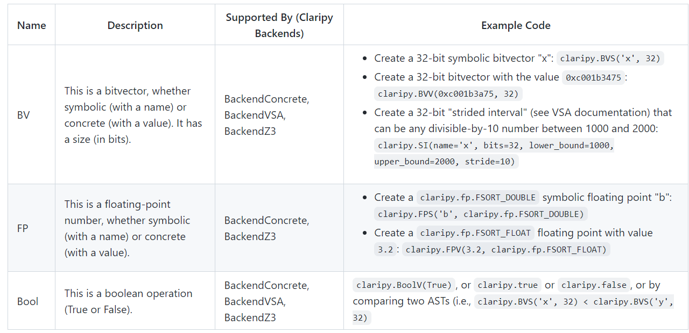

## Applications

- Control-flow graph recovery.
- Symbolic execution.
- Automatic ROP chain building using angrop.
- Automatic binary hardening using patcherex.
- Automatic exploit generation.


angr itself is made up of several subprojects, all of which can be used separately in other projects:

- an executable and library loader, CLE
- a library describing various architectures, archinfo
- a Python wrapper around the binary code lifter VEX, PyVEX
- a data backend to abstract away differences between static and symbolic domains, Claripy

## 架构


### CLE
CLE loads binaries and their associated libraries, resolves imports and provides an abstraction of process memory the same way as if it was loader by the OS's loader.

　　二进制的装载组件是CLE（CLE Load Everything)，它负责装载二进制对象以及它所依赖的库，将自身无法执行的操作转移给angr的其它组件，最后生成地址空间，表示该程序已加载并可以准备运行。

```ipython
>>> import angr, monkeyhex
>>> proj = angr.Project('/bin/true')
>>> proj.loader
<Loaded true, maps [0x400000:0x5008000]>
```

cle.loader代表着将整个程序映射到某个地址空间，而地址空间的每个对象都可以由一个加载器后端加载，例如cle.elf用于加载linux的32位程序。下面是地址空间的分类

```ipython
>>> proj.loader.all_objects
[<ELF Object fauxware, maps [0x400000:0x60105f]>,
 <ELF Object libc.so.6, maps [0x1000000:0x13c42bf]>,
 <ELF Object ld-linux-x86-64.so.2, maps [0x2000000:0x22241c7]>,
 <ELFTLSObject Object cle##tls, maps [0x3000000:0x300d010]>,
 <KernelObject Object cle##kernel, maps [0x4000000:0x4008000]>,
 <ExternObject Object cle##externs, maps [0x5000000:0x5008000]>
```
其中，类型可以分为 proj.loader.main_object、proj.loader.share_object、proj.loader.kernel_object等

```ipython
>>> proj.loader  # &将其加载到内存
<Loaded true, maps [0x400000:0x5004000]>

>>> proj.loader.shared_objects # &共享库
{'ld-linux-x86-64.so.2': <ELF Object ld-2.24.so, maps [0x2000000:0x2227167]>,
 'libc.so.6': <ELF Object libc-2.24.so, maps [0x1000000:0x13c699f]>}

>>> proj.loader.min_addr  # 内存中最小地址
0x400000
>>> proj.loader.max_addr  # 内存中最大的地址
0x5004000

>>> proj.loader.main_object  # 加载的二进制文件个数
<ELF Object true, maps [0x400000:0x60721f]>

>>> proj.loader.main_object.execstack  # 二进制文件是否有可执行堆栈吗?
False
>>> proj.loader.main_object.pic  # 二进制是否独立
True
```
### ArchInfo
```ipython
>>> import angr
>>> proj = angr.Project('/bin/true')
>>> import monkeyhex # 格式化十六进制
>>> proj.arch
<Arch AMD64 (LE)>
>>> proj.arch.bits
64
>>> proj.arch.bytes
8
>>> proj.entry
0x401670
>>> proj.filename
'/bin/true'
```
- proj.arch：arch是archinfo.Arch对象的一个实例，表示程序指令架构，在本例中是AMD64小端，一般会关心 arch.bits, arch.bytes,arch.name与arch.memory_endness。
- proj.entry：二进制文件的入口
- proj.filename：二进制文件的文件名

### PyVEX
```ipython
>>> import angr
>>> proj = angr.Project("/bin/true")
>>> block = proj.factory.block(proj.entry)
>>> block.capstone.pp()
0x4017b0:       xor     ebp, ebp
0x4017b2:       mov     r9, rdx
0x4017b5:       pop     rsi
0x4017b6:       mov     rdx, rsp
0x4017b9:       and     rsp, 0xfffffffffffffff0
0x4017bd:       push    rax
0x4017be:       push    rsp
0x4017bf:       lea     r8, [rip + 0x322a]
0x4017c6:       lea     rcx, [rip + 0x31b3]
0x4017cd:       lea     rdi, [rip - 0xe4]
0x4017d4:       call    qword ptr [rip + 0x2057fe]
>>> block.vex.pp()
IRSB {
   t0:Ity_I32 t1:Ity_I32 t2:Ity_I32 t3:Ity_I64 t4:Ity_I64 t5:Ity_I64 t6:Ity_I64 t7:Ity_I64 
t8:Ity_I64 t9:Ity_I64 t10:Ity_I64 t11:Ity_I64 t12:Ity_I64 t13:Ity_I64 t14:Ity_I64 t15:Ity_I32 t16:Ity_I64 t17:Ity_I64 t18:Ity_I64 t19:Ity_I64 t20:Ity_I32 t21:Ity_I64 t22:Ity_I32 t23:Ity_I64 t24:Ity_I64 t25:Ity_I64 t26:Ity_I64 t27:Ity_I64 t28:Ity_I64 t29:Ity_I64 t30:Ity_I64 t31:Ity_I64 t32:Ity_I64 t33:Ity_I64 t34:Ity_I64 t35:Ity_I64 t36:Ity_I64

   00 | ------ IMark(0x4017b0, 2, 0) ------
   01 | PUT(rbp) = 0x0000000000000000
   02 | ------ IMark(0x4017b2, 3, 0) ------
   03 | t26 = GET:I64(rdx)
   04 | PUT(r9) = t26
   05 | PUT(rip) = 0x00000000004017b5  RIP下一条指令地址
   06 | ------ IMark(0x4017b5, 1, 0) ------
   07 | t4 = GET:I64(rsp)
   08 | t3 = LDle:I64(t4)
   09 | t27 = Add64(t4,0x0000000000000008)
   10 | PUT(rsi) = t3                   出栈，需要四条指令
   11 | ------ IMark(0x4017b6, 3, 0) ------
   12 | PUT(rdx) = t27
   13 | ------ IMark(0x4017b9, 4, 0) ------
   14 | t5 = And64(t27,0xfffffffffffffff0)  
   15 | PUT(cc_op) = 0x0000000000000014 操作类型
   16 | PUT(cc_dep1) = t5               cc_dep1、cc_dep2是让memcheck认为结果标志位依赖于它们
   17 | PUT(cc_dep2) = 0x0000000000000000
   18 | PUT(rip) = 0x00000000004017bd
   19 | ------ IMark(0x4017bd, 1, 0) ------
   20 | t8 = GET:I64(rax)
   21 | t29 = Sub64(t5,0x0000000000000008)
   22 | PUT(rsp) = t29
   23 | STle(t29) = t8                  入栈
   24 | PUT(rip) = 0x00000000004017be  
   25 | ------ IMark(0x4017be, 1, 0) ------
   26 | t31 = Sub64(t29,0x0000000000000008)
   27 | PUT(rsp) = t31
   28 | STle(t31) = t29                 入栈
   29 | ------ IMark(0x4017bf, 7, 0) ------
   30 | PUT(r8) = 0x00000000004049f0    写入值
   31 | ------ IMark(0x4017c6, 7, 0) ------
   32 | PUT(rcx) = 0x0000000000404980   这里直接计算好了rip + 0x322a
   33 | ------ IMark(0x4017cd, 7, 0) ------
   34 | PUT(rdi) = 0x00000000004016f0
   35 | PUT(rip) = 0x00000000004017d4
   36 | ------ IMark(0x4017d4, 6, 0) ------
   37 | t17 = LDle:I64(0x0000000000606fd8)
   38 | t33 = Sub64(t31,0x0000000000000008)
   39 | PUT(rsp) = t33
   40 | STle(t33) = 0x00000000004017da
   41 | t35 = Sub64(t33,0x0000000000000080)
   42 | ====== AbiHint(0xt35, 128, t17) ======
   NEXT: PUT(rip) = t17; Ijk_Call
}
```

- CC_OP, which describes the operation.
- CC_DEP1 and CC_DEP2.  These are arguments to the operation. We want Memcheck to believe that the resulting flags are data-dependent on both CC_DEP1 and CC_DEP2, hence the name DEP.

### SimuVEX
对中间语言VEX进行模拟

### Claripy
- Claripy的抽象语法树AST提供了一种与具体和符号表达式交互的统一方式
- 
- Frontends provide different paradigms for evaluating these expressions. For example, the **FullFrontend** solves expressions using something like an SMT solver backend, while **LightFrontend** handles them by using an abstract (and approximating) data domain backend.
- 
- Frontends不具备求解能力，需要转换成Backend objects
- 
- SMT: 在计算机科学和数学逻辑中，可满足模理论(SMT)是确定一个数学公式是否可满足的问题。

