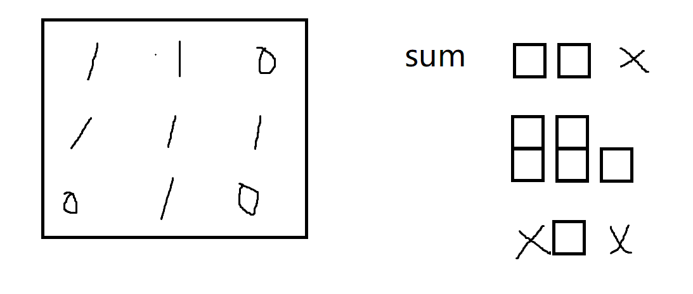

## 概念
单调栈，顾名思义就是栈内元素单调按照递减(递增)顺序排列的栈。(相同值的用链表或者数组放一起！)

单调栈何时用：为任意一个元素找左边和右边第一个比自己小的位置用单调栈.

由于每个元素最多各自进出栈一次,复杂度是O(n).

## 步骤
0. 栈是从小到大的！
1. 从左到右遍历数组，如果当前元素比栈顶元素小，就把当前元素入栈。
2. 否则就把栈顶元素出栈，直到当前元素比栈顶元素小，然后把当前元素入栈。
3. 被出栈的元素记录信息，**即将入栈**的数就是右边第一个比自己小的数，**现在栈顶**的数就是左边第一个比自己小的数。
4. 遍历完数组后，栈中剩下的元素依次出栈，记录信息，右边没有比自己小的数。

```java
public static int[][] getNearLessNoRepeat(int[] arr) {
		int[][] res = new int[arr.length][2];
		// 只存位置！
		Stack<Integer> stack = new Stack<>();
		for (int i = 0; i < arr.length; i++) { // 当遍历到i位置的数，arr[i]
			while (!stack.isEmpty() && arr[stack.peek()] > arr[i]) {
				int j = stack.pop();
				int leftLessIndex = stack.isEmpty() ? -1 : stack.peek();
				res[j][0] = leftLessIndex;
				res[j][1] = i;
			}
			stack.push(i);
		}
		while (!stack.isEmpty()) {
			int j = stack.pop();
			int leftLessIndex = stack.isEmpty() ? -1 : stack.peek();
			res[j][0] = leftLessIndex;
			res[j][1] = -1;
		}
		return res;
	}
```

如果考虑重复值（**需要找严格小于的值**）的话，入栈的元素不是单个下标，而是一个下标list！！！

被出栈的元素记录信息，**即将入栈**的数就是右边第一个比自己小的数，**现在栈顶**的最后list数就是左边第一个比自己小的数。

```java
public static int[][] getNearLess(int[] arr) {
    int[][] res = new int[arr.length][2];
    Stack<List<Integer>> stack = new Stack<>();
    for (int i = 0; i < arr.length; i++) { // i -> arr[i] 进栈
        while (!stack.isEmpty() && arr[stack.peek().get(0)] > arr[i]) {
            List<Integer> popIs = stack.pop();
            int leftLessIndex = stack.isEmpty() ? -1 : stack.peek().get(stack.peek().size() - 1);
            for (Integer popi : popIs) {
                res[popi][0] = leftLessIndex;
                res[popi][1] = i;
            }
        }
        if (!stack.isEmpty() && arr[stack.peek().get(0)] == arr[i]) {
            stack.peek().add(Integer.valueOf(i));
        } else {
            ArrayList<Integer> list = new ArrayList<>();
            list.add(i);
            stack.push(list);
        }
    }
    while (!stack.isEmpty()) {
        List<Integer> popIs = stack.pop();
        int leftLessIndex = stack.isEmpty() ? -1 : stack.peek().get(stack.peek().size() - 1);
        for (Integer popi : popIs) {
            res[popi][0] = leftLessIndex;
            res[popi][1] = -1;
        }
    }
    return res;
}
```
## 正数子数组max（累加和*最小值）
给定一个只包含正数的数组arr，arr中任何一个子数组sub一定可以算出(sub累加和 )* (sub中的最小值)是什么那么所有子数中，这个值最大是多少 ?

思路，单调栈+前缀和数组

单调栈可以求出index最左边和最右边比它小的范围[i, j]，那么子数组[i+1, j-1]的最小值下标就是index。配合累加和数组求乘积。

**这里可以用无重复值的单调栈！！**

```java
public static int max2(int[] arr) {
    int size = arr.length;
    int[] sums = new int[size];
    sums[0] = arr[0];
    for (int i = 1; i < size; i++) {
        sums[i] = sums[i - 1] + arr[i];
    }
    int max = Integer.MIN_VALUE;
    Stack<Integer> stack = new Stack<Integer>();
    for (int i = 0; i < size; i++) {
        while (!stack.isEmpty() && arr[stack.peek()] >= arr[i]) {
            int j = stack.pop();
            max = Math.max(max, (stack.isEmpty() ? sums[i - 1] : (sums[i - 1] - sums[stack.peek()])) * arr[j]);
        }
        stack.push(i);
    }
    while (!stack.isEmpty()) {
        int j = stack.pop();
        max = Math.max(max, (stack.isEmpty() ? sums[size - 1] : (sums[size - 1] - sums[stack.peek()])) * arr[j]);
    }
    return max;
}
```

## 直方图最大矩形面积
给定非负整数数组 heights ，数组中的数字用来表示柱状图中各个柱子的高度。每个柱子彼此相邻，且宽度为 1 。

求在该柱状图中，能够勾勒出来的矩形的最大面积。

Leetcode: https://leetcode.cn/problems/0ynMMM/

易错点：最后栈不为空的时候，要用len(heights)作为右边界清空栈，相当于最后一个把全部栈清空！
不能用len(stack)，因为会变动

```go
var stack []int
func largestRectangleArea(heights []int) int {
    stack = make([]int, 0)
    res := 0
    if len(heights)==0{
        return res
    }
    for i := range heights{
        for len(stack)>0 && heights[i] < heights[peek()]{
            j := pop()
            res = max(res, heights[j] * (i - peek() - 1))
        }
        stack = append(stack, i)
    }

    for len(stack)>0{
        j := pop()
        // res = max(res, heights[j] * (len(stack) - peek() - 1))
        res = max(res, heights[j] * (len(heights) - peek() - 1))    //这里要用len(heights)作为右边界，相当于最后一个把全部栈清空！不能用len(stack)，因为会变动

    }
    return res
}

func pop() int {
    if len(stack) == 0{
        return -1
    }
    tmp := stack[len(stack)-1]
    stack = stack[:len(stack)-1]
    return tmp
}

func peek() int {
    if len(stack) == 0{
        return -1
    }
    return stack[len(stack)-1]
}

func max(i, j int) int {
    if i>j {
        return i
    }
    return j
}
```

## 变体！二维01矩阵，最多1组成的矩形
可以转换为上题的直方图！

- 建一个sum数组每次对一行进行累加，遇到0，则清零！
- 对sum数组使用上一题直方图最大面积求解！表示以第i行为底边的最大面积



## 二维01矩阵，统计1子矩阵的全部个数
忽略

## 907. 子数组的最小值之和
给定一个整数数组 arr，找到 min(b) 的总和，其中 b 的范围为 arr 的每个（连续）子数组。

由于答案可能很大，因此 返回答案模 10^9 + 7 。
链接：https://leetcode.cn/problems/sum-of-subarray-minimums

- 求x左边第一个小于等于x的位置，右边第一个小于x的位置，确定x是最小值的区间

- 根据公式求和，子数组的个数为 (x-L)*(R-x)
```go
func sumSubarrayMins(arr []int) (ans int) {
    const mod int = 1e9 + 7
    n := len(arr)
    left := make([]int, n)
    right := make([]int, n)
    monoStack := []int{}
    for i, x := range arr {
        for len(monoStack) > 0 && x <= arr[monoStack[len(monoStack)-1]] {
            monoStack = monoStack[:len(monoStack)-1]
        }
        if len(monoStack) == 0 {
            left[i] = i + 1
        } else {
            left[i] = i - monoStack[len(monoStack)-1]
        }
        monoStack = append(monoStack, i)
    }
    monoStack = []int{}
    for i := n - 1; i >= 0; i-- {
        for len(monoStack) > 0 && arr[i] < arr[monoStack[len(monoStack)-1]] {
            monoStack = monoStack[:len(monoStack)-1]
        }
        if len(monoStack) == 0 {
            right[i] = n - i
        } else {
            right[i] = monoStack[len(monoStack)-1] - i
        }
        monoStack = append(monoStack, i)
    }
    for i, x := range arr {
        ans = (ans + left[i]*right[i]*x) % mod
    }
    return
}

```
其它题解：https://leetcode.cn/problems/sum-of-subarray-minimums/solution/gong-xian-fa-dan-diao-zhan-san-chong-shi-gxa5/

动态规划解法：
``` go
func sumSubarrayMins(arr []int) (ans int) {
    const mod int = 1e9 + 7
    n := len(arr)
    monoStack := []int{}
    dp := make([]int, n)
    for i, x := range arr {
        for len(monoStack) > 0 && arr[monoStack[len(monoStack)-1]] > x {
            monoStack = monoStack[:len(monoStack)-1]
        }
        k := i + 1
        if len(monoStack) > 0 {
            k = i - monoStack[len(monoStack)-1]
        }
        dp[i] = k * x
        if len(monoStack) > 0 {
            dp[i] += dp[i-k]
        }
        ans = (ans + dp[i]) % mod
        monoStack = append(monoStack, i)
    }
    return
}

链接：https://leetcode.cn/problems/sum-of-subarray-minimums/solution/zi-shu-zu-de-zui-xiao-zhi-zhi-he-by-leet-bp3k/
```