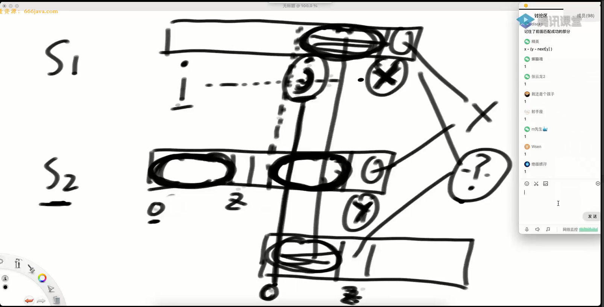

## 解决问题
找到字符串s1中和s2匹配的子串的开始位置。

暴力解时间复杂度: O(M*N), KMP时间复杂度: O(N)
N << M
## next数组：前缀串与后缀串的最长匹配长度

某个位置之前的字符串，其前缀和后缀相等情况下，最长的长度！（前缀串和后缀串不能取到整体，且这个位置不参与比较，规定0位置是-1，1位置是0）
如 a b c a b c【d】，d的最长匹配长度是3
1 =》【a】【c】 ×

2 =》【ab】【bc】 ×

3 =》【abc】【abc】 √

4 =》【abca】【cabc】 ×
 
5 =》【abcab】【bcabc】 ×

要对s2求next数组，因为可以使得匹配过程加速

## 匹配过程
  
两个实质：
- i和0位置开始匹配，在x和y位置无法匹配后，j移到后缀串的开头x-next\[y\]与0对齐，并从x和next\[y\]位置开始进行匹配。**（s1的后缀和s2的前缀已经匹配，然后从下一位开始比较）**
- 中间的i+1、i+2...j-1均无法匹配！