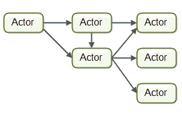
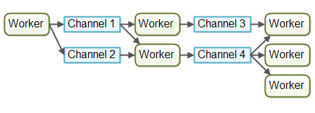

## 并发模型

### 传统并发模型(基于共享内存)
多线程编程，就是传统的并发编程模式，使用ShreadMemory(共享内存)、Mutex(互斥锁)、Condition(条件变量)、Semaphore(信号量)等来实现多线程编程。

### 基于消息的并发模型

基于消息的并发模型有两种：Actor模型和CSP模型(Communicating Sequential Processes, 顺序通信进程)。

在Actor模型中，主角是Actor，Actor彼此之间直接发送消息，不需要经过中介，消息是异步发送和处理的。

为了实现通信，每个Actor自身都有一个邮箱，想和外接通信必须发送message。



Actor模型描述了一组为了避免并发编程的常见问题的公理:

- 所有Actor状态是Actor本地的，外部无法访问

- Actor必须只有通过消息传递进行通信

- 一个Actor可以响应消息

- Actor可能会堵塞自己，但Actor不应该堵塞它运行的线程


CSP模型的核心思想是多个线程之间通过Channel来通信。Go语言的CSP模型是由协程Goroutine与通道Channel实现：

- Go协程goroutine: 是一种轻量线程，它不是操作系统的线程，而是将一个操作系统线程分段使用，通过调度器实现协作式调度。

- 通道channel: 类似Unix的Pipe，用于协程之间通讯和同步。协程之间虽然解耦，但是它们和Channel有着耦合



### Actor模型和CSP模型的区别

- 接收方和发送方：

    Actor注重处理单元，发送消息时，需要知道对方是谁。

    CSP模型注重消息传递方式(channel)，向channel写消息的人不需要知道对方是谁。

- 消息传递方式:

    Actor模型是通过邮箱进行收发消息的，消息的收发是异步的。

    CSP模型使用channel收发消息，收发消息是同步的。

- 传输类型:

    Actor传输消息只能通过MailBox，所以可以收发任何类型，在收发时做好类型适配。

    CSP模型的类型是定好的，两个协程之间可以用多个通道传输消息。

- 实现角度:

    Actor理论上需要一个无限大的邮箱来作为消息缓冲

    CSP模型为了读写channel时不会阻塞，需要检查传入的消息，来预见正确的顺序。


### Actor和CSP都贯彻了一句话：

    Don't communicate by sharing memory; share memory by communicating.


## 锁

Go 语言不仅仅提供基于 CSP 的通讯模型，也支持基于共享内存的多线程数据访问。

Sync 包提供了锁的基本原语：

- sync.Mutex 互斥锁

    - Lock()加锁，Unlock 解锁

- sync.RWMutex 读写分离锁

    - 不限制并发读，只限制并发写和并发读写

- sync.WaitGroup

    - 等待一组 goroutine 返回

- sync.Once

    - 保证某段代码只执行一次
    
- sync.Cond

    - 让一组 goroutine 在满足特定条件时被唤醒

### WaitGroup示例

```golang
// CreateBatch create a batch of pods. All pods are created before waiting.
func (c *PodClient) CreateBatch(pods []*v1.Pod) []*v1.Pod {
    ps := make([]*v1.Pod, len(pods))
    var wg sync.WaitGroup
    for i, pod := range pods {
        wg.Add(1)
        go func(i int, pod *v1.Pod) {
            defer wg.Done()
            defer GinkgoRecover()
            ps[i] = c.CreateSync(pod)
        }(i, pod)
    }
    wg.Wait()
    return ps
}
```

### Cond示例

sync.Cond实现了一个条件变量，用于等待一个或一组goroutines满足条件后唤醒的场景。每个Cond关联一个Locker通常是一个\*Mutex或\*RWMutex根据需求初始化不同的锁。

cond: sync.NewCond(&sync.Mutex{})

*cond还需要继续学习*
```golang
// Add marks item as needing processing.
type FIFO struct {
    lock  sync.Mutex
    cond  *sync.Cond
    queue []int
}

type Queue interface {
    Pop() int
    Offer(num int) error
}

func (f *FIFO) Offer(num int) error {
    f.lock.Lock()
    defer f.lock.Unlock()
    f.queue = append(f.queue, num)
    f.cond.Broadcast()
    return nil
}
func (f *FIFO) Pop() int {
    f.lock.Lock()
    defer f.lock.Unlock()
    for {
        for len(f.queue) == 0 {
            f.cond.Wait()   //这里会让出锁
        }
        item := f.queue[0]
        f.queue = f.queue[1:]
        return item
    }
}
func main() {
    l := sync.Mutex{}
    fifo := &FIFO{
        lock:  l,
        cond:  sync.NewCond(&l),
        queue: []int{},
    }
}
```