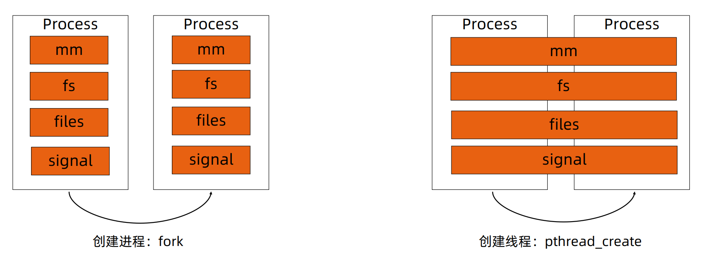
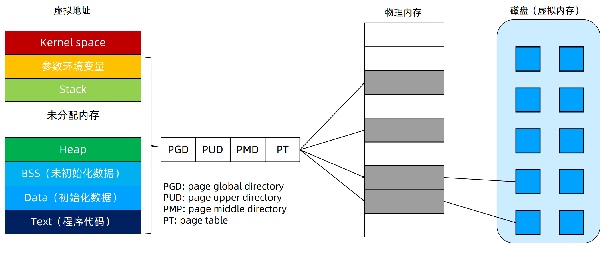
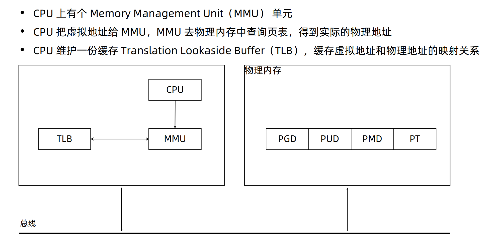
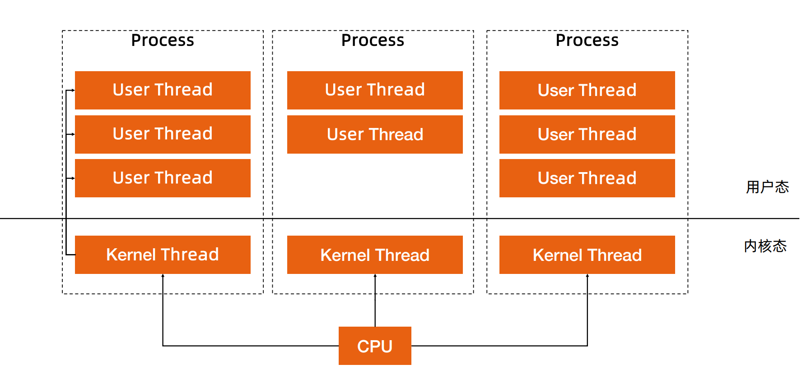
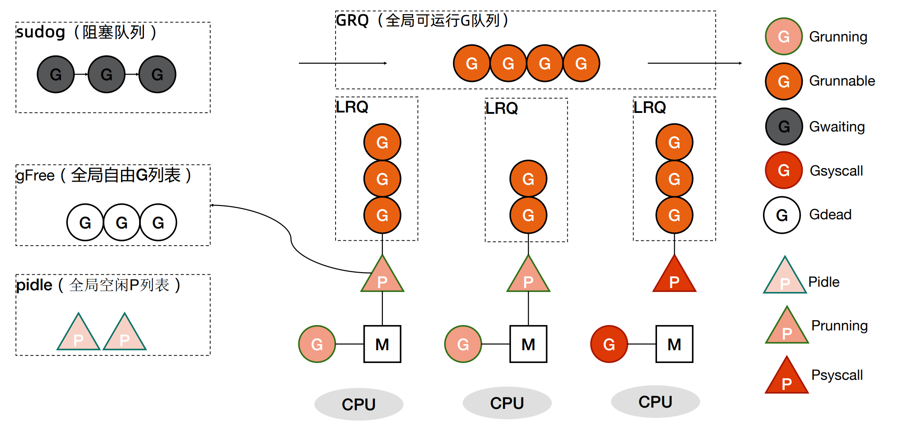

## Go语言线程调度

- 进程：资源分配的基本单位

- 线程：调度的基本单位

- 无论是线程还是进程，在 linux 中都以 **task_struct** 描述，从内核角度看，线程与进程无本质区别，**线程是共享资源的进程**。

    task struct主要有标识符、状态、优先级、程序计数器、内存指针、上下文数据、IO状态等等

## Linux内存的使用

Linux四级页表

## CPU对内存的访问

## 进程切换开销
- 直接开销
    - 切换页表全局目录
    - 刷新TLB
    - 切换内核态堆栈
    - 切换硬件上下文(寄存器)
    - 系统调度器代码执行
- 间接开销
    - CPU缓存失效，导致需要到内存直接访问的IO变多

## 线程切换开销

- 线程本质上只是一批共享资源的进程，**线程切换本质上依然需要内核进行进程切换**

- 一个进程的所有线程共享虚拟地址空间，线程切换相比进程切换，主要节省了**虚拟地址空间的切换**

## 用户线程和Goroutine
无需内核帮助，应用程序在用户空间创建的可执行单元，创建销毁完全在用户态完成。

Go语言基于 GMP 模型实现用户态线程

G：表示 goroutine，每个 goroutine 都有自己的栈空间，定时器，初始化的栈空间在 2k 左右，空间会随着需求增长。

M：表示machine，抽象化代表内核线程，一个 machine 对应一个内核线程，记录内核线程栈信息，当 goroutine 调度到线程时，使用该 goroutine 自己的栈信息。M的数量大于P，上限是10000。

P：代表调度器，负责调度 goroutine，维护一个本地 goroutine 队列，M从P上获得goroutine 并执行，同时还负责部分内存的管理。默认情况下P的数量 = CPU数量，上限是256。

M和P之间有可能一对多的关系，比如P空闲队列。

### G所在的位置

- **全局队列**

- 每个 P 拥有自己的**本地执行队列**

- 有不在运行队列中的 G
    - 处于阻塞态的 G 被放在 sudog
    - 脱离 P 绑定在 M 上的 G，如**系统调用**
    - 为了复用，执行结束进入**P的gFree 空闲列表**中的 G

### Goroutine创建过程
- **获取或者创建新的 Goroutine 结构体**
    - 从处理器P的 gFree 列表中查找空闲的 Goroutine
    - 如果不存在空闲的 Goroutine，会创建一个的新结构体

- 将**函数传入的参数移到 Goroutine 的栈**上

- 更新 Goroutine 调度相关的属性，**更新状态为_Grunnable**

- 返回的 Goroutine 会存储到**全局变量 allgs**中

### Goroutine放到运行队列上
- Goroutine 设置到处理器的 runnext **作为下一个任务**

- 当处理器的本地运行队列已经没有剩余空间时，处理器把 Goroutine添加到**全局运行队列**上

### 调度器行为

- 为了保证公平，以1//61的几率从**全局的运行队列**中查找对应的Goroutine

- 从处理器**本地的运行队列**中查找待执行的 Goroutine

- 如果前两种方法都没有找到 Goroutine
    - 从本地运行队列、全局运行队列中查找
    - 从网络轮询器中查找是否有 Goroutine 等待运行
    - 尝试从其他随机的处理器中窃取1//2的Goroutine

- 对于执行时间超过10ms的G，其它G可以进行抢占调度

    [Goroutine调度](https://zhuanlan.zhihu.com/p/74036955)
