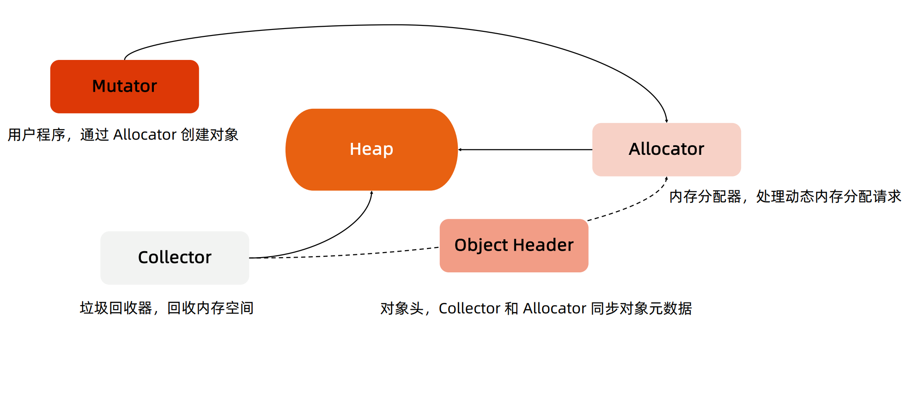
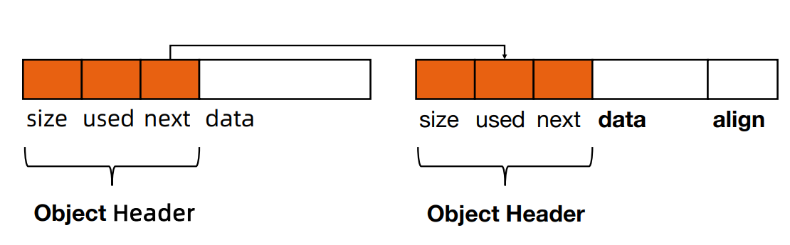
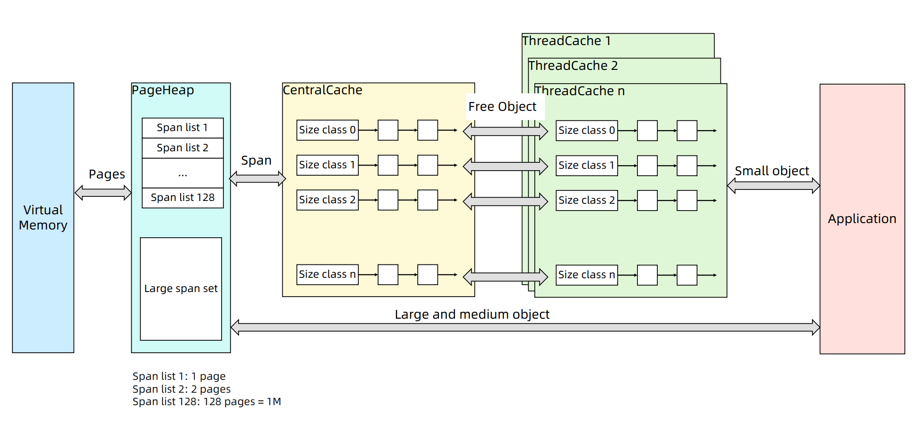
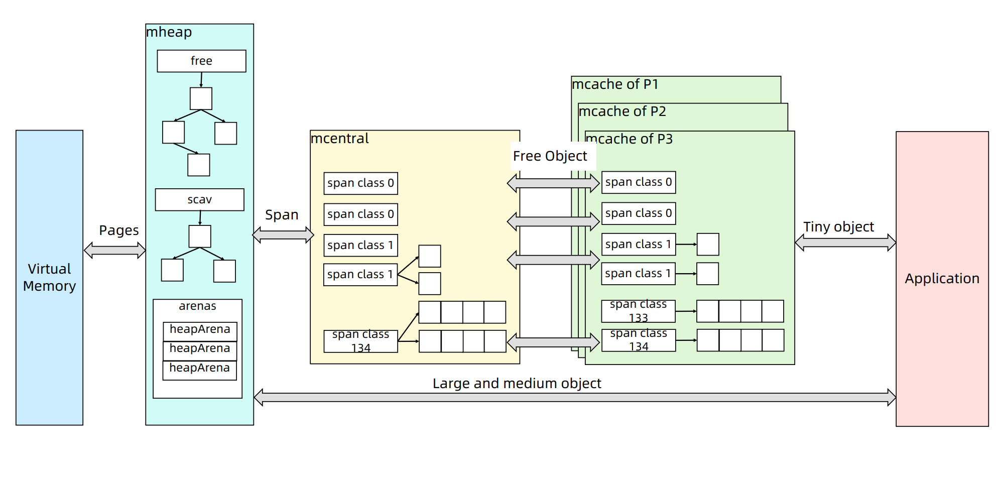
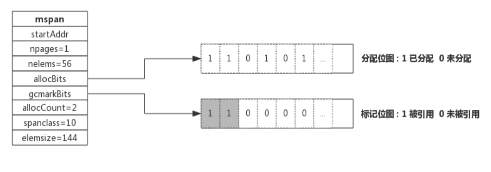
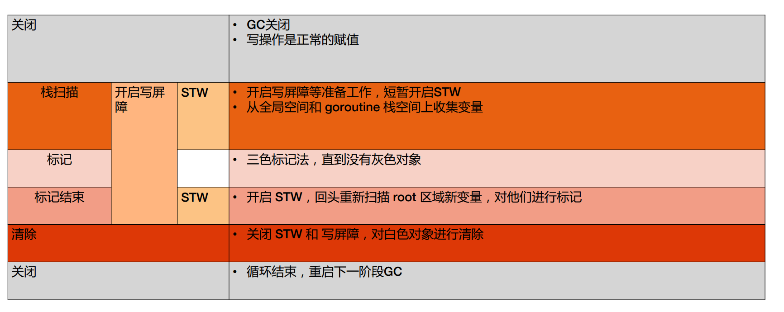

## 堆内存管理

- 初始化连续内存块作为堆
- 有内存申请的时候，Allocator 从堆内存的未分配区域分割小内存块
- 用链表将已分配内存连接起来
- 需要信息描述每个内存块的元数据：大小，是否使用，下一个内存块的地址等

## TCMalloc和Golang内存管理

### TCMalloc

- page:内存页，一块 8K 大小的内存空间。Go 与操作系统之间的内存申请和释放，都是以page为单位的
- span: 内存块，一个或多个连续的page组成一个span
- sizeclass : 空间规格，每个span都带有一个sizeclass，标记着该span中的page应该如何使用
- object: 对象，用来存储一个变量数据内存空间，一个span在初始化时会被切割成一堆等大的object。所谓内存分配，就是分配一个object出去。

- 对象大小定义
    - 小对象大小：0~256KB
    - 中对象大小：256KB~1MB
    - 大对象大小：>1MB

- 小对象的分配流程
    - ThreadCache -> CentralCache -> HeapPage，大部分时候ThreadCache 缓存都是足够的，不需要去访问CentralCache 和 HeapPage，无系统调用配合无锁分配，分配效率是非常高的

- 中对象分配流程
    - 直接在 PageHeap 中选择适当的大小即可，128 Page 的 Span 所保存的最大内存就是 1MB

- 大对象分配流程
    - 从large span set 选择合适数量的页面组成span，用来存储数据

### Go语言内存分配

- mcache：小对象的内存分配直接走
    - size class 从 1 到 66，每个 class 两个 span
    - Span 大小是 8KB，按 span class 大小切分
- mcentral
    - Span内的所有内存块都被占用时，没有剩余空间继续分配对象，mcache会向mcentral申请1个span，mcache拿到span后继续分配对象
    - 如果没有符合条件的span，mcentral会向mheap申请span
- mheap
    - 当mheap没有足够的内存时，mheap会向OS申请内存
    - Mheap把Span组织成了二叉搜索树结构，而不是链表
    - 然后把Span分配到heapArena进行管理，为了更高效的分配、回收和再利用内存，它包含地址映射和span是否包含指针等位图

## 内存回收
- 引用计数（Python，PHP，Swift）
    - 对每一个对象维护一个引用计数，当引用该对象的对象被销毁的时候，引用计数减 1，当引用计数为 0 的时候，回收该对象
    - 优点：对象可以很快的被回收，不会出现内存耗尽或达到某个阀值时才回收
    - 缺点：不能很好的处理循环引用，而且实时维护引用计数，有也一定的代价

- 标记-清除（Golang）
    - 从根变量开始遍历所有引用的对象，引用的对象标记为"被引用"，没有被标记的进行回收
    - 优点：解决引用计数的缺点
    - 缺点：需要 STW（stop the word），即要暂停程序运行

- 分代回收（Java）
    - 按照生命周期进行划分不同的代空间，生命周期长的放入老年代，短的放入新生代，新生代的回收频率高于老年代的频率
    - 缺点：老对象不易被回收，不适用于Go语言内存逃逸会削弱分代回收的优势。

在mspan中，有两个Bits比较关键：
- allocBits分配位图：记录了每块内存是否分配；
- gcmarkBits标记位图：记录了每块内存的引用情况，有对象引用的内存标记为1，没有的标记为0

这两个位图的数据结构是完全一致的，标记结束则进行内存回收，回收的时候，将 allocBits 指向 gcmarkBits，标记过的则存在，未进行标记的则进行回收

## GC工组流程
Golang GC 的大部分处理是和用户代码并行的

-  标记
    -  标记准备: 初始化 GC 任务，包括开启写屏障 (write barrier) 和辅助 GC(mutator assist)，统计root对象的任务数量等。**这个过程需要STW**
    -  并发标记: 扫描所有 root 对象，包括全局指针和 goroutine(G) 栈上的指针（扫描对应 G 栈时需停止该 G)，将其加入标记队列(灰色队列)，并循环处理灰色队列的对象，直到灰色队列为空。该过程后台并行执行
-  标记终止：完成标记工作，重新扫描(re-scan)全局指针和栈。因为 Mark 和用户程序是并行的，所以在 Mark 过程中可能会有新的对象分配和指针赋值，这个时候就需要通过写屏障（write barrier）记录下来，re-scan 再检查一下，**这个过程也是会STW**
-  垃圾清理：按照标记结果回收所有的白色对象，该过程后台并行执行
-  垃圾清理终止：对未清扫的 span 进行清扫, 只有上一轮的 GC 的清扫工作完成才可以开始新一轮的 GC

### 垃圾回收触发机制
-  内存分配量达到阀值触发 GC
    -  阀值 = 上次 GC 内存分配量 * 内存增长率
    -  内存增长率由环境变量 GOGC 控制，默认为 100，即每当内存扩大一倍时启动 GC。
-  定期触发 GC
    -  默认情况下，最长2分钟触发一次GC，这个间隔在 src/runtime/proc.go:forcegcperiod 变量中被声明
-  手动触发
    -  程序代码中也可以使用 runtime.GC()来手动触发 GC。这主要用于 GC 性能测试和统计。