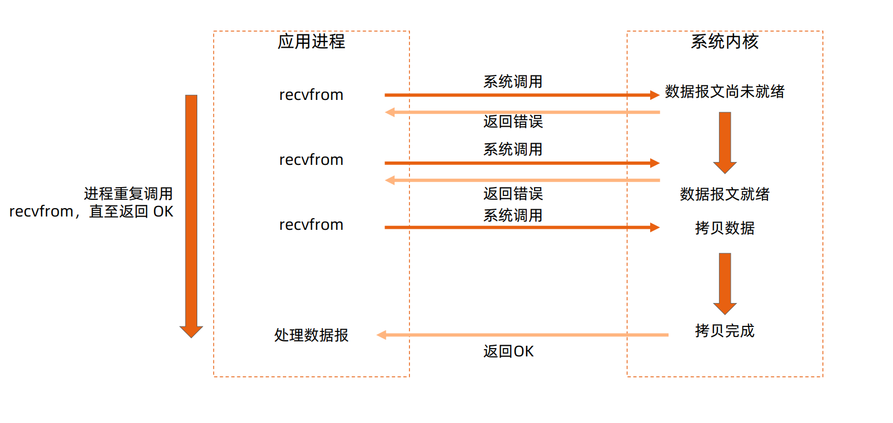

## 阻塞IO模型

## 非阻塞IO模型

多次轮询

## IO多路复用

第一次返回可读，第二次正式读取

## 异步IO

## Linux epoll图解

一个rbt，一个rdlist

## Go实现细节

- Go 语言将Goroutine与fd绑定
- 一个socket fd与一个协程绑定
- 当socket fd未就绪时，将对应协程设置为Gwaiting状态，将CPU时间片让给其他协程
- Go语言 runtime 调度器进行调度唤醒协程时，检查fd是否就绪，如果就绪则将协程置为Grunnable并加入执行队列
- 协程被调度后处理fd数据

