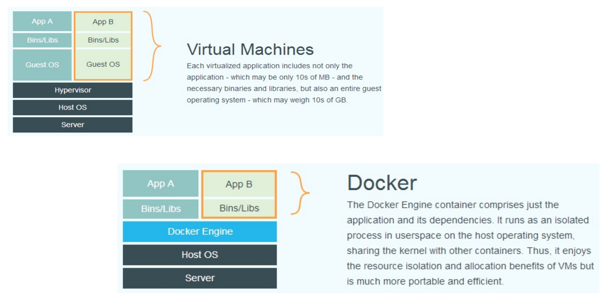
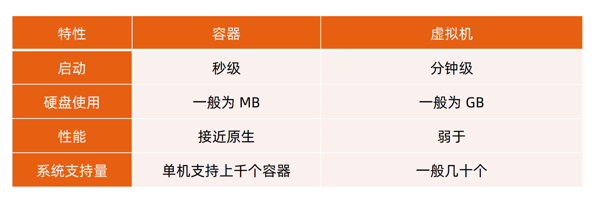
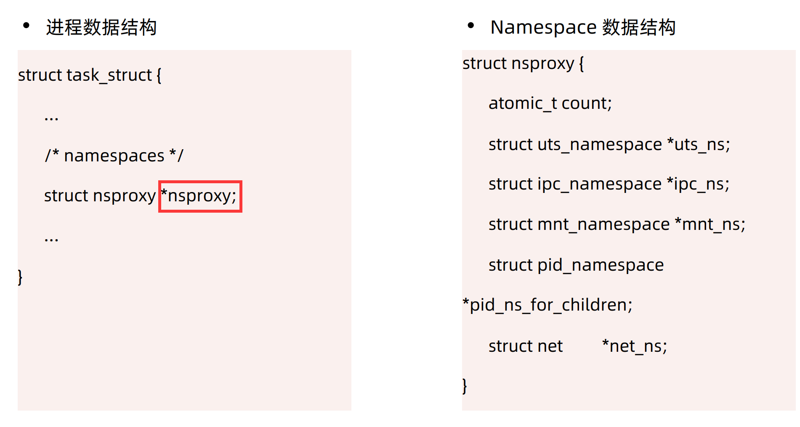
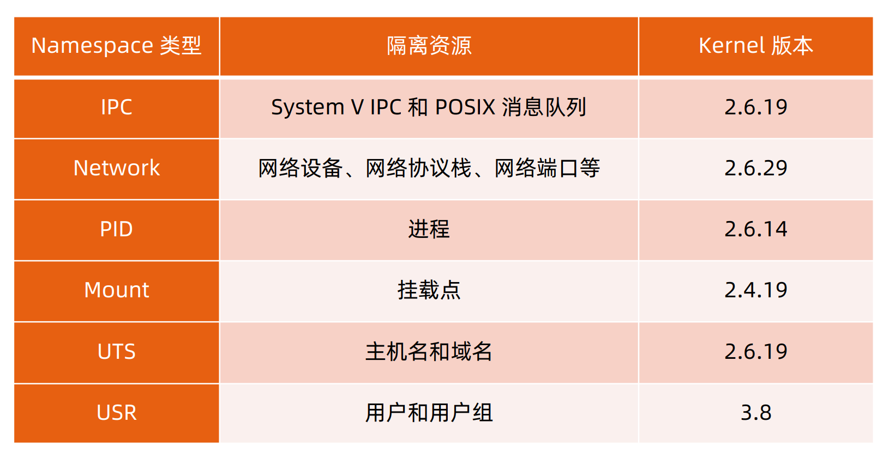
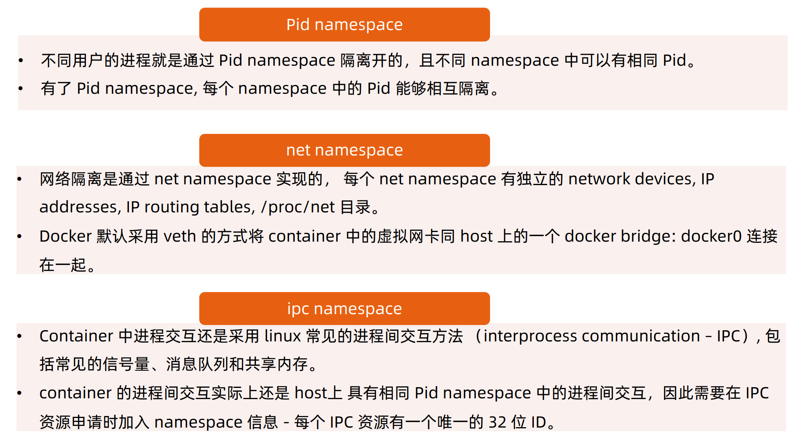
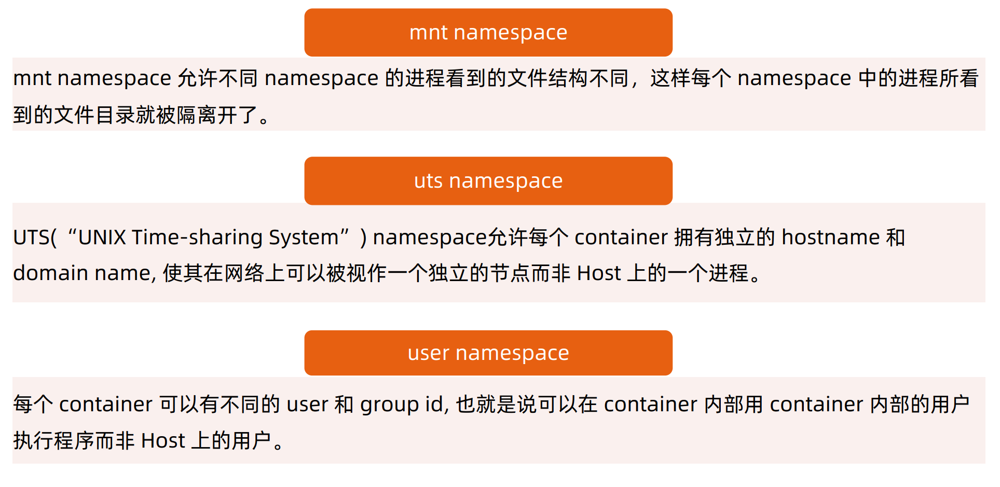
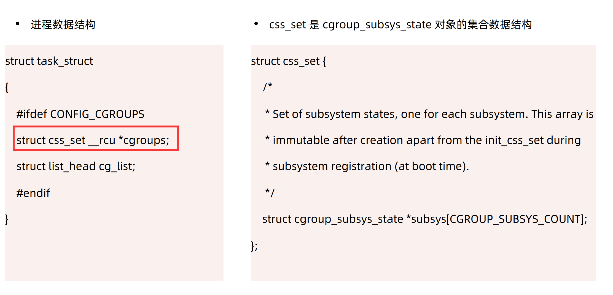

## Docker核心技术

基于 Linux 内核的 **Cgroup**，**Namespace**，以及**Union FS**等技术，对进程进行封装隔离，属于操作系统
层面的虚拟化技术

最初实现是基于 LXC，从 0.7 以后开始去除 LXC，转而使用自行开发的 Libcontainer，从 1.11 开始，则
进一步演进为使用 runC 和 Containerd

Docker 在容器的基础上，进行了进一步的封装，从**文件系统**、**网络互联**到**进程隔离**等等，极大的简化了容
器的创建和维护，使得 Docker 技术比虚拟机技术更为轻便、快捷

## 为什么要使用Docker

- 更高效地利用系统资源
- 更快速的启动时间
- 一致的运行环境
- 持续交付和部署
- 更轻松地迁移
- 更轻松地维护和扩展
……

## 虚拟机和Docker对比





## 常用的容器操作

```shell
docker run -it ubuntu bash
# 启动一个容器
# -it 交互模式
# -d 后台运行
# -p 端口映射
# -v 容器内文件系统映射
# -e 环境变量

docker start [container_id]
# 启动容器

docker stop [container_id]
# 停止容器

docker ps -a
# 查看容器进程

docker inspect [container_id]
# 查看容器细节信息

docker attach [container_id]
# 附加到容器进程

docker exec -it [container_id] bash
# 进入容器

nsenter -a -t [pid] -m -p -i -u -n -v -w
# 进入容器

```

- docker run -it会创建前台进程，但是会在输入exit后终止进程。
- docker attach 会通过连接stdin，连接到容器内输入输出流，会在输入exit后终止进程.
- docker exec -it 会连接到容器，可以像SSH一样进入容器内部，进行操作，可以通过exit退出容器，不影响容器运行。

## Dockerfile基本操作
- cat Dockerfile

    FROM ubuntu
    ENV MY_SERVICE_PORT=80
    ADD bin/amd64/httpserver /httpserver
    ENTRYPOINT /httpserver

- 将Dockerfile打包成镜像

    docker build -t msxf/httpserver:${tag} .
    docker push msxf/httpserver:v1.0

- 运行容器

    docker run -d msxf/httpserver:v1.0

## Namespace

- Linux Namespace 是一种 Linux Kernel 提供的资源隔离方案
- 系统可以为进程分配不同的 Namespace
- 保证不同的 Namespace 资源独立分配、进程彼此隔离，即不同的 Namespace 下的进程互不干扰

### 内核实现


### 对Namespace操作方法
- clone

在创建新进程的系统调用时，可以通过 flags 参数指定需要新建的 Namespace 类型：
// CLONE_NEWCGROUP / CLONE_NEWIPC / CLONE_NEWNET / CLONE_NEWNS / CLONE_NEWPID /
CLONE_NEWUSER / CLONE_NEWUTS

int clone(int (*fn)(void *), void *child_stack, int flags, void *arg)

- setns

该系统调用可以让调用进程加入某个已经存在的 Namespace 中：
Int setns(int fd, int nstype)

- unshare

该系统调用可以将调用进程移动到新的 Namespace 下：
int unshare(int flags)

```shell
lsns -t [type]
# 查看当前进程的Namespace

ls -la /proc/[pid]/ns
# 查看进程的Namespace

nsenter -t [pid] -a
# 进入进程的Namespace
```

### 隔离性






## Cgroups

- Cgroups （Control Groups）是 Linux 下用于对一个或一组进程进行**资源控制和监控**的机制；
- 可以对诸如 **CPU 使用时间**、**内存**、**磁盘 I/O** 等进程所需的资源进行限制；
- 不同资源的具体管理工作由相应的 **Cgroup 子系统（Subsystem）**来实现 ；
- 针对不同类型的资源限制，只要将限制策略在不同的的子系统上进行关联即可 ；
- Cgroups 在不同的系统资源管理子系统中以**层级树（Hierarchy）**的方式来组织管理：每个 Cgroup 都可包含其他的子 Cgroup，因此子 Cgroup 能使用的资源除了受本 Cgroup 配置的资源参数限制，还受到父
Cgroup 设置的资源限制 。

### 内核实现


### 子系统
cgroups 实现了对资源的配额和度量
- blkio： 这个子系统设置限制每个块设备的输入输出控制。例如:磁盘，光盘以及USB等
- CPU： 这个子系统使用调度程序为cgroup任务提供CPU的访问
- cpuacct： 产生 cgroup 任务的 CPU 资源报告
- cpuset： 如果是多核心的CPU，这个子系统会为cgroup任务分配单独的CPU和内存
- devices： 允许或拒绝cgroup任务对设备的访问
- freezer： 暂停和恢复 cgroup 任务。
- memory： 设置每个cgroup的内存限制以及产生内存资源报告
- net_cls： 标记每个网络包以供cgroup方便使用
- ns： 名称空间子系统
- pid: 进程标识子系统