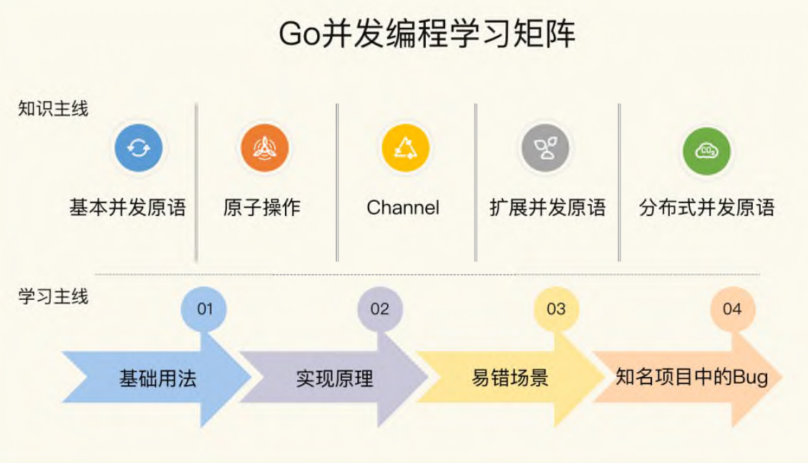
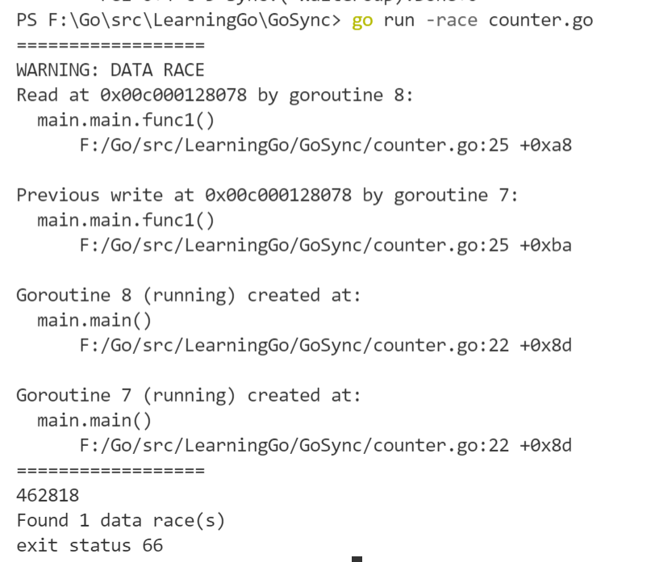
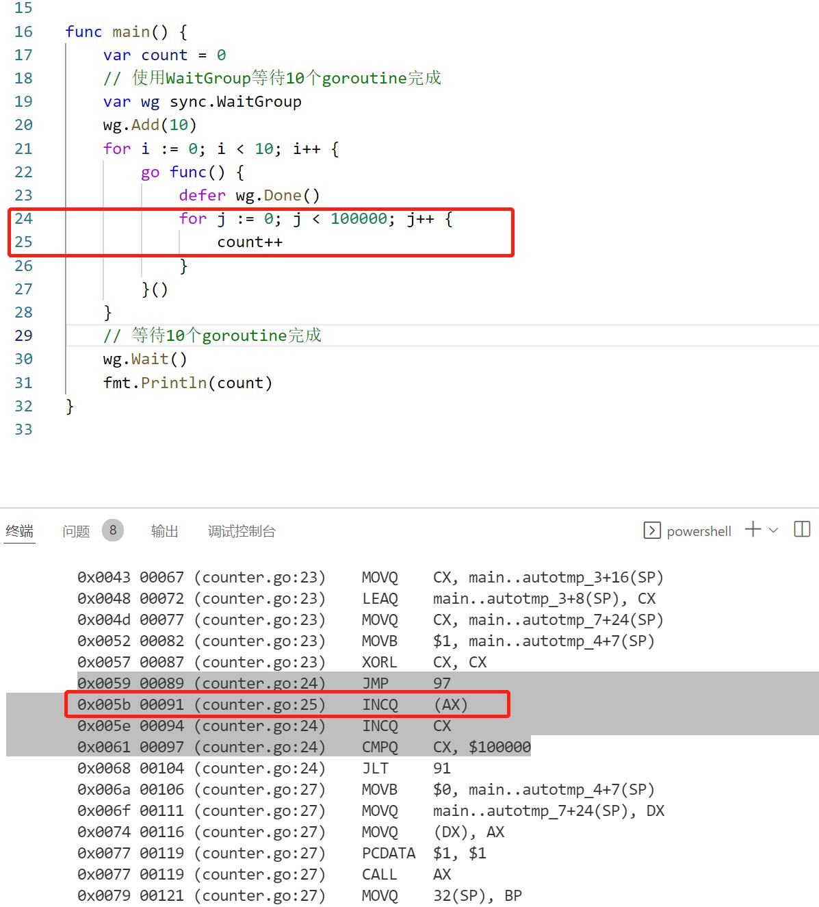
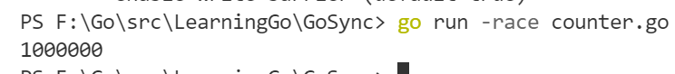

## 学习路线

### 学习Go并发编程可能遇到的困难

1. 在面对并发难题时，感觉无从下手，不知道该用什么并发原语来解决问题。 
2. 如果多个并发原语都可以解决问题，那么，究竟哪个是最优解呢？比如说是用互斥锁，还是用 Channel。
3. 不知道如何编排并发任务。并发编程不像是传统的串行编程，程序的运行存在着很大的不确定性。这个时候，就会面临一个问题，怎么才能让相应的任务按照你设想的流程运行呢？
4. 有时候，按照正常理解的并发方式去实现的程序，结果莫名其妙就panic或者死锁了，排查起来非常困难。
5. 已知的并发原语都不能解决并发问题，程序写起来异常复杂，而且代码混乱，容易出错。

### Go并发编程的两条主线————知识主线和学习主线


- 基本并发原语: Mutex、RWMutex、Waitgroup、Cond、 Pool、Context 等标准库中的并发原语。
- 原子操作: 原子操作是其它并发原语的基础，主要是Go标准库提供的原子操作。
- Channel: 基本用法和处理场景。
- 扩展并发原语: 信号量、SingleFlight、循环栅栏、ErrGroup。
- 分布式并发原语: Leader选举、分布式互斥锁、分布式读写锁、分布式队列

## Mutex

### 互斥锁的实现机制

在并发编程中，如果程序中的一部分会被**并发访问或修改**，为了避免并发访问导致的意想不到的结果，这部分程序需要被保护起来，这部分被保护起来的程序，就叫做**临界区**。

临界区就是一个**被共享的资源**，或者说是一个整体的一组共享资源，比如对数据库的访问、对某一个共享数据结构的操作、对一个 I/O 设备的使用、对一个连接池中的连接的调用。

使用互斥锁，限定临界区只能同时由一个线程持有，其它线程如果想进入这个临界区就会返回失败，或者是等待持有线程退出。因此，很好地解决了资源竞争问题。

**同步原语的适用场景**

- 共享资源。并发地读写共享资源，会出现数据竞争（data race）的问题，所以需要Mutex、RWMutex这样的并发原语来保护。
- 任务编排。需要goroutine按照一定的规律执行，而goroutine之间有相互等待或者依赖的顺序关系，我们常常使用WaitGroup或者Channel来实现。
- 消息传递。信息交流以及不同的goroutine之间的线程安全的数据交流，常常使用Channel来实现。

### Mutex 的基本使用方法
Mutex实现了package sync提供的Locker接口，进入临界区之前调用Lock方法，退出临界区的时候调用Unlock方法。
```golang
type Locker interface {
    Lock()
    Unlock()
}
```
```golang
func(m *Mutex)Lock()
func(m *Mutex)Unlock()
```

当一个goroutine通过调用Lock方法获得了这个锁的拥有权后，其它请求锁的goroutine就会**阻塞**在Lock方法的调用上，直到锁被释放并且自己获取到了这个锁的拥有权。

### Race detection
Go race detector是基于Google的C/C++ sanitizers技术实现的，编译器通过在内存访问时插桩来监控读写操作，定位对共享变量的非同步访问并打印警告。

用法：在编译（compile）、测试（test）或者运行（run）Go代码的时候，加上race参数。

```golang
package main

import (
	"fmt"
	"sync"
)

func main() {
	var count = 0
	// 使用WaitGroup等待10个goroutine完成
	var wg sync.WaitGroup
	wg.Add(10)
	for i := 0; i < 10; i++ {
		go func() {
			defer wg.Done()
			for j := 0; j < 100000; j++ {
				count++
			}
		}()
	}
	// 等待10个goroutine完成
	wg.Wait()
	fmt.Println(count)
}
```
```bash
go run -race counter.go
```


生成汇编代码
```
go tool compile -S counter.go
```

(这里留个坑，虽然优化成了INCQ指令，但是由于多核CPU存中SMP的竞争。具体内容之后再看)
[指令集的原子操作](https://www.51cto.com/article/718443.html)

通过在改变变量前后增加`mu.Lock()`, `mu.Unlock()`即可消除竞争警告

**Mutex 的零值是还没有 goroutine 等待的未加锁的状态**

## Mutex的其它用法
**Mutex会嵌入到其它struct中使用**
```golang
type Counter struct { 
    mu sync.Mutex
    Count uint64 
    }
```

**采用嵌入字段的方式**
```golang
type Counter struct { 
    sync.Mutex
    Count uint64 
    }
```
**把获取锁、释放锁、计数加一的逻辑封装成一个方法**
代码略

### Mutex源码分析
[sync.mutex 源代码分析](https://colobu.com/2018/12/18/dive-into-sync-mutex/)