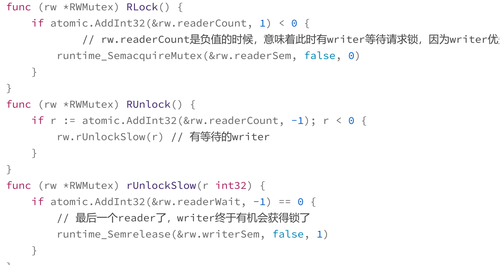
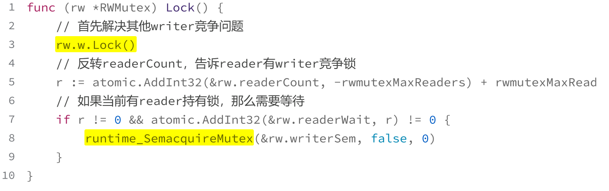
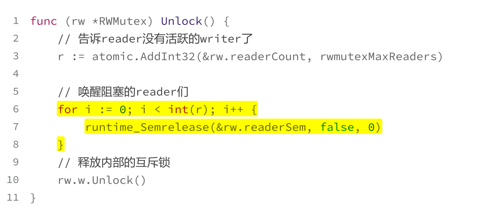
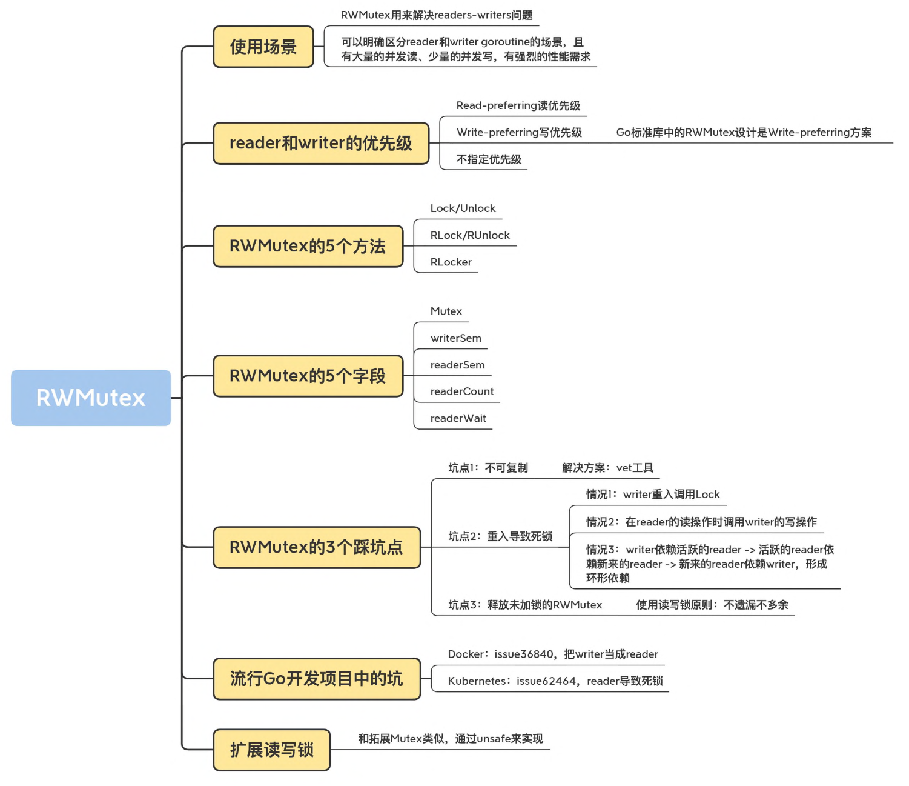

## 什么是RWMutex
如果不管是读还是写，我们都通过Mutex来保证只有一个goroutine访问共享资源，这在某些情况下有点“浪费”。

比如说，在写少读多的情况下，即使一段时间内没有写操作，大量并发的读访问也不得不在Mutex的保护下变成了串行访问，这个时候，使用Mutex，对性能的影响就比较大。

如果将将串行的读变成并行读，可以提高读操作的性能，Go标准库中的RWMutex（读写锁）就是用来解决这类readers-writers问题的。

RWMutex在某一时刻只能由任意数量的reader持有，或者是只被单个的writer持有。

RWMutex有五个方法：
- Lock/Unlock：写操作时调用的方法。
- RLock/RUnlock：读操作时调用的方法。
- RLocker：这个方法的作用是为读操作返回一个Locker接口的对象。

RWMutex 的零值是未加锁的状态。

有大量的并发读、少量的并发写，并且有强烈的性能需求，你就可以考虑使用读写锁RWMutex替换Mutex。

## 实现原理

readers-writers问题一般有三类，基于对读和写操作的优先级：
- Read-preferring：读优先的设计可以提供很高的并发性，但是，在竞争激烈的情况下可能会导致写饥饿。
- Write-preferring：写优先的设计意味着，如果已经有一个writer在等待请求锁的话，它会阻止新来的请求锁的reader获取到锁，所以优先保障writer。
- 不指定优先级：不区分reader和writer优先级，解决了饥饿的问题。

Go标准库中的RWMutex设计是Write-preferring方案。

``` golang

type RWMutex struct { 
    w Mutex // 互斥锁
    writerSem uint32 // writer信号量 
    readerSem uint32 // reader信号量 
    readerCount int32 // reader的数量 
    readerWait int32 // writer等待完成的reader的数量
} 
const rwmutexMaxReaders = 1 << 30
```

### RLock/RUnlock的实现



没有writer竞争或持有锁时，readerCount正数计数；

### Lock的实现
为了避免writer之间的竞争，RWMutex就会使用一个Mutex来保证writer的互斥。writer获得了内部的互斥锁，就会反转readerCount字段，将其设置为 -rwmutexMaxReaders + readerCount，表示当前有writer持有锁。



### Unlock的实现
当一个writer释放锁的时候，它会再次反转readerCount字段。唤醒reader并释放互斥锁。


## RWMutex的三个踩坑点
- 不可复制: 它的字段就会记录它当前的一些状态。这个时候你去复制这把锁，就会把它的状态也给复制过来。
- 死锁: 
    情况1：读写锁内部基于互斥锁，而互斥锁本身不可重入; 
    情况2：在reader的读操作时调用writer的写操作，相互依赖导致死锁。
    情况3：writer依赖活跃的reader -> 活跃的reader依赖新来的reader -> 新来的reader依赖writer
- 释放未加锁的RWMutex

## 思维导图
