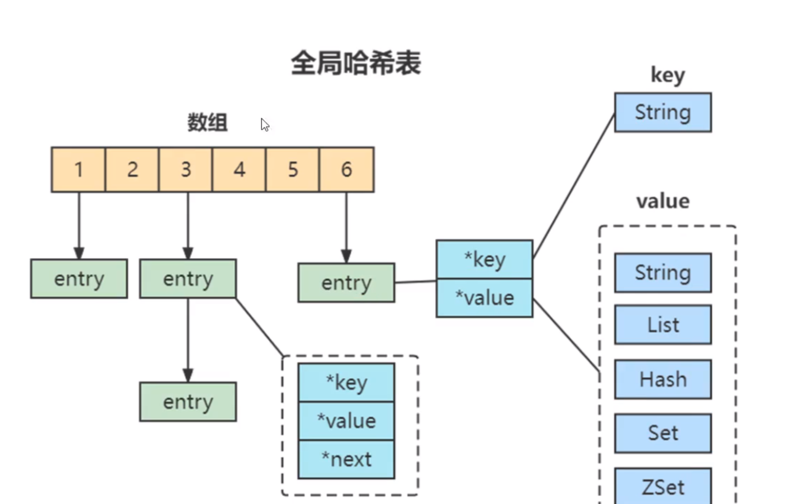

## 两大维度，三大主线
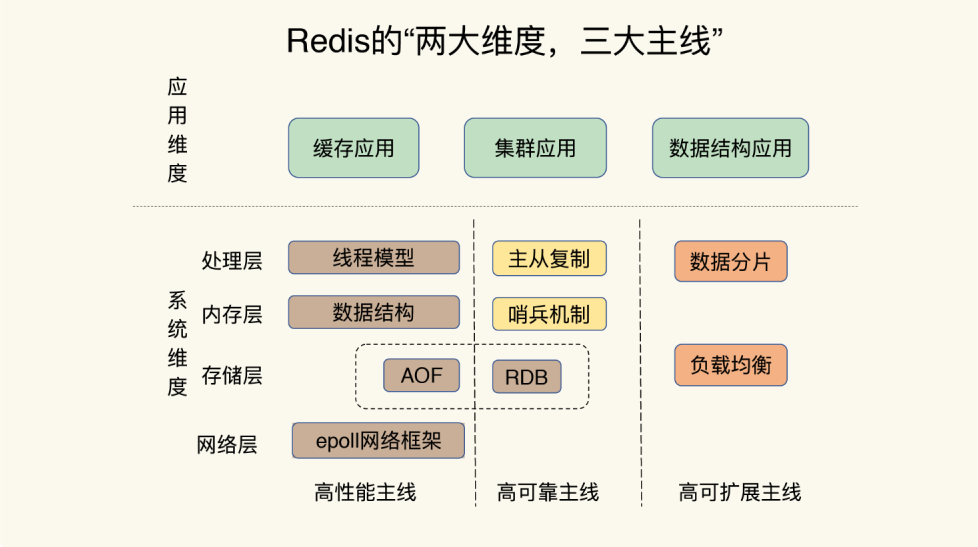

“两大维度”就是指系统维度和应用维度，“三大主线”也就是指高性能、高可靠和高可 扩展（可以简称为“三高”）

Redis 分别提供了 RDB 和 AOF 两种持久化机制，日志（AOF）和快照（RDB）：

RDB 将数据库的快照（snapshot）以二进制的方式保存到磁盘中。
AOF 则以协议文本的方式，将所有对数据库进行过写入的命令（及其参数）记录到 AOF 文件，以此达到记录数据库状态的目的。

## 遇到的坑

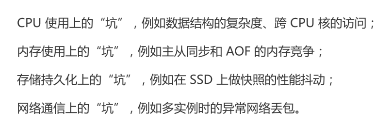

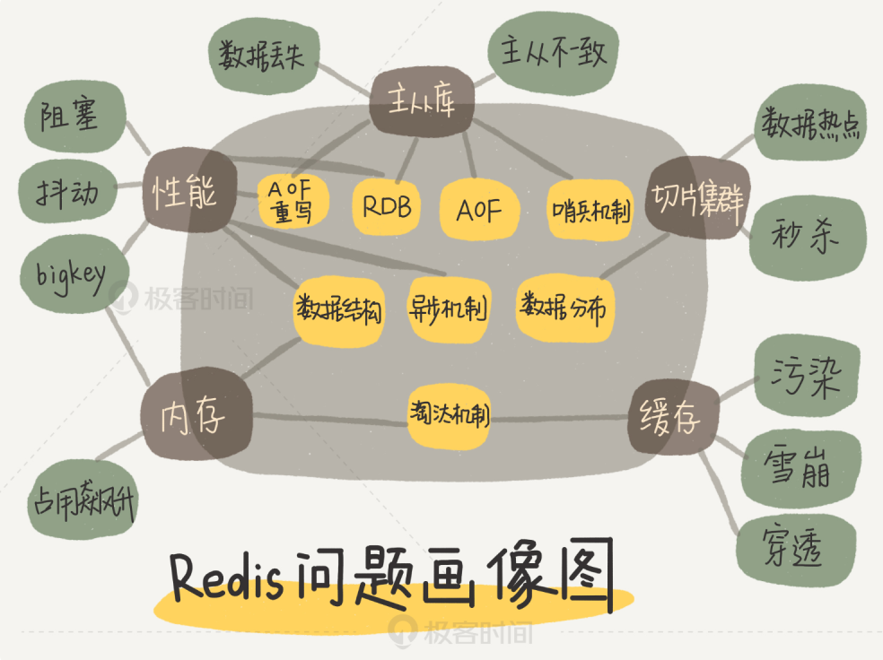

# 01 基本架构：一个键值数据库包含什么？
一个键值数据库包括了访问框架、索引模块、操作模块和存储模块四部分
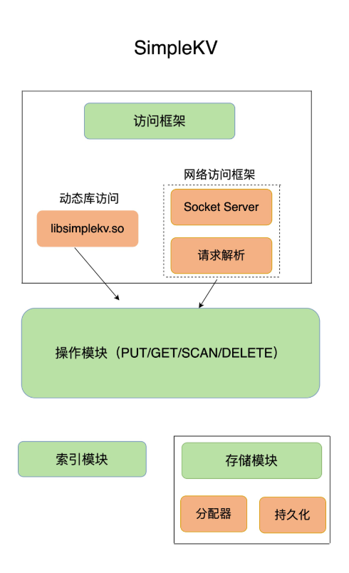
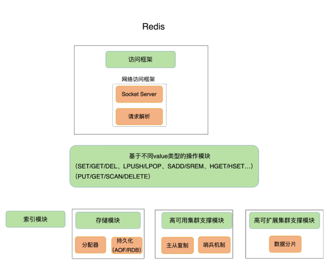

# 02 | 数据结构：快速的Redis有哪些慢操作？

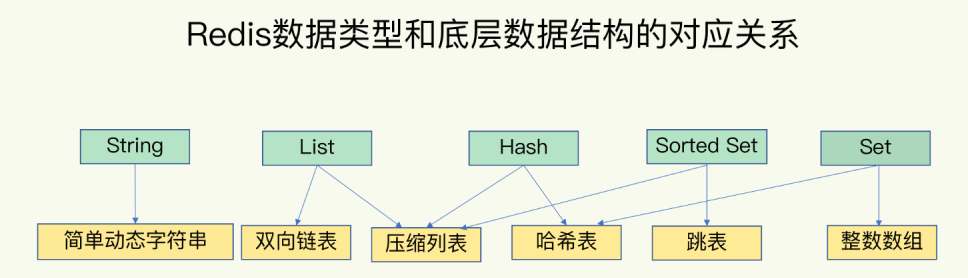

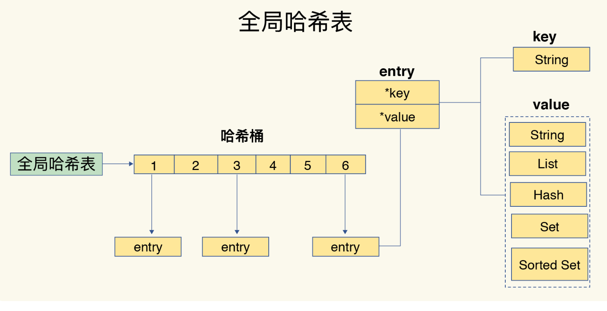

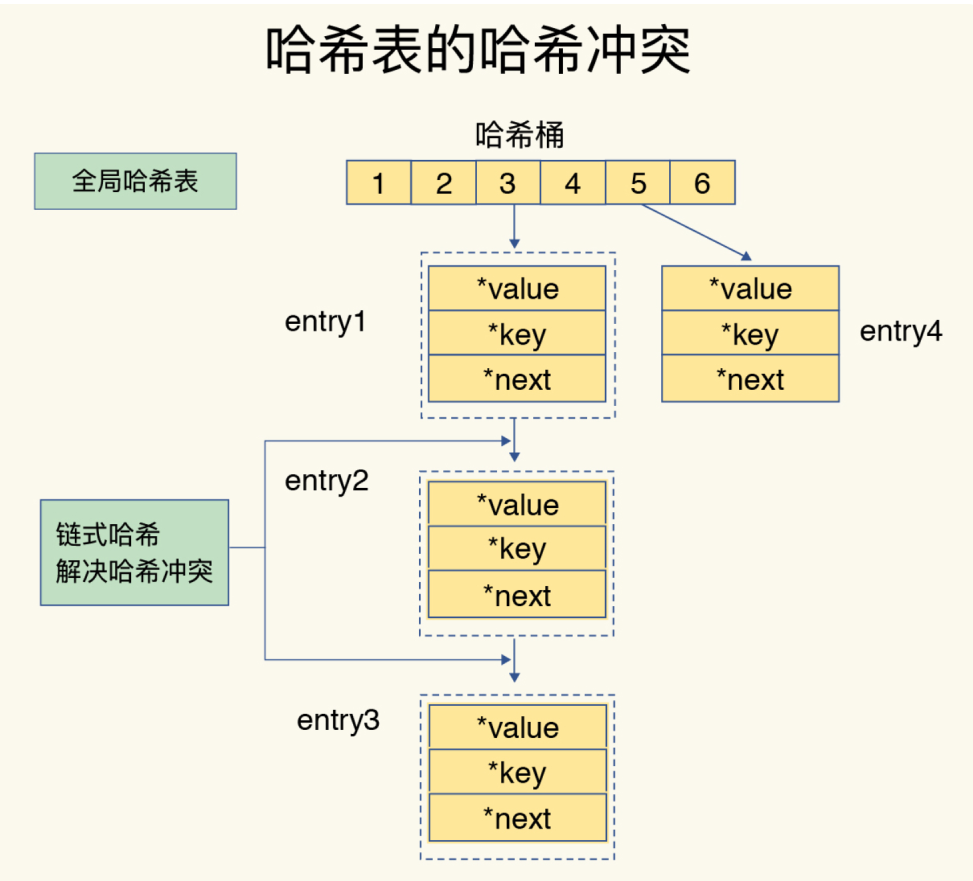

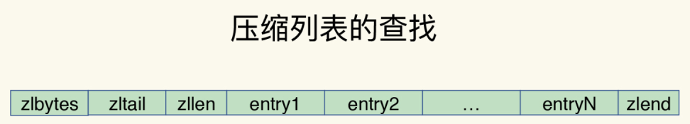

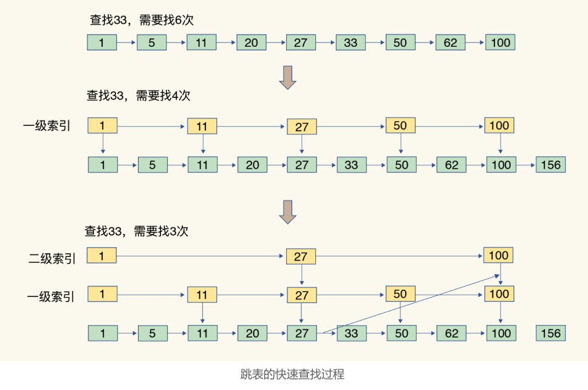

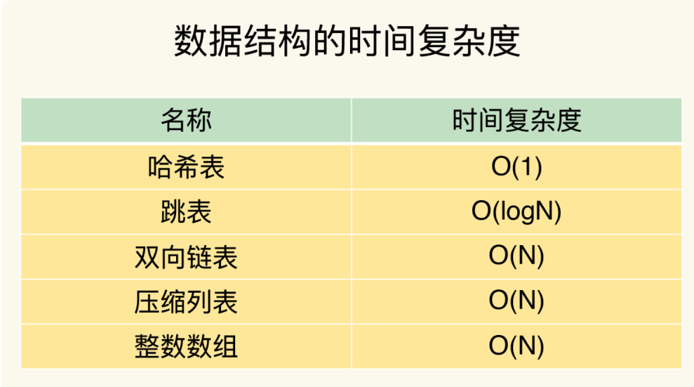

## 不同操作复杂度

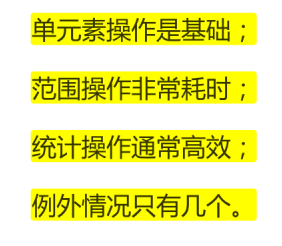

# 高性能IO模型：为什么单线程Redis能那么快？

## 基本 IO 模型与阻塞点
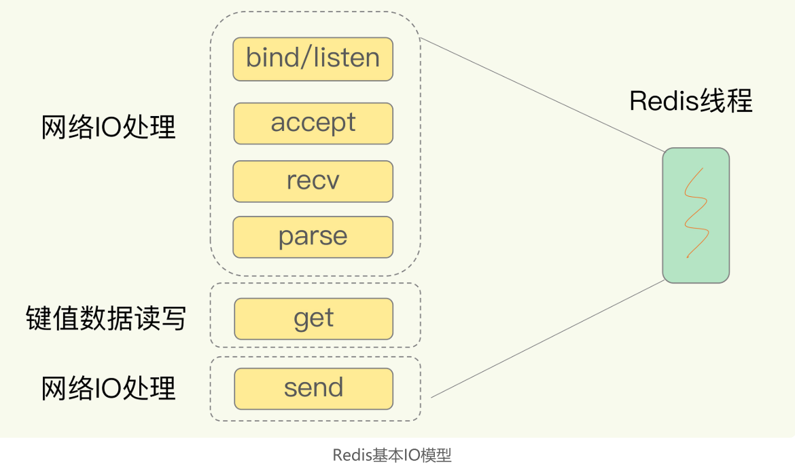

## 多路复用的I/O模型

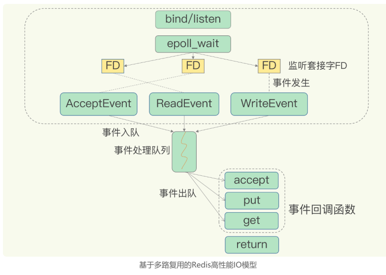

# AOF日志：宕机了，Redis如何避免数据丢失？

## AOF 日志是如何实现的？
