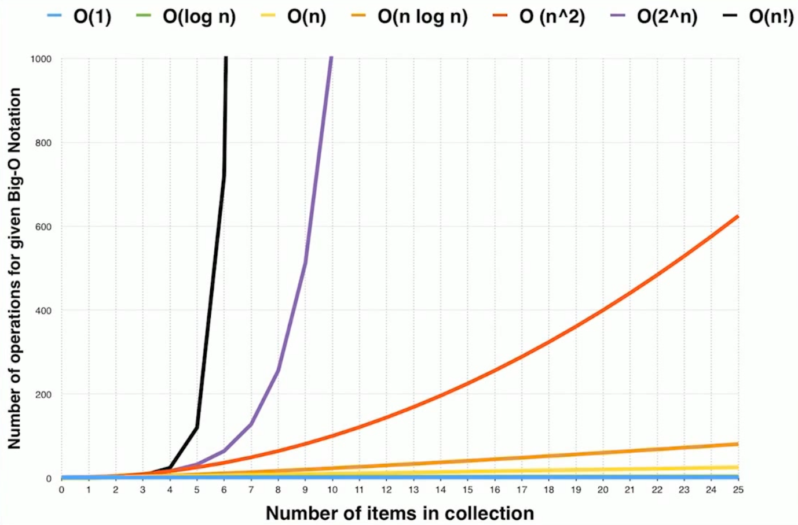
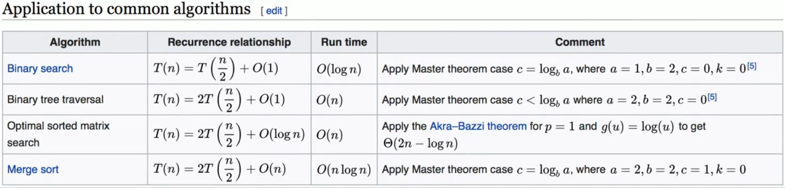

  

## Big O Notation
- O(1) Constant Complexity
- O(log n) Logarithmic Complexity
- O(n) Linear Complexity
- O(n log n) Logarithmic Linear Complexity
- O(n^2) Quadratic Complexity
- O(n^3) Cubic Complexity
- O(2^n) Exponential Complexity
- O(n!) Factorial Complexity

不考虑系数

while 和 for 的嵌套循环不一定是 O(n^2)

O(log n) 一般是二分法

## 指令条数

一般指令要跑 10^8~10^9，所以要限制在10^8内。

比如n=10^3，n^2=10^6，可以满足要求。

比如n=10^6，nlogn=6*10^6，可以满足要求。

## 时间复杂度曲线

## Master Theorem
二维有序矩阵的查找, O(n)

归并排序的O(nlogn)

二叉树、图、BFS、DFS的遍历都是O(n)

