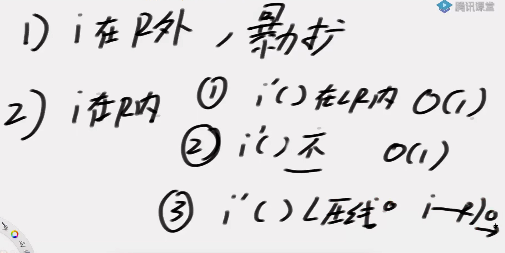

## 目的
求最长回文子串（子串必须连续）

## 填充
在字符串的每个字符前后插入一个#，并且开头和结尾都有。

**填充一个已经存在的字符，不影响结果**

原串下标 = 填充串下标/2

## 概念
- 回文直径、回文半径
- 回文数组
- 最右回文边界（从-1开始）
- 取得最右回文边界时的中心

## 步骤
分情况：
- 当前位置i在最右回文边界外，没有办法优化，暴力扩
- 当前位置i在最右回文边界内，找当前点i关于中心点c的对称点j，分三种情况：
    - 若j的左边界在L内，那么j的回文半径就是i的回文半径
    - 若j的左边界超过L，那么i的回文半径就是R-i+1(回文的右边界就是R不变)
    
    - 若j的左边界和L压线，那么要去R下一个位置继续比较
    



**不用验的区域是min(R-i+1, arr\[j\])**

## 时间复杂度
O(N)，在情况1和情况2.c中，扩充以后R增加；在其他情况下，R不变。所以R只增不减，最多只会扩充N次。

## 代码
**代码中的R为了方便，是第一次失败的位置！比原R多1**

编程的时候，把不用验的区域弄出来，之后再while验证

返回 (半径-1) /2
``` java
public static int manacher(String s) {
		if (s == null || s.length() == 0) {
			return 0;
		}
		// "12132" -> "#1#2#1#3#2#"
		char[] str = manacherString(s);
		// 回文半径的大小
		int[] pArr = new int[str.length];
		int C = -1;
		// 讲述中：R代表最右的扩成功的位置
		// coding：最右的扩成功位置的，再下一个位置
		int R = -1;
		int max = Integer.MIN_VALUE;
		for (int i = 0; i < str.length; i++) { // 0 1 2
			// R第一个违规的位置，i>= R
			// i位置扩出来的答案，i位置扩的区域，至少是多大。
			pArr[i] = R > i ? Math.min(pArr[2 * C - i], R - i) : 1;// 先设置现在的回文半径，至少为1
			while (i + pArr[i] < str.length && i - pArr[i] > -1) {
				if (str[i + pArr[i]] == str[i - pArr[i]])
					pArr[i]++;
				else {
					break;
				}
			}
			if (i + pArr[i] > R) {
				R = i + pArr[i];
				C = i;
			}
			max = Math.max(max, pArr[i]);
		}
		return max - 1;
	}

	public static char[] manacherString(String str) {
		char[] charArr = str.toCharArray();
		char[] res = new char[str.length() * 2 + 1];
		int index = 0;
		for (int i = 0; i != res.length; i++) {
			res[i] = (i & 1) == 0 ? '#' : charArr[index++];
		}
		return res;
	}
```