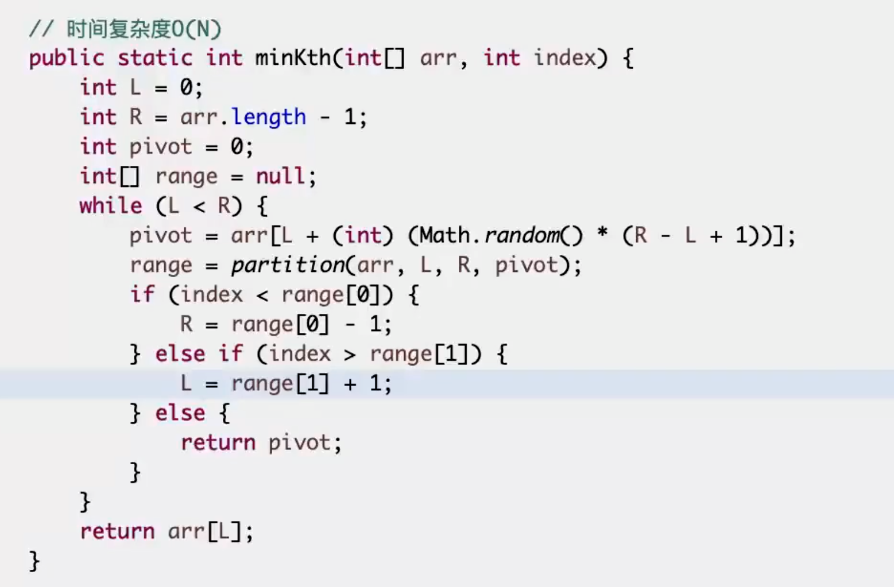

## 在无序数组中求第N小的数
- 改写快排
- Bfprt算法

## 改写快排
- 先做一个荷兰国旗问题，**随机选一个p**
- 将数组分为三部分，小于、等于、大于区域。
- 然后根据区域的大小判断第N小的数在哪个区域，然后递归调用

时间复杂度：O(N)，因为每次只需走一边，可以用master公式求解



## Bfprt算法

- **很讲究地选P**
- 将数组分为三部分，小于、等于、大于区域。
- 然后根据区域的大小判断第N小的数在哪个区域，然后递归调用

bfprt(arr, kth)
具体步骤：
- 五个一组（逻辑上）
- 小组内部排好序（注意这一流程的时间复杂度是O(n)）
- **找到中位数（或最后一组上中位数），组成一个新的数组m，数组长度为（N/5），求m中的中位数bfprt(m, N/10)作为划分数p**
- 然后再用荷兰国旗问题的方法，将数组分为三部分，小于、等于、大于区域，进行递归

在m中，中位数p是N/5，故至少有N/10个数大于等于p。所以在N数组中，至少有3N/10个数大于等于p（每组的中位数和比中位数大的两个数组成），那么有7N/10个数小于p，同理有7N/10个数大于p。 

好的情况下，可以直接命中，最差情况下也只需要承担 T(7N/10) 的代价，递归调用。

所以T(N) = T(N/5)(递归找中位数作为划分数) + T(7N/10)(最差情况递归) + O(N)(组内排序、组成新数组), 最后证明复杂度为O(N)


## 给定一个长度为N的无序数组arr，给定一个正数K，返回top K个最大的数
不同时间复杂度三个方法实现：

- O(N * logN)
- O(N + K*logN)
- O(N + K*logK)

### O(N * logN)
- 先排序，然后取前K个数

### O(N + K*logN)
- 从下往上建堆，然后弹出K次

### O(N + K*logK)
- O(N)求第K个数
- O(N)遍历数组，将大于第K个数放入数组，不足K个数的话，补充第K个数的值
- O(K*logK)对K个数的小数组排序


## 蓄水池算法
假设袋子大小为N, 第i个数进袋
- i <= N, 直接进袋
- i > N, 以N/i的概率进袋，否则不进袋，并均等替换掉袋子中的一个数

```go
func reservoirSampling(arr []int, N int) []int {
    rand.Seed(time.Now().UnixNano())
    if len(arr) <= N {
        return arr
    }
    res := make([]int, N)
    for i := 0; i < N; i++ {
        res[i] = arr[i]
    }
    for i := N; i < len(arr); i++ {
        if rand.Intn(i+1) < N { // 以k/i的概率进袋
            res[rand.Intn(N)] = arr[i]
        }
    }
    return res
}
```
