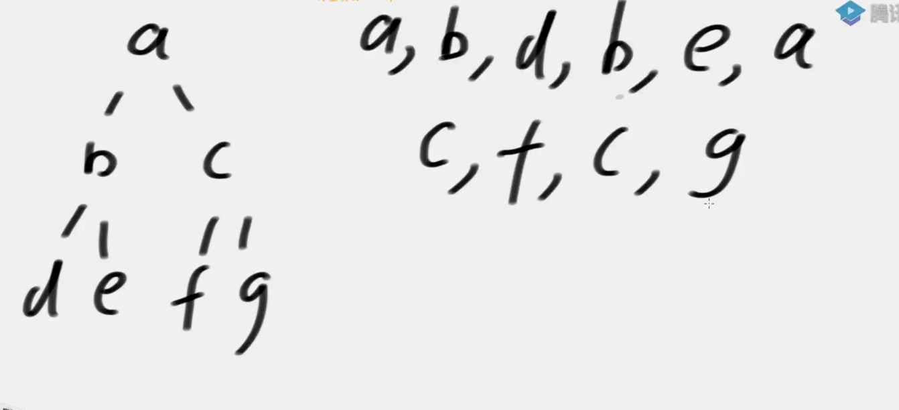
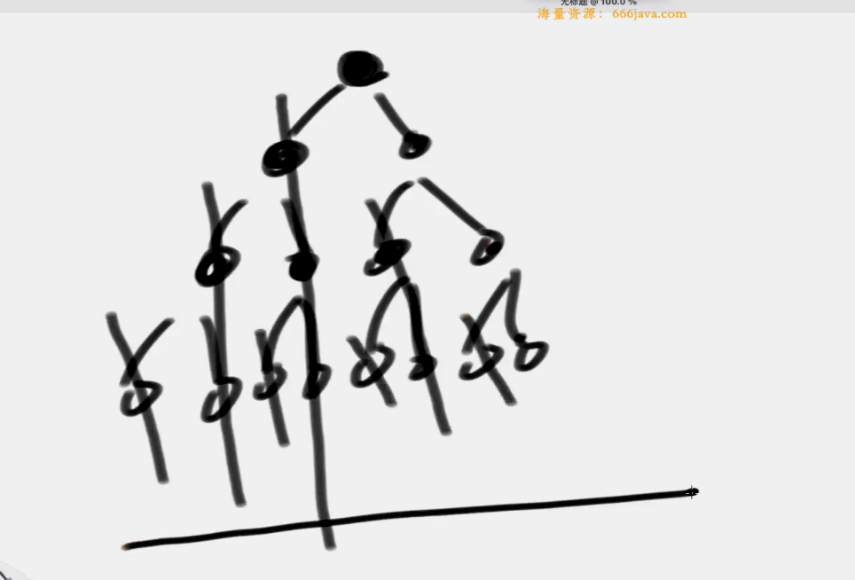

## Morris遍历
遍历树，时间复杂度O(N)，空间复杂度降低到O(1)

## 步骤
假设来到当前节点cur，开始时cur来到头节点位置

- 如果cur没有左孩子，cur向右移动(cur = curright)
- 如果cur有左孩子，找到左子树上最右的节点mostRight:
  - 如果mostRight的右指针指向空，让其指向cur然后cur向左移动(cur = curleft)
  - 如果mostRiaht的右指针指向cur，让其指向null然后cur向右移动(cur =curright)
- cur为空时遍历停止


特点：
- 遍历顺序是Morriss序
- 任何有左树的节点，会被遍历两次，一次是遍历前，一次是遍历完左树后
- 本质是用左子树的最右节点的右指针，来标记是否是第一次遍历左子树



可以加工出先序、中序遍历
- 先序：对于能到两次的节点（有左树的节点）第一次打印，第二次不打印
- 中序：对于能到两次的节点（有左树的节点）第一次不打印，第二次打印
- 后序：第一次来到的时候不管，第二次时，**逆序打印左子树的右边界**，**最后单独逆序打印整个树的右边界**。

**逆序打印使用反转链表**
## 实现
```java
public static void morris(Node head) {
  if (head == null) {
    return;
  }
  Node cur = head;
  Node mostRight = null;
  while (cur != null) {
    if (cur.left == null) {
      cur = cur.right;
    }else{
      mostRight = cur.left;
      while (mostRight.right != null && mostRight.right != cur) {
        mostRight = mostRight.right;
      }
      //找到左子树最右节点
      if (mostRight.right == null) {
        // 第一次来
        mostRight.right = cur;
        cur = cur.left;
      } else {
        // 第二次来
        mostRight.right = null;
        cur = cur.right;
      }
    }
    
  }
}
```

## 时间复杂度分析
时间复杂度会随着找左子树的最右节点而增大吗？
不会！虽然每个节点都会找它左子树的右边界！但是这些左子树的右边界是不重复的！！！

