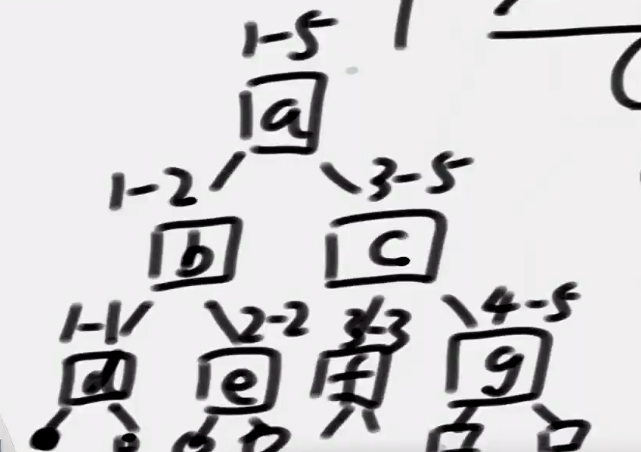

## 线段树

解决的问题：
\[L,R\]范围上的查询和qureySum、修改update、增加add

下标从1开始的话：
- 左孩子：2i
- 右孩子：2i+1
- 父节点：i>>1

下标从0开始的话：
- 左孩子：2i+1
- 右孩子：2i+2
- 父节点：(i-1)>>1

原数组长度为N，准备长度为4N的数组，可以构建线段树

## sum懒数组
用lazy表示懒数组，sum表示区间和
- 任务可以完全包住区间：直接修改懒数组
- 任务不能完全包住区间：将懒数组值下传，修改子sum数组，清空当前懒数组，修改当前sum信息

## update懒数组
用change表示懒数组，update表示是否有效

因为有可能change=0，无法区分是值为零，还是没有修改过，所以需要一个update数组来标记是否修改过

更新的判断同上。

**先更新change数组，再更新sum数组**，因为先更新sum，更新change数组时，原来的值会被覆盖掉

## 应用
只能用于某个区间sum、max、min等，已知左右区间信息，求整个区间信息时是O(1)复杂度的操作。

不能用于求左右区间，出现次数最多的数，因为左右区间选取出最多的数，可能并不是左右区间加起来最多的数。