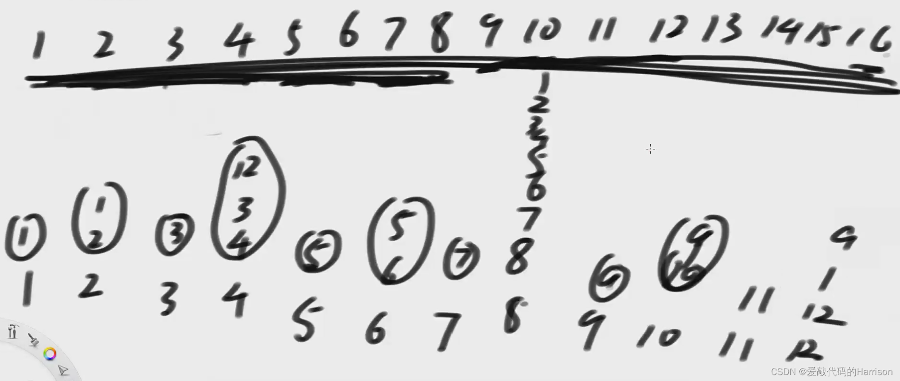
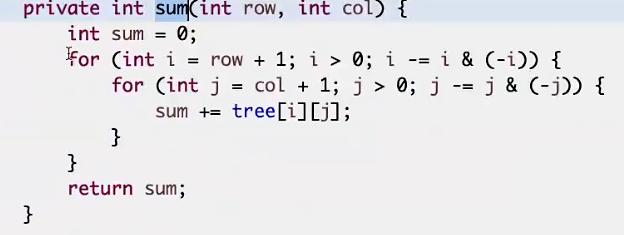
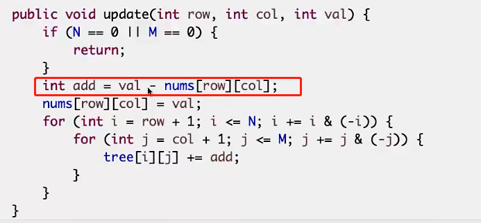

## IndexTree

特点：

- 无法范围更新，只能单点更新。
- sum(L, R)
- update(index, value)
- **下标从1开始**

help数组：1位置记录的是原数组1到1位置上的累加和、2位置记录的是原数组1到2位置上的累加和

## help数组管理arr哪些值？

二进制表示管理范围：二进制最后一个1变0后，再加1，直到它自己。
如0101 1100 => 管理 \[0101 1001, 0101 1100\]

## arr值变化后，help哪些值会更新？

- help\[index\] = help\[index\] + value

- index = index + (index & -index)

**index & -index的意义是取出最右的1**

每次加上最右侧的1，直到达到数组长度

## sum怎么算？

求sum时，从index开始

- sum = sum + help\[index\]
- index = index - (index & -index)
- 直到index = 0

## 初始化

- 设置一个N=len(arr)+1的数组
- 数组值全为0
- 调用add方法添加元素

## 二维indexTree

只需要将行和列，分别套用规律进行row * col组合即可

