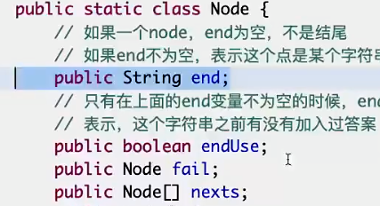
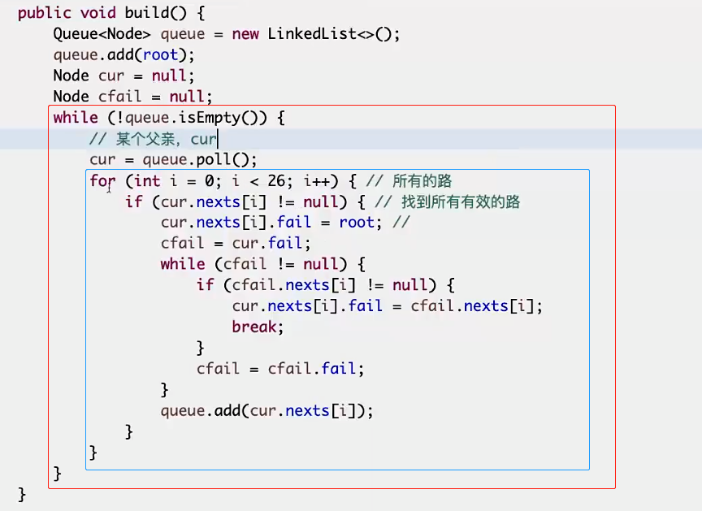
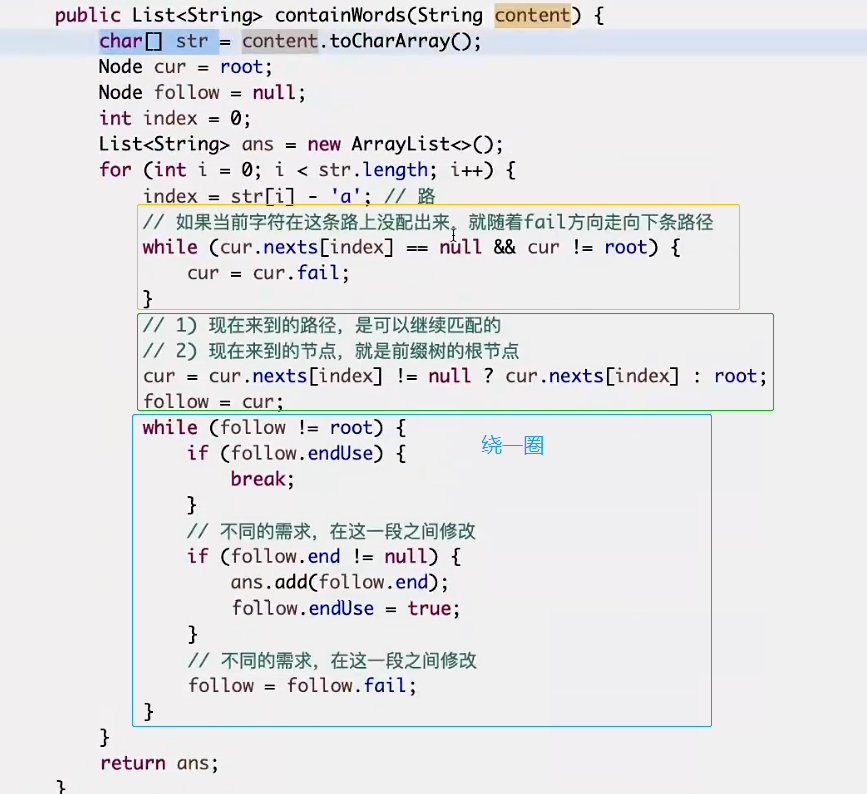

## AC自动机

KMP是indexOf方法，求字符串str1的子串str2的起始位置。

AC自动机是，有多个模式串，求出模式串的起始位置。

例如 可以匹配文章中的多个敏感词
## 方法

- 敏感词先用前缀树构建。
- **宽度优先遍历**连接fail指针

## fail指针连接方法

- 认为规定头节点->null
- 第一层节点->头节点
- 第二层开始宽度优先遍历
- **父节点走向当前节点**的字母记作A，若父节点的fail有指向A的路径，则fail指向该节点；否则，找父节点的fail节点，直到null

## 匹配敏感词步骤


## 实现


```go
type Node struct {
    isWord bool //是否是结尾
    word string //如果是结尾，记录单词

    used bool   //是否被使用过
    next [26]*Node
    fail *Node  //失败指针
}
```

### 敏感词组建树

类似前缀树

### 宽度优先遍历连接fail指针

在父亲节点出队列的时候，就设置子节点的fail指针（因为子节点不好找父）


### 查找单词

**遍历的每一步，都需要顺着fail指针走一遍！！！**跳到fail，同样也需要绕一圈

