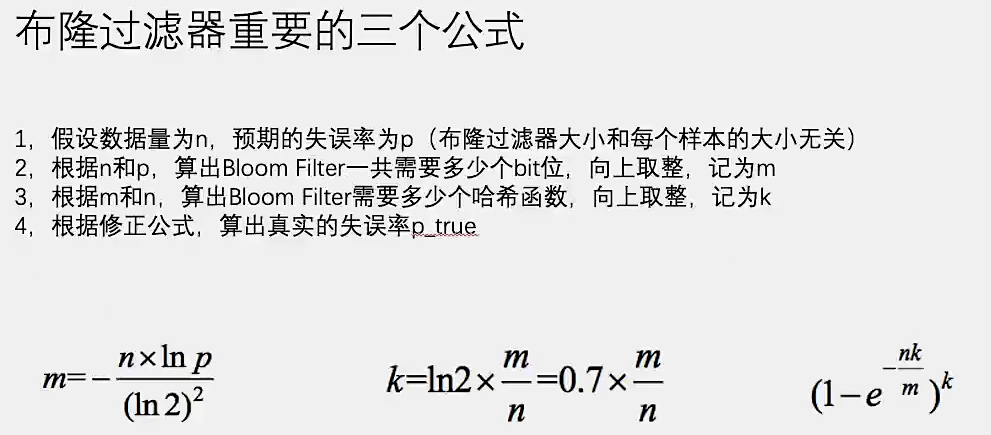
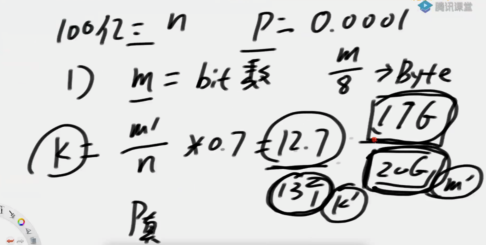
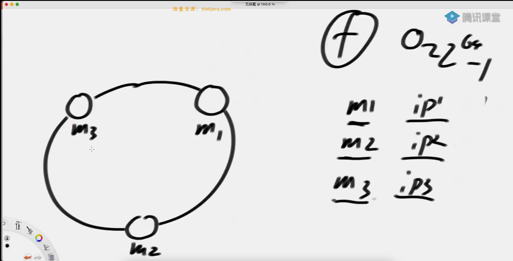
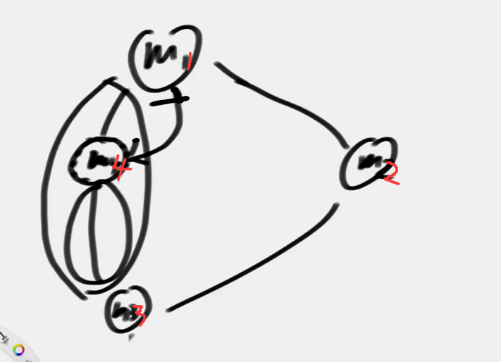

## 哈希函数

## 布隆过滤器

假设有黑名单的大集合，查询url是否在黑名单中。

哈希表中存的话，空间复杂度会高

布隆过滤器一定有失误率！

原理：

- 申请一个M bits的位图
- **每个黑名单的str**都通过N个哈希函数，得到的结果mod M，对应位置标记为1
- 得到过滤器的位图！
- 匹配时对str0通过N个哈希函数，得到标记都为1则在黑名单，有一个为0，则不在黑名单

### 影响M的因素

- 样本量
- 失误率
- **（和单样本大小无关）**

m位图大小，k哈希函数个数，p失误率，n样本大小

k个哈希函数可以选用两个哈希函数f1和f2，进行线性组合：

f1 + f2
2 * f1 + f2
3 * f1 + f2
...

## 一致性哈希

分布式存储最常见的结构：
- 哈希域变成环的设计
- 虚拟节点技术

### 经典算法
经典的数据存储，key通过哈希函数，mod 存储机器数，将不同数据存到不同机器上。

hashkey的选取，高频、中频、低频应该都有分布。

缺点：
增加机器时，数据更新是全量的。

### 哈希环

将不同机器上环

将数据放到环上，归顺时针旋转遇到的第一个机器！

当新增环时，只需将m4、m3之间的数据给m4

### 存在的问题

(1)三台机器哈希值分布不均的问题，(2)增加机器后，分布不均的问题 (3)负载均衡，根据不同机器性能，调整虚拟节点比例

使用虚拟节点技术。

给m1、m2、m3分配1000个虚拟节点。虚拟节点上环！环会几乎均分。