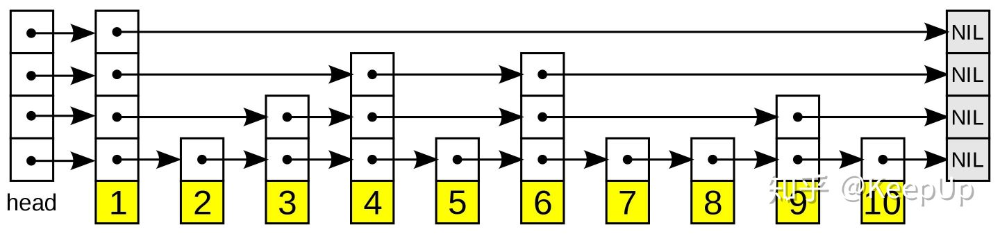
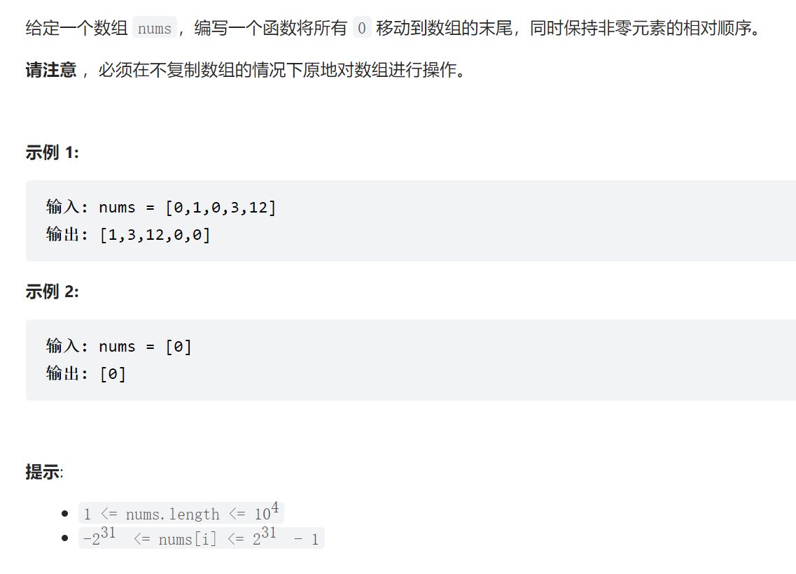
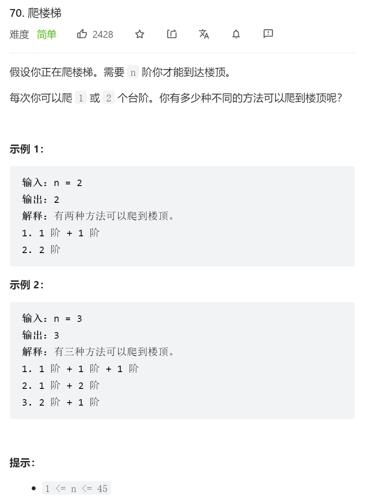
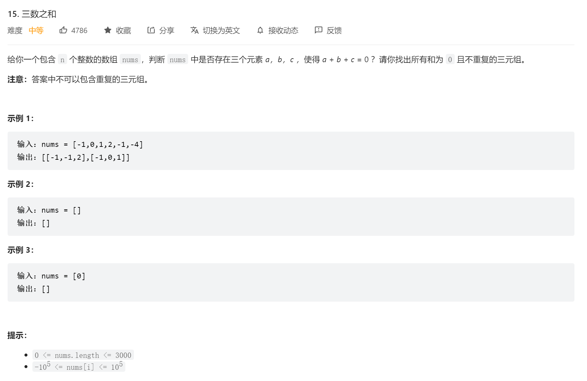
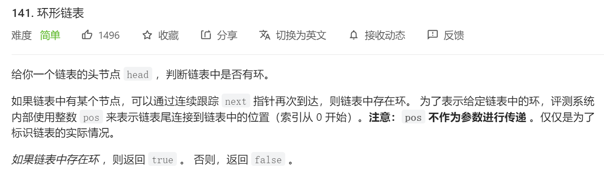

## 跳表
在链表的基础上，增加了多级(log2n)索引。

跳表查找、插入的时间复杂度为O(logn)

**跳表是通过引入随机函数，来避免退化成链表的！**，随机值为k，则将它插入到1到k级索引。

在redis中使用跳表，而不是RBT，实现简单、在并发环境下，更新跳表只需要局部更新，不需要锁住大量数据。
## 238.移动零

``` golang
func moveZeroes(nums []int)  {
    i, j := 0, 0
    for ;i<len(nums);++i{
        if nums[i]!=0{
            nums[j],nums[i] = nums[i],nums[j]
            ++j
        }
    }
}
```

## 70.爬楼梯

``` golang
func climbStairs(n int) int {
    f := make([]int, n+1)
    f[0], f[1] = 1, 1
    for i:=2; i<=n; i++{
        f[i] = f[i-1] + f[i-2]
    }
    return f[n]
}
```

## 15.**三数之和**


思路:
    - 排序
    - 第一层循环遍历c
    - 第二层用双指针遍历，且要满足 k < l < r 否则会重复，target=-c，二分搜索
    - 若相等或不等，都要跳过已经遍历过的数，防止重复
``` golang  
func threeSum(nums []int) [][]int {
    res := make([][]int, 0)
    if len(nums)<3{
        return res
    }
    sort.Ints(nums)
    
    for k:=0; k<len(nums); {
        target := -nums[k]
        l,r := k+1,len(nums)-1
        for l < r{
            if nums[l] + nums[r] < target{
                tmp := nums[l]
                for l<r && nums[l]==tmp{
                    l++
                }
            }else if nums[l] + nums[r] > target{
                tmp := nums[r]
                for l<r && nums[r]==tmp{
                    r--
                }
            }else{
                res = append(res, []int{nums[k], nums[l], nums[r]})
                tmp := nums[l]
                
                for l<r && nums[l]==tmp{
                    l++
                }
                tmp = nums[r]
                for l<r && nums[r]==tmp{
                    r--
                }
            }
        }
        tmp := nums[k]
        for k<len(nums) && nums[k]==tmp{
            k++
        }
    }
    return res
}
```

## 206.反转链表
``` golang
func reverseList(head *ListNode) *ListNode {
    p := head
    if p==nil {
        return head
    }
    q := p.Next
    p.Next = nil    //这里很重要，否则会有环！！！
    if q==nil{
        return head
    }
    r := q.Next
    for q!=nil{
        q.Next = p
        p = q
        q = r
        if r!=nil{
            r = r.Next
        }
    }
    return p
}
```

## 141.环形链表

如果要求环开始位置，可以在p==q后，让快指针q回到head，然后每次循环p、q都移动一步直至相遇。
``` golang
func hasCycle(head *ListNode) bool {
    if head==nil || head.Next==nil{
        return false
    }
    p,q := head, head.Next
    for q!=nil && q.Next!=nil{
        p = p.Next
        q = q.Next.Next
        if p==q{
            return true
        }
    }
    return false
}
```
``` golang
func detectCycle(head *ListNode) *ListNode {
    if head==nil || head.Next==nil{
        return nil
    }
    p,q := head, head   //这里必须是head和head！不然不会相遇！！！
    for q!=nil && q.Next!=nil{
        p = p.Next
        q = q.Next.Next
        if p==q{
            q = head
            for p!=q{
                q = q.Next
                p = p.Next
            }
            return p
        }
    }
    return nil
}
```