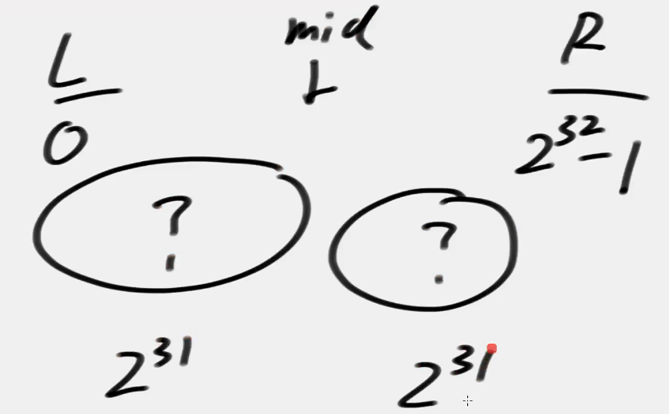

## 资源限制技巧汇总
1. 布隆过滤器用于集合的建立与查询，并可以节省大量空间
2. 一致性哈希解决数据服务器的负载管理问题
3. 利用并查集结构做岛问题的并行计算
4. 哈希函数可以把数据按照种类均匀分流
5. **位图**解决某一范围上数字的出现情况，并可以节省大量空间
6. 利用**分段统计**思想、并进一步节省大量空间
7. 利用堆、外排序来做多个处理单元的结果合并

## 题目一 

32位无符号整数的范围是0~4,294,967,295
现在有一个正好包含40亿个无符号整数的文件,可以使用最多1GB的内存，怎么找到出现次数最多的数?

1. 假设想法是排序，32位 = 4B，40亿个数 = 40亿 * 4B = 16GB，所以需要16GB的内存，远远超过了1GB的限制。

**(GB = 10亿B)**

2. 假设想法是哈希表，hash\[int\] int，一条8B，40亿个数 = 40亿 * 8B = 32GB，所以需要32GB的内存，远远超过了1GB的限制。

假设1G全拿来做哈希表，1G/8B = 125M ≈ 10^8, 一亿条数据，再退一步讲，只能存一千万条数据。

40亿/1千万 = 400。

对每个数hash，并mod 400，分为400个组。**（求hash是让其均匀分布到每个组里）**

依次对400个组求出现次数最多的数，再求这400个数中出现次数最多的数。

**总结：用哈希函数把大文件分成多个小文件，分到不同机器上算。**

## 题目二

32位无符号整数的范围是0~4,294,967,295
现在有一个正好包含40亿个无符号整数的文件,可以使用最多1GB的内存，**怎么找到所有没出现的数**?

使用位图，8bit占1B，使用2^32个bit = 2^29B = 512MB，所以可以使用1GB的内存。

采用int32的数组存，每个int32有32个bit，所以数组长度为2^32/32 = 2^28。
提取时，(arr[i/32]) & ( 1<<(i&0xFF) )) == 0 ? 0 : 1

### 【进阶】 内存限制为 3KB，但是只用找到一个没出现过的数即可

**分段统计** （512分）
- 计算int数组长度 3KB / 4B = 768
- 选512 < 768，因为可以被2整除
- arr\[512\], arr\[0\]统计 0~8388608的个数，arr\[1\]统计8388608+1~2*8388608的个数...
- 必然可以出现不满的范围，在小范围上也进行分组统计！

### 【进阶plus】变量限制为有限个变量

**二分分段统计**

## 题目三

有一个包含100亿个URL的大文件，假设每个URL占用64B, 请找出其中所有重复的URL

1. 布隆过滤器（有失误率）
2. hash分到小文件中，检测每个小文件中的重复

## 题目四

现在有40亿个无符号整数，可以使用最多1GB的内存，找出所有出现了两次的数。

2^32*2bit = 2^33bit = 2^30B = 1GB
用两位信息表示一个数，需要1G

## 题目五
现在有40亿个无符号整数，可以使用最多3K的内存，怎么找到这40亿个整数的中位数?

**分段统计** （512份）
统计每个范围出现的个数，找到中位数可能出现的区间（找第20亿个）

## 题目六
有一个10G大小的文件，每一行都装着这种类型的数字，整个文件是无序的，给你5G的内存空间，请你输出一个10G大小的文件，就是原文件所有数字排序的结果

**堆排**（也相当于分段统计）

- 创建一个大根堆，包含(num, count)
- 每次从文件中读一个数，与堆顶比较，若小于堆顶，则替换
- 一轮过后，输出到文件中，记录t = 堆顶，0~t则有序，之后再排t之后的数

## 总结

位图、分段统计、堆，可以相互组合优化！！！