## 从数据库说起

为什么可以建索引？

索引字段是可排序的，如任何字符串都可排序

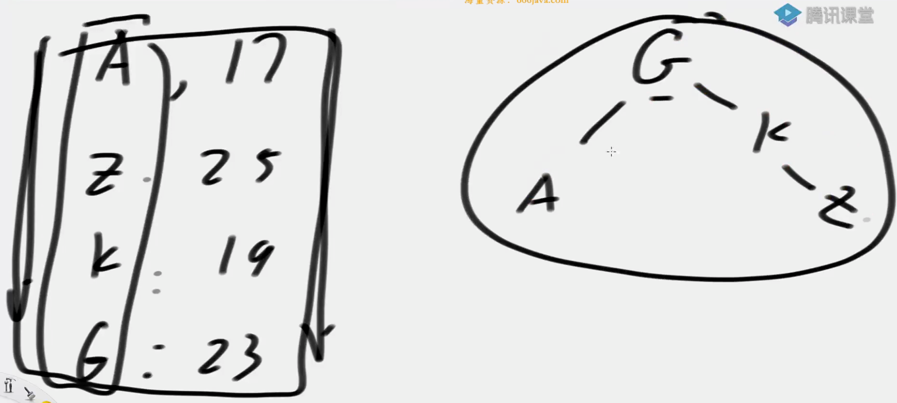

### 搜索二叉树

用搜索二叉树去建索引，弊端是复杂度依赖用户输入的顺序。**（不接受重复的key）**

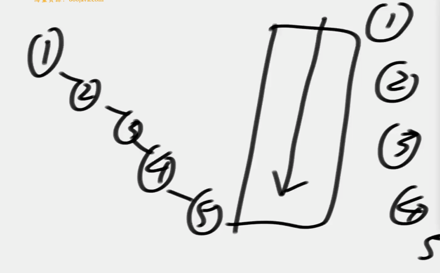

### 平衡搜索二叉树

左旋和右旋操作，让不平衡的树变平衡一点。

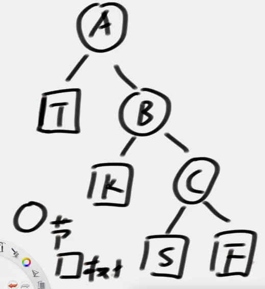

左旋操作，就是头节点左边倒，A左旋：
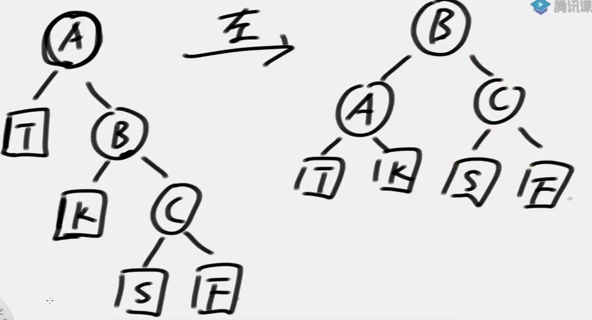

## AVL树(具有最严格的平衡性)
任何一个节点，左树和右树的高度差不超过1

本质上是带了平衡功能的搜索二叉树（二叉排序树）

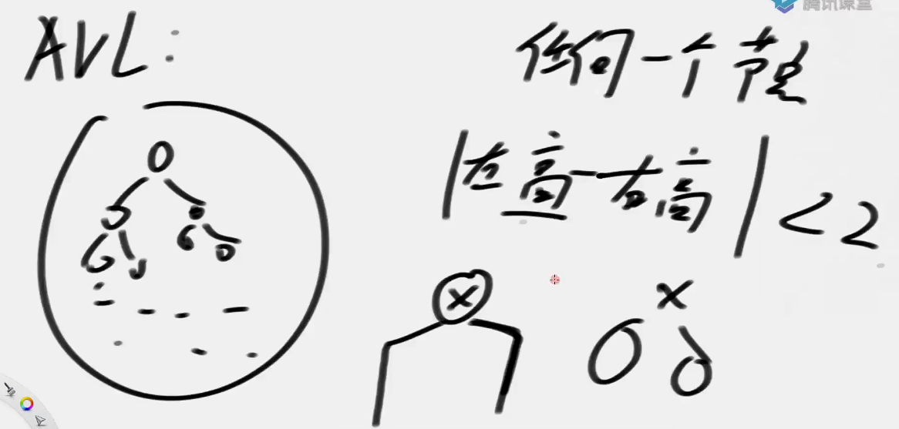

### 加入

### 删除

- 左右都无，直接删除
- 有左无右，用左树直接代替
- 有左有右（不容易）

假设X节点要被删除，X既有左，又有右。

- 拿右树最左边的节点Y，替换X节点。
- 然后删除节点Y（有右无左）

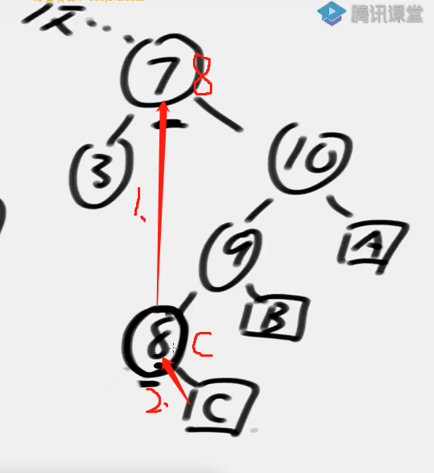

因为，Y是离X最近，且比X大的节点，不会破坏搜索性质。

### 平衡性调整

AVL树平衡性破坏情况：
- LL 右旋
- LR （孙来爷）左旋右旋
- RR 左旋
- RL 右旋左旋

LL
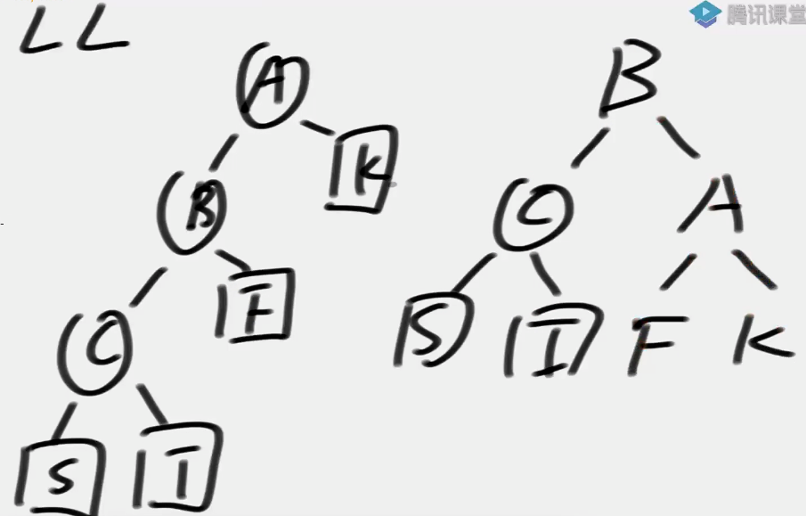

LR
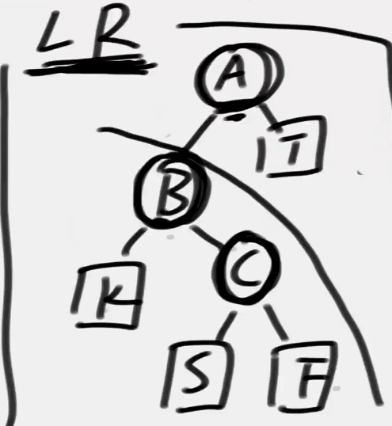
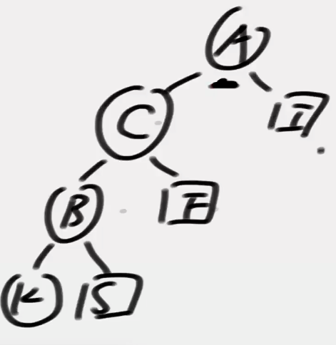
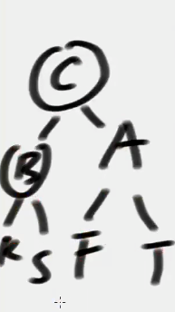  

**细节**
有可能既是LL，又是LR

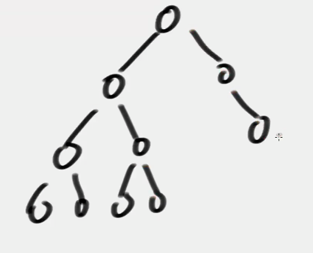

此时删除右树节点，左树同时出现LL和LR，**按照LL调整**即可。

### 调整时机
一次调整平衡性的复杂度O(1)

添加节点时，沿途的所有父节点都检查四种类型，所以总的复杂度O(logn)

删除节点时，若无左无右|左右只有一个，则沿途父节点都检查；**若左右都有，是拿后继节点（右树的最左侧节点）替换的，所以从后继节点查沿途所有的父节点。**

## SB树(Size Balanced Tree, SBT)

任何叔叔节点的子树大小，不小于任何侄子树。

例如 B>G , B>H
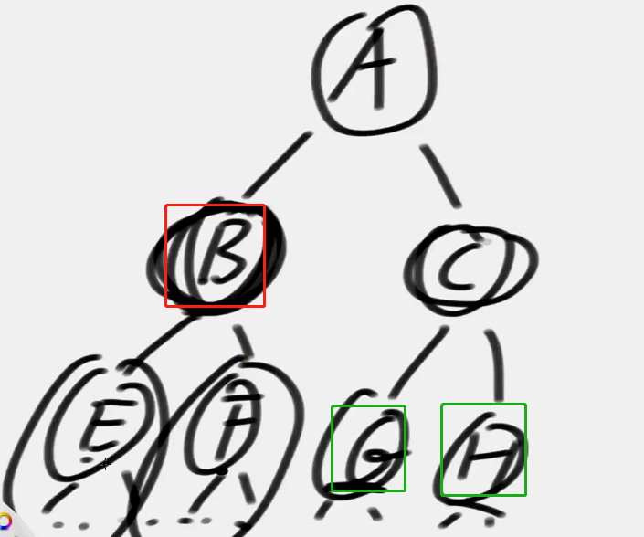

**因此多子树不会超过少子树的两倍以上**
### 平衡性调整

SB树平衡性破坏情况：
- LL 左儿子的左节点数 > 右儿子的总节点数
- LR 左儿子的右节点数 > 右儿子的总节点数
- RR 右儿子的右节点数 > 左儿子的总节点数
- RL 右儿子的左节点数 > 左儿子的总节点数

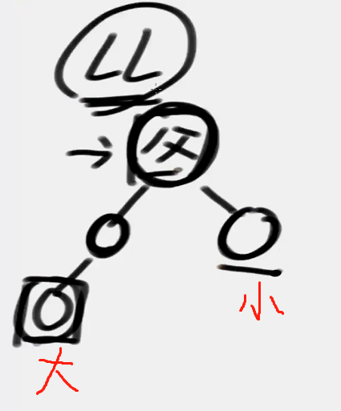
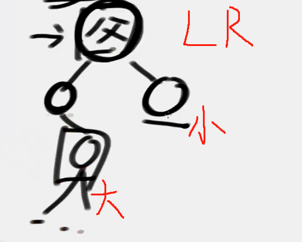

**调整过程类似AVL树，只不过需要递归调用调整函数。**

例如 LL
- 首先对父节点右旋
- 再获取左右孩子发生变化的节点！
- 对这些节点进行递归调整（图中父和A）
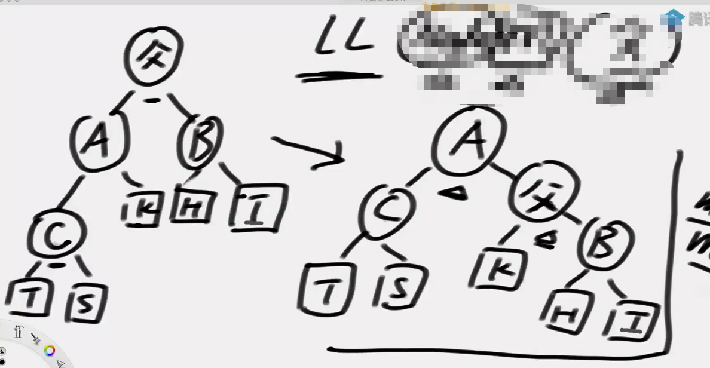

LR

- 先左旋、后右旋（类似AVL树）
- 再递归调用左右孩子变化的节点（A、B、D）
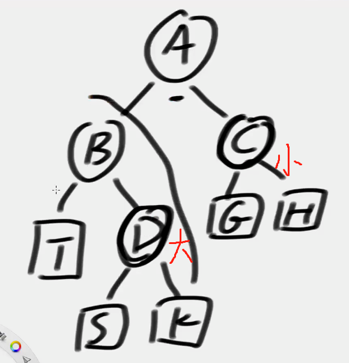
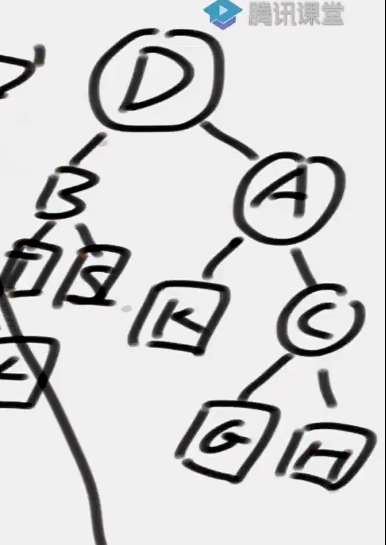
**为什么递归调用？**
- AVL树比较敏感，需要沿途所有父节点都检查
- SB树只需要局部的子树去调整，不会频繁去调整，只能保证左右两边两倍关系，不会出现左右两边差距很大的情况。
- SB树可以不用在删除的时候调整，只在添加的时候调整

复杂度：当前节点为n，曾经最大节点为N，O(log N)，（因为可能删除后没有添加，导致删除成了一个链表）
