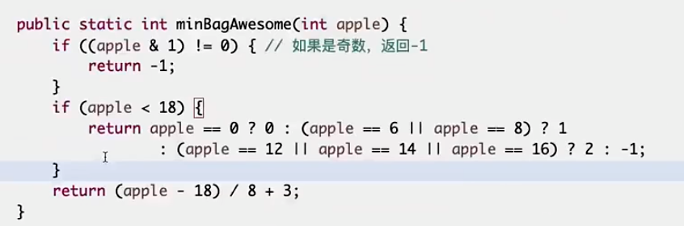

## 题目1
小虎去买苹果，商店只提供两种类型的塑料袋，每种类型都有任意数量。
- 能装下6个苹果的袋子
- 能装下8个苹果的袋子

小虎可以自由使用两种袋子来装苹果，但是小虎有强迫症，他要求自己使用的袋子数量必须最少，且使用的每个袋子必须装满。

给定一个正整数N，返回至少使用多少袋子。如果N无法让使用的每个袋子必须装满，返回-1

## 解答
先写出一段代码，之后根据代码找规律，发现1-17是无规律的hard code，之后18开始，每8个为一组。

O(1) 复杂度

## 题目2
给定一个正整数N，表示有N份青草统一堆放在仓库。
有一只牛和一只羊，牛先吃，羊后吃，它俩轮流吃草。

不管是牛还是羊，每一轮能吃的草量必须是1，4，16，64.(4的某次方)
谁最先把草吃完，谁获胜。
假设牛和羊都绝顶聪明，都想赢，都会做出理性的决定。
根据唯一的参数N，返回谁会赢

## 题目3

定义一种数:可以表示成若干(数量>1)连续正数和的数
比如:
5= 2+3， 5就是这样的数
12 = 3+4+5，12就是这样的数
1不是这样的数，因为要求数量大于1个、连续正数和
2= 1 + 1, 2也不是，因为等号右边不是连续正数
给定一个参数N，返回是不是可以表示成若干连续正数和的数

## 题目4

给定一个非负数组arr，和一个正数m。
返回arr的所有子序列中累加和 %m 之后的最大值。

### 假设arr长度不大，m很大

采用背包解法，dp\[i\]\[j\]，表示使用0-i，能否把刚好为j的数拼出来，复杂度O(i*j) = O(len(arr)*sum(arr))

### 假设arr长度不大，但是数值巨大

先mod后再转移，复杂度O(i*m) = O(len(arr)*m)

### arr巨大，m巨大，但是len(arr) 30以内

**分治法！！！特点：样本量很少！！！ 把左右切成两半！！！**

左部分15个数求mod，右部分15个数求mod，放到有序表内。

对左边每一个数，求最接近m-左的右边的数，log(2^15) = 15

整体时间复杂度O(2 ^ (len/2) * len/2)

## 总结

- 某个面试题，输入参数类型简单，并且只有一-个实际参数
- 要求的返回值类型也简单，并且只有一个
- 用暴力方法，把输入参数对应的返回值，打印出来看看，进而优化code

## 根据数据规模猜解法

- C/C++，1秒处理的指令条数为10的8次方
- Java等语言，1~4秒处理 的指令条数为10的8次方
- 这里就有大量的空间了!

一般来说1s的题，计算量不能超过1e8（10的8次方），否则就有超时的风险。

例如一个题有1e3的数据，那n^2不会超时，n^3就会超时。

1e6数据情况下，一般n^2超时，nlogn和O(n)都不会超时。