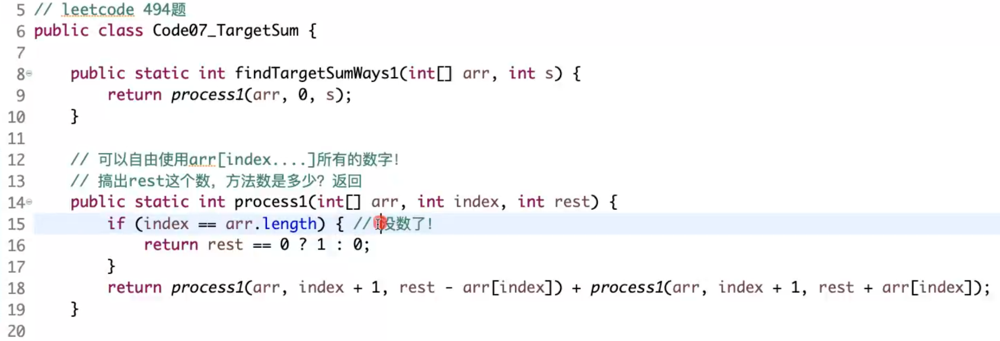

## 题目1
给定一个有序数组arr，代表坐落在X轴上的点，给定一个正数K，代表绳子的长度

返回绳子最多压中几个点? 即使绳子边缘处盖住点也算盖住。

- 滑动窗口（每次滑动的时候，滑动arr的数处就行，**不必要滑动1个单位！！！**）

## 题目2

给定一个文件目录的路径，写一个函数统计这个目录下所有的文件数量，并返回隐藏文件也算，但是文件夹不算

```go
func listAll(path string) int{
    //处理边界，判断path是否是一个文件
    s, err := os.Stat(path)  
    if err != nil {  
        return false  
    }  
    if !s.IsDir() {
        return 1
    }

    readerInfos ,err := ioutil.ReadDir(path)
    if err != nil {
        fmt.Println(err)
        return
    }
    count := 0
    for _, info := range readerInfos {
        if info.IsDir() {
            count = count + listAll(path + "\\" + info.Name())
        }else {
            count++
        }
    }
}
```

## 题目3
给定一个非负整数num，如何不用循环语句返回>=num，并且离num最近的，2的某次方

```go
func do(num int) int{
    num--

    num = num | num >> 1
    num = num | num >> 2
    num = num | num >> 4
    num = num | num >> 8
    num = num | num >> 16

    return num + 1
}
```

## 题目4
一个数组中只有两种字符G和B，想让所有的G都放在左侧，所有的B都放在右侧，但是只能在相邻字符之间进行交换操作返回至少需要交换几次

- i和l，同向指针扫，遇到则需要交换，交换后i++，l++，否则i++，l不变

## 题目7
给定一个数组arr，你可以在每个数字之前决定+或者但是必须所有数字都参与再给定一个数target，请问最后算出target的方法数是多少?



``` go
func findTargetSumWays(nums []int, t int) int {
    dp := make([][]int, len(nums)+1)
    sum := 0
    for i := range nums{
        sum = sum + nums[i]
    }
    if sum < t || sum < -t || subAbs(sum, t)%2!=0{
        return 0
    }

    for i:=0; i<len(dp); i++{
        dp[i] = make([]int, sum + 1) //0...sum
    }

    dp[0][0] = 1 //前i个数组成t的方法数有dp[i][t]种
    for i:=0; i<len(nums); i++{
        for j:=0; j<=sum; j++{
            //目标是j
            if subAbs(j, nums[i]) <= sum{
                dp[i+1][j] = dp[i][subAbs(j, nums[i])]  //注意这里nums是i！！！ 别越界了！
            }
            if subAbs(j, -nums[i]) <= sum{
                dp[i+1][j] = dp[i+1][j] + dp[i][subAbs(j, -nums[i])]  //别越界了！
            }
        }
    }
    return dp[len(nums)][subAbs(t, 0)]
}

func subAbs(a, b int) int {
    if a>b {
        return a-b
    }
    return b-a
}

```

### 天啦噜！

- 优化点1：arr可以全部弄成正数，符号不影响最终结果数
- 优化点2：target > sum 不可能有答案
- **优化点3：target和sum奇偶性相同！！！**
- **优化点4：P = (target + sum)/2** target和sum是定值！任选P，只要sum(P)是定值即可！
- 优化点5：空间压缩，滚动数组

原有规模，dp\[index\]\[-sum, sum\]，变为dp\[index\]\[0, sum\]

## 题目五 329. 矩阵中的最长递增路径
给定一个 m x n 整数矩阵 matrix ，找出其中 最长递增路径 的长度。

对于每个单元格，你可以往上，下，左，右四个方向移动。 你不能在对角线方向上移动或移动到边界外（即不允许环绕）。

```go
type point struct{
    I int
    J int
}
var move [4]point = [4]point{{-1, 0}, {1, 0}, {0, -1}, {0, 1}}
func longestIncreasingPath(matrix [][]int) int {
    // 因为是严格递增序列，所以肯定不会走重复的路！
    cache := make([][]int, len(matrix))
    for i := range cache{
        cache[i] = make([]int, len(matrix[0]))
        for j:= range cache[i]{
            cache[i][j] = -1
        }
    }

    // -1 是未初始化
    ans := 0
    for i:= range matrix{
        for j:= range matrix[i]{
            t := dfs(matrix, i, j, cache, -1)
            if t > ans{
                ans = t
            }
        }
    }
    return ans

}
func dfs(matrix [][]int, i, j int, cache [][]int, cur int) int {
    if i<0 || i>= len(matrix) || j<0 || j>=len(matrix[0]) || matrix[i][j] <= cur{
        return 0
    }
    if cache[i][j] != -1{
        return cache[i][j]
    }
    ans := 0
    for _, m := range move{
        ii := i+m.I
        jj := j+m.J
        t := dfs(matrix, ii, jj, cache, matrix[i][j]) //这里忘记 + 1
        if t > ans{
            ans = t
        }
    }
    cache[i][j] = ans + 1
    return ans + 1
}
```

- 优化点1：因为是严格递增序列，所以肯定不会走重复的路！所以才可以用记忆化搜索
- 注意点：ans默认值是1，最少有1个长度！！！！

## 题目六 

给定两个非负数组x和hp，长度都是N，再给定一个正数range

x有序，x\[i\]表示i号怪兽在x轴上的位置; hp表示i号怪兽的血量; range表示法师如果站在x位置，用AOE技能打到的范围是[x-range,x+range]，被打到的每只怪兽损失1点血量

返回要把所有怪兽血量清空，至少需要释放多少次AOE技能?

- 贪心的部分：每次AOE可以选择覆盖最左侧的怪物
**- 优化：使用线段树优化，每次更新可以用O(logN)，总复杂度O(NlogN)**