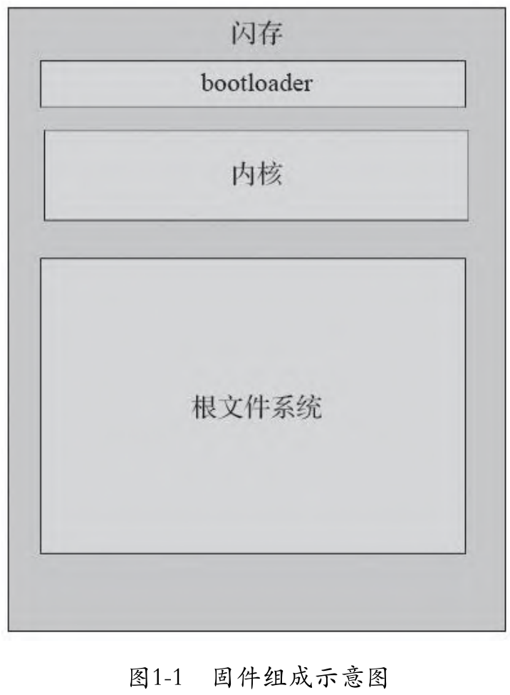

# 固件入门

## 渗透测试方法

1.  黑盒测试

​		黑盒测试是在不了解设备所采用的技术原理或实现方式的情况下进行的测试。由于黑盒测试成本相对较低，因此黑盒测试是最为常见的测试方法。通常情况下，安全研究人员或第三方咨询公司都会采用黑盒测试方法，内部安全团队也会采用该方法进行风险评估。

2. 白盒测试

​		如果测试人员能向够接触到源代码、网络拓扑图、架构图、数据流图以及其他目标设备所采用技术的详细信息，那么此时开展的测试即白盒测试。
通常来说，预先能够向测试人员提供的目标设备或应用的信息越多，测试效果就会越好。白盒测试的成本相对较高，但能够确保对设备的安全控制措施及其实现情况进行更加全面、彻底的筛查。

3. 灰盒测试

​		相对于被测机构内部人员而言，如果测试人员对被测系统的了解有限，仅能获取到被测系统的部分信息，那么此时所开展的测试即灰盒测试。在灰盒测试过程中，测试人员通常只知道所用到的应用程序.栈和库文件，但是没有关于API的详细文档。

## 固件简介

​		固件是一种写入硬件设备的软件，作用是对应用和各项系统功能实施控制。固件中包含底层代码，这些代码能够帮助软件实现对硬件的操作。运行固件的设备称为嵌入式系统，嵌入式系统的硬件资源在存储能力以及内存等方面往往具有诸多限制。举例来说，智能手机、 交通信号灯、车联网汽车、某些类型的专用计算机、无人机和有线机顶盒都是运行固件的嵌入式设备。

​		嵌入式技术及运行在嵌入式设备之上的固件控制着我们的日常生活。固件通常由bootloader、内核、文件系统以及其他资源组成。根据嵌入式Linux、嵌入式Windows、Windows IoT内核以及各种实时操作系统(Real Time Operating System, RTOS)的区别，固件也有多种类型。

### bootloader

​		bootloader的作用主要包括 RAM初始化（目的是存储易失性数据）、串口初始化、机器类型检测、内核参数链表（kernel tagged list）设置、initramfs（基于RAM的初始文件系统）加载以及内核镜像调用等。bootloader通过板级支持包（Board Support Package，BSP）初始化硬件驱动，其中板级支持包通常由第三方厂商开发。可以将bootloader存储在单独的电可擦除可编程只读存储器（Electrically Erasable Programmable Read-Only Memory，EEPROM）中，但这种情况一般不太常见，更为常见的形式是直接将bootloader写入闪存存储器。从某种程度上说，我们可以将bootloader看作启动PC时的BIOS。ARM、MIPS架构中部分常见的bootloader包括：Redboot、u-boot以及barebox等。当bootloader启动内核之后，文件系统就完成了加载。

### 文件系统

​		固件可以采用的文件系统类型有很多，有时根据设备的区别也会采用某些专有文件类型。部分较为常见的文件系统类型包括SquashFS、cramFS、JFFS2、YAFFS2以及ext2等。其中设备（尤其是消费级电子设备）最常采用的文件系统是SquashFS。可以使用unsquashfs工具从SquashFS中提取数据。

​		同时，非标准的SquashFS文件系统时的偏移量会有所区别，偏移的定位与识别也是一个值得研究的方向。

### 固件镜像

​		固件镜像也可以采用LZMA、.gzip、.zip、.zlip、.arj等多种文件压缩类型。每种文件类型在压缩后的文件尺寸、压缩时间、解压时间以及设备自身的业务需求等方面都各有擅长。从渗透测试的角度出发，我们可以把文件系统看作存储配置文件、服务、账户口令、散列值、应用程序代码以及启动脚本的地方。如何查找设备中的文件系统，以及如何确定其采用的压缩方式也同样值得研究。

## IoT无线通信简介

​		同IoT设备建立连接并与其进行交互的最常见方式是采用无线射频( Radio Frequ-ency， RF)通信方式。目前市场上有许多不同的无线频率、调制模块和协议，其中既有专有无线协议，也有标准协议。

​		无线技术与无线通信设备的一个优势在于能够实现设备的远程控制。当通过无线通信方法对设备开展漏洞利用时也正是利用了这一点。因此，了解每种无线技术所能达到的最远通信距离对实际测试而言非常重要。有的无线协议支持105英尺(约32米)远的距离，而有的可能只支持20厘米远，差别非常大。在IoT生态系统.的众多无线协议中，最常用的协议主要包括Wi-Fi (802. 11)、ZigBee (802. 15.4)、Z-Wave、蓝牙(802. 15. 1)和低功耗蓝牙等。

### WiFi

​		多年以来，Wi-Fi一直是众多设备最常采用的无线技术，其通常使用2.4GHz或5GHz ISM频段。 同时也提出了多套Wi-Fi协议标准，例如802.1la、802. 11b、802. 11g、802. 11n和802. 11ac等。其中802. 11b和802.11g协议使用2.4GHz频段，802. lla、802. 11n和802. llac协议使用5GHz频段。2. 4GHz频段根据不同频率又分为14个无线子信道。在部分地区，Wi-Fi 路由器还必须采用特定的广播信道。

### ZigBee

​		ZigBee是基于IEEE 802. 15. 4协议为物理层和媒体接入控制层实现的规范，支持低功耗无线Mesh网络。不同地区的ZigBee协议使用不同的ISM频段，ZigBee网络由协调器(ZigBee Coordinator, ZC)、路由器(ZigBee Router，ZR) 和终端节点(ZigBee End Device, ZED)组成。建立ZigBee网络时协调器自动启动进行组网。每个网络只允许有一个协调器，它是整个网络的信任中心，负责对入网节点的认证与验证，并且拥有唯一的入网密钥。路由器主要负责在各节点之间传送数据，并将协调器与终端节点连接起来。

​		为了确保报文在网络中的正确传递，路由器需要一直处于工作状态。终端节点就是IoT设备，例如电灯开关、传感器、摄像头或者监控设备。终端节点不能在网络中路由数据，在没有数据传输的情况下会以低功率模式休眠。

​		ZigBee网络基于两个安全密钥，即网络密钥和链路密钥。网络密钥是网络中所有设备共享的128位密钥，主要用于确保传输通信的安全。链路密钥是只在相互通信的两个设备之间共享的128位密钥，主要用于确保ZigBee应用层单播通信的安全。链路密钥可以预先分配给设备或通过密钥交换进行分发。但是在ZigBee网络中，已知设备配对过程中的密钥交换存在漏洞，攻击者能够利用该漏洞嗅探网络密钥交换过程，进而影响整个网络的安全。

### Z-Wave

​		Z-Wave是另-种低功耗无线通信协议，该协议支持主从模型的Mesh网络。基于Z-Wave协议实现的物理层和媒体接入控制层经ITU认可成为国际标准G.9959。采用Z-Wave协议的设备最远通信距离能够达到100米，但在Mesh网络中，当流量通过Z-Wave设备时最远距离能够达到200米。

​		Z-Wave网络采用4字节(32比特)的Home ID进行标识，该标识也是控制器或主节点的唯一标识。每个节点加入网络时，控制器会为其分配1字节(8比特)的Node ID。 Home ID不同的节点间不能通信。Z-Wave协议可以采用AES加密算法，这也是Z-Wave Hub所支持的加密算法，但是到底是否实现对于厂商而言是可选的。Z -Wave协议还具有良好的信号干扰检测特性，能够防止拒绝服务(Denial of Service, DoS)攻击。

### 蓝牙

​		蓝牙是一种常用的短距离数据通信的无线技术标准(IEEE802.15.1)。蓝牙在2.4GHz~2.485GHz频段进行广播，最远通信距离可以达到100米，但常用于10米以内的通信。由于大量IoT设备采用蓝牙作为主要通信手段，对蓝牙和低能耗蓝牙(Bluetooth Low Energy，BLE) 的渗透测试技术进行学习是很有必要的。

## IoT渗透环境部署

​		IoT渗透环境包括软件、硬件、无线电分析工具，其中软件包括固件、Web应用、移动应用测试工具；

### 固件分析工具

- binwalk
- firmadyne
- firmwalker
- Angr
- firmware-mod-toolkit
- firmware analysis toolkit
- gdb
- radare2
- binary analysis tool
- qemu
- IDA Pro

### Web渗透测试工具

- Burp Suite
- OWASP Zed Attack Proxy
- REST easy firefox plugin
- postman chrome extension

### 移动渗透工具

Android

- 安卓虚拟机Android Emulater
- enjarify
- JD-Gui
- mob-sf
- SQLite Browser
- Burp Suite
- OWASP ZAP

IOS

​		需要MAC OS系统电脑和已越狱手机

- idb
- Xcode Tools
- Class-Dump
- hopper
- mob-SF

- SQLite Browser
- Burp Suite
- OWASP ZAP

​		手机需要安装

- Cydia
- openURL
- dumpdecrypted
- ipainstaller
- SSL kill switch 2
- clutch2
- cycript

### 硬件分析工具和软件

- 万用表
- bus pirate
- USB转串口、JTAG接口转换器
- OpenOCD
- Spiflash
- Minicom
- Baudrate

### 无线电分析工具和软件

- Atmel RZ Raven USB设备(KillerBee框架)
- Attify badge
- HackRF one
- Yardstick one
- Ubertooth
- BLe适配器

- KillerBee
- Attify ZigBee
- Blue Hydra
- GQRX

……
