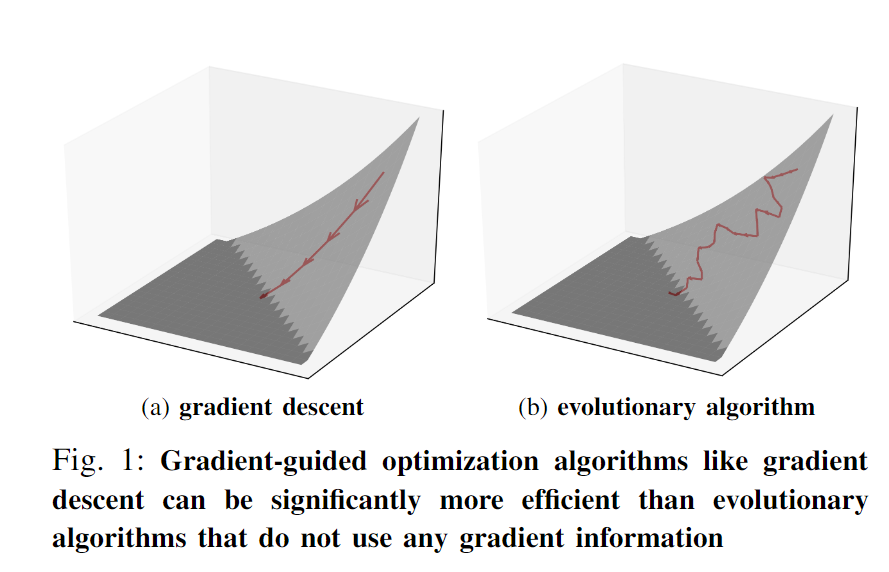
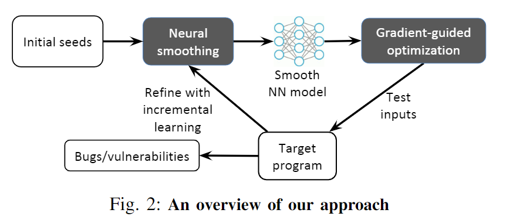
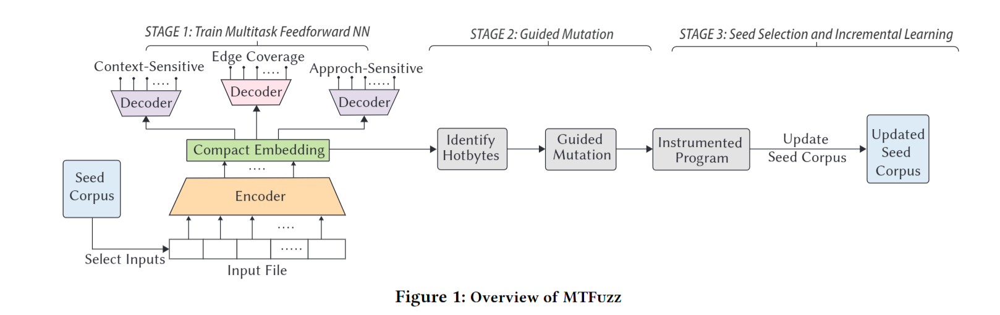
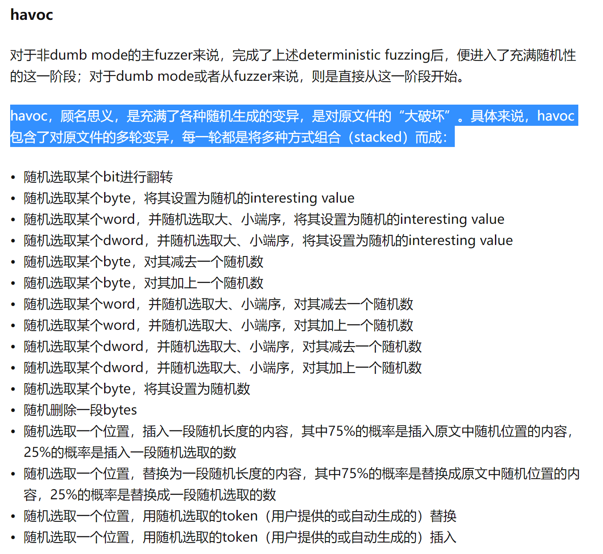

# 硬件调研

+++++ **详情**

## QNX支持的硬件
[支持的硬件列表](https://blackberry.qnx.com/en/developers/board-support-packages)

### 树莓派

### 瑞萨Renesas
[板子汇总](https://www.renesas.com/us/en/products/automotive-products/automotive-system-chips-socs#parametric_options)

### NXP
[板子汇总](https://www.nxp.com/design/development-boards:EVDEBRDSSYS)

+++++

# Deep Learning
+++++ **详情**
## NEUZZ: Efficient Fuzzing with Neural Program Smoothing
+++ **详情**
### 作者首页：https://www.cs.columbia.edu/~dongdong/publication/
问题：
梯度引导优化不适用于包含许多不连续、极值点的模糊测试。

解决：
使用代理神经网络，程序平滑技术，学习平滑近似。并且和梯度引导的输入生成方案一起使用。

+++

# 基于机器学习的Fuzzing

一个Fuzzing测试程序包括**测试用例生成**、**种子调度**、**测试执行**、**目标状态检测**和**结果分析**几个阶段。

## MTFuzz: Fuzzing with a Multi-Task Neural Network
+++ **详情**

问题：
现有的基于ML的模糊器由于训练数据缺乏质量和多样性而受到限制。由于目标程序的输入空间是高维和稀疏的，为了训练模型，收集许多不同的样本来证明成功和失败的突变是令人望而却步的。

解决：
我们通过使用多任务神经网络来解决这些问题，该网络可以基于多个相关任务的不同训练样本来学习输入空间的紧凑嵌入(即预测不同类型的覆盖)。紧凑嵌入可以通过将大部分突变集中在嵌入的梯度较高的部分来有效地指导突变过程。

为了共同学习输入的紧凑嵌入表示，我们使用不同的任务来预测程序输入与模糊相关程序行为的不同方面(例如，不同类型的边缘覆盖)之间的关系。
这样的架构既解决了数据稀疏性问题，又解决了多样性不足的问题。该模型可以同时从不同任务的不同程序行为中学习，也可以专注于学习所有任务中的重要功能(在我们的例子中是热字节)。

学习三种代码覆盖度量
- 边缘覆盖：测试输入探索了哪些边缘 [64、76]？
- 接近敏感的边缘覆盖：如果没有探索边缘，它离被触发有多远（即接近水平）[5,47,48,55]
- 上下文敏感的边缘覆盖：从哪个调用上下文中，探索的边缘被称为 [20 , 72 ]
(from which call context an explored edge is called)

call_stack = call_id1 xor call_id2 xor ...

请注意，我们的主要任务，就像大多数流行的模糊器一样，仍然是生成可以增加边缘覆盖率的突变体。
+++

## Evaluating and Improving Neural Program-Smoothing-based Fuzzing
+++ **详情**
问题：
Neuzz和MTFuzz只在有限数据集评估，其边缘覆盖性能是不稳定。
还不清楚它们的关键技术组成部分以及其他因素是否会影响模糊性能。

解决：
构建了一个包含28个流行开源项目的大规模基准测试套件
PreFuzz使用资源高效的边缘选择机制来增强其梯度引导，并使用概率字节选择机制进一步提高突变有效性。
+++

## One Fuzzing Strategy to Rule Them All
+++ **详情**
问题：
提升边缘覆盖率

解决：
将Havoc突变策略建模为一个多臂老虎机问题，提出Havoc_MAB，通过动态调整突变策略来解决

原始的Havoc

+++

+++++

+++++ **想法**

+++ **生成 + havoc变异 + 多度量**

+++

+++ **平滑近似 + 多度量** 

+++
+++++