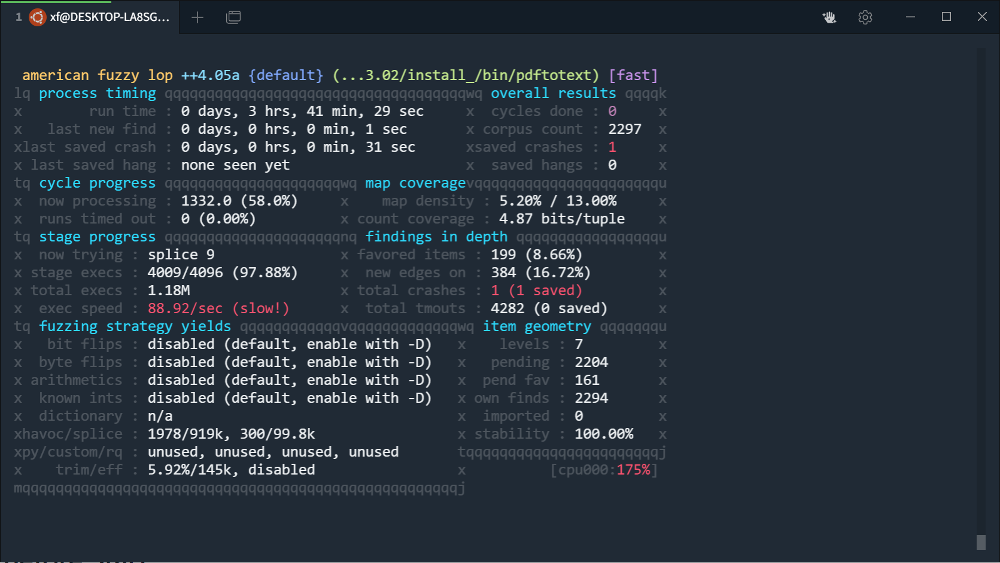
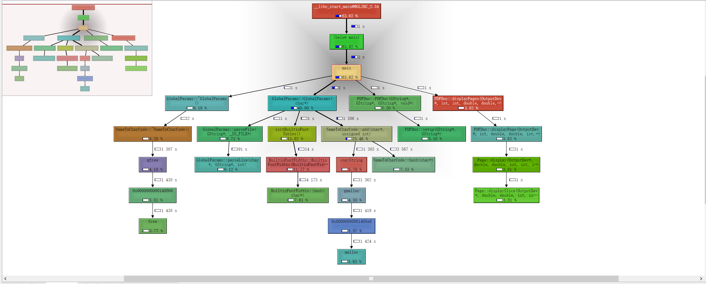
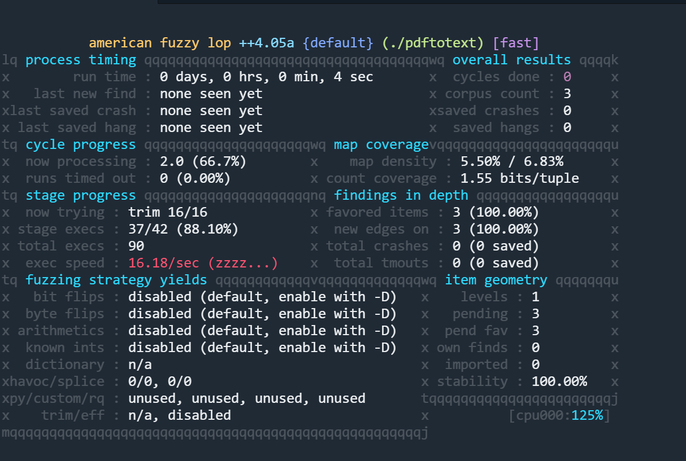
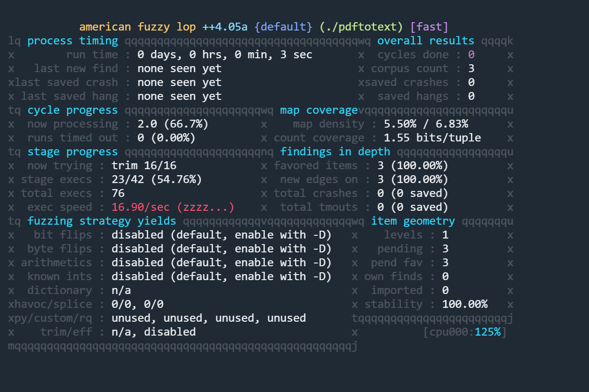

## 创建afl++环境

使用wsl+docker

image: `aflplusplus/aflplusplus`

``` bash
docker run -itd --name=aflpp -v /mnt/c/Users/xf/afl:/src aflplusplus/aflplusplus /bin/bash

docker exec -it aflpp /bin/bash
```
每次启动时，先启动docker desktop，再启动wsl。如果没能识别docker环境，可以restart一次。

## Exercise 1 - Xpdf
环境准备
``` bash
cd /src
mkdir fuzzing_xpdf && cd fuzzing_xpdf/
apt install build-essential
```

编译xpdf 3.02

之前直接使用网站提供的二级制，会导致缺so，所以需要自己手动去编译一下
``` bash
wget https://dl.xpdfreader.com/old/xpdf-3.02.tar.gz
tar -xvzf xpdf-3.02.tar.gz
cd xpdf-3.02
apt update && apt install -y build-essential gcc
./configure --prefix="$(pwd)/install_"
make
make install
```

准备输入样本
``` bash
cd /src/fuzzing_xpdf
mkdir pdf_examples && cd pdf_examples
wget https://github.com/mozilla/pdf.js-sample-files/raw/master/helloworld.pdf
wget http://www.africau.edu/images/default/sample.pdf
wget https://www.melbpc.org.au/wp-content/uploads/2017/10/small-example-pdf-file.pdf
```

网络遇到问题需要设置代理时，需要设置：
- http_proxy环境变量
- git的http.proxy配置
- wget -e设置环境变量。

**另外要注意，windows可以直接通过localhost访问wsl的端口；但是wsl需要知道windows虚拟网卡的ip才能访问。**

测试编译
``` bash
./xpdf-3.02/install_/bin/pdftotext ./pdf_examples/helloworld.pdf output
cat output
```

重新使用afl-clang-fast编译
``` bash
CC=afl-clang-fast CXX=afl-clang-fast++ ./configure --prefix="$(pwd)/install/"
make
make install
```
执行模糊测试
``` bash
afl-fuzz -i ./pdf_examples/ -o out -s 123 -- ./xpdf-3.02/install_/bin/pdftotext @@ output
```



## Persistent fuzzing
AFL持久模式基于进程内模糊器:模糊器利用单个进程，将代码注入目标进程并更改内存中的输入值。

持久模式要求可以在一个或多个函数中调用目标，并且它的状态可以完全重置，以便在不泄漏资源的情况下执行多个调用，并且早期的运行不会对未来的运行产生影响。

Persistent Mode在有源码时，需要插入代码

``` cpp
#include "what_you_need_for_your_target.h"
__AFL_FUZZ_INIT();
main() {
#ifdef __AFL_HAVE_MANUAL_CONTROL
  __AFL_INIT();
#endif
  unsigned char *buf = __AFL_FUZZ_TESTCASE_BUF;  // must be after __AFL_INIT
                                                 // and before __AFL_LOOP!
  while (__AFL_LOOP(10000)) {
    int len = __AFL_FUZZ_TESTCASE_LEN;  // don't use the macro directly in a
                                        // call!
    if (len < 8) continue;  // check for a required/useful minimum input length
    /* Setup function call, e.g. struct target *tmp = libtarget_init() */
    target_function(buf, len);
    /* Reset state. e.g. libtarget_free(tmp) */
  }
  return 0;
}
```
- #ifdef __AFL_HAVE_MANUAL_CONTROL 判断一下，可以使得正常编译器不报错

- __AFL_FUZZ_TESTCASE_BUF 使用的是共享内存fuzzing

- while (__AFL_LOOP(10000))使用的是Persistent mode


### 二进制Persistent fuzzing
**但是，在只有二进制的情况下，因为不能修改源码，需要执行的是另外的操作。**

[参考文档](https://github.com/AFLplusplus/AFLplusplus/blob/stable/qemu_mode/README.persistent.md)

(Qemu 持久模式目前只适用于x86/x86_64、arm和aarch64目标)

- 设置起始地址AFL_QEMU_PERSISTENT_ADDR，一般设置为某个函数的入口处。

- 设置RET地址，默认情况下可以不需要，AFL_QEMU_PERSISTENT_RET

- OFFSET 没细究，arm不支持

- 重置寄存器状态 AFL_QEMU_PERSISTENT_GPR=1

- 循环次数 AFL_QEMU_PERSISTENT_CNT 默认1000

- A hook for in-memory fuzzing 需要修改源码，[具体例子](https://github.com/AFLplusplus/AFLplusplus/blob/stable/utils/qemu_persistent_hook)

在找AFL_QEMU_PERSISTENT_ADDR时，可以借助工具valgrind
安装
``` bash
apt-get install valgrind
```
使用
``` bash
valgrind --tool=callgrind target
```
会在目录下生成`callgrind.out`文件，

然后使用kcachegrind可视化的分析输出文件，因为linux上要安装Qt所以直接在windows跑。


I recommend you to look at the count field in kcachegrind to identify functions that only get executed 1 time, and to try to achieve a stability score over 90% in afl-fuzz.

**pdfinfo 需要设置AFL_NO_FORKSRV=1**

没开persistent mode
``` bash
AFL_NO_FORKSRV=1 afl-fuzz -Q -m none -i ./pdf_examples/ -o out_qemu -- ./pdftotext @@ output
```



开启persistent mode
``` bash
AFL_QEMU_PERSISTENT_GPR=1 AFL_QEMU_PERSISTENT_ADDR=0x3ACC0 AFL_NO_FORKSRV=1 afl-fuzz -Q -m none -i ./pdf_examples/ -o out_qemu -- ./pdftotext @@ output
```


结论： 几乎没区别，可能是因为AFL_NO_FORKSRV=1关掉的原因


## uEmu
launch-AFL.sh

``` bash
FIRMWARE="./uEmu-real_world_firmware/P2IM.Gateway.elf"
FUZZ_IN="AFL/./uEmu-real_world_firmware/P2IM.Gateway.elf_fuzz_in"
FUZZ_OUT="AFL/./uEmu-real_world_firmware/P2IM.Gateway.elf_fuzz_out"
SEED_FILE="testcase"
if [ ! -d $FUZZ_IN ];then
        mkdir -p $FUZZ_IN
        cp -i $SEED_FILE $FUZZ_IN
fi


if [ ! -d $FUZZ_OUT ];then
        mkdir -p $FUZZ_OUT
else
        echo "You need to rm $FUZZ_OUT first"
fi
        afl-fuzz -i $FUZZ_IN -o $FUZZ_OUT -t 100000 uEmu
```

afl-fuzz -i P2IM.Gateway.elf_fuzz_in -o P2IM.Gateway.elf_fuzz_out -t 100000 **uEmu**
这个uEmu

launch-uEmu.sh
``` bash
#!/bin/bash
#
# This file was automatically generated by s2e-env at 2022-09-14 02:06:15.422056
#
# This script is used to run the S2E analysis. Additional QEMU command line
# arguments can be passed to this script at run time.
#

uEmu_DIR="/root/uemu"
BUILD_DIR="$uEmu_DIR/build"
BUILD=release
INSTALL_DIR="$BUILD_DIR/libs2e-$BUILD/arm-s2e-softmmu"
FIRMWARE="./uEmu-real_world_firmware/P2IM.Gateway.elf"

# Comment this out to enable QEMU GUI
GRAPHICS=-nographic

if [ "x$1" = "xdebug" ]; then
  DEBUG=1
  shift
elif [ $1 ]; then
  echo "wrong parameter!"
  exit 8
fi

export S2E_CONFIG=uEmu-config.lua
export S2E_SHARED_DIR=$INSTALL_DIR
export S2E_MAX_PROCESSES=1
export S2E_UNBUFFERED_STREAM=1

if [ $S2E_MAX_PROCESSES -gt 1 ]; then
    # Multi-threaded mode does not support graphics output, so we override
    # whatever settings were there before.
    export GRAPHICS=-nographic
fi

if [ "x$DEBUG" != "x" ]; then

    if [ ! -d "$BUILD_DIR/qemu-$BUILD" ]; then
        echo "No debug build found in $BUILD_DIR/qemu-$BUILD. Please run \`\`uEmu build -g\`\`"
        exit 1
    fi

    QEMU="$BUILD_DIR/qemu-$BUILD/arm-softmmu/qemu-system-arm"
        QEMU_MEMORY="2M"
    LIBS2E="$BUILD_DIR/libs2e-$BUILD/arm-s2e-softmmu/libs2e.so"

    rm -f gdb.ini

    echo handle SIGUSR1 noprint >> gdb.ini
    echo handle SIGUSR2 noprint >> gdb.ini
    echo set disassembly-flavor intel >> gdb.ini
    echo set print pretty on >> gdb.ini
    echo set environment S2E_CONFIG=$S2E_CONFIG >> gdb.ini
    echo set environment S2E_SHARED_DIR=$S2E_SHARED_DIR >> gdb.ini
    echo set environment LD_PRELOAD=$LIBS2E >> gdb.ini
    echo set environment S2E_UNBUFFERED_STREAM=1 >> gdb.ini
        echo set environment S2E_MAX_PROCESSES=1 >> gdb.ini
    # echo set environment LIBCPU_LOG_LEVEL=in_asm,int,exec >> gdb.ini
    # echo set environment LIBCPU_LOG_FILE=/tmp/log.txt >> gdb.ini
    # echo set environment S2E_QMP_SERVER=127.0.0.1:3322 >> gdb.ini
    echo set python print-stack full >> gdb.ini

    GDB="gdb --init-command=gdb.ini --args"


    $GDB $QEMU \
        -k en-us $GRAPHICS -M mps2-ans2e -cpu cortex-m3 -m $QEMU_MEMORY -enable-kvm \
        -serial file:s2e-last/serial.txt $QEMU_EXTRA_FLAGS \
        -kernel $FIRMWARE

else

    QEMU="$BUILD_DIR/opt/bin/qemu-system-arm"
        QEMU_MEMORY="2M"
    LIBS2E="$BUILD_DIR/opt/share/libs2e/libs2e-arm-s2e.so"

    LD_PRELOAD=$LIBS2E $QEMU \
        -k en-us $GRAPHICS -M mps2-ans2e -cpu cortex-m3 -m $QEMU_MEMORY -enable-kvm \
        -serial file:s2e-last/serial.txt $QEMU_EXTRA_FLAGS \
        -kernel $FIRMWARE
```


## Qiling + IDA动态调试
HITL

stm32板子
  qiling （除了建模外，其他的问题就是仿真和fuzz）
    怎么让固件跑起来（提供kernel和fs，修复baseaddress，重建函数，修复段信息）
    怎么让它接入fuzz（qiling、QEMU+AFL，这块有优化空间）
    怎么接受外设输入（HAL层Hook、ARM统一编址）