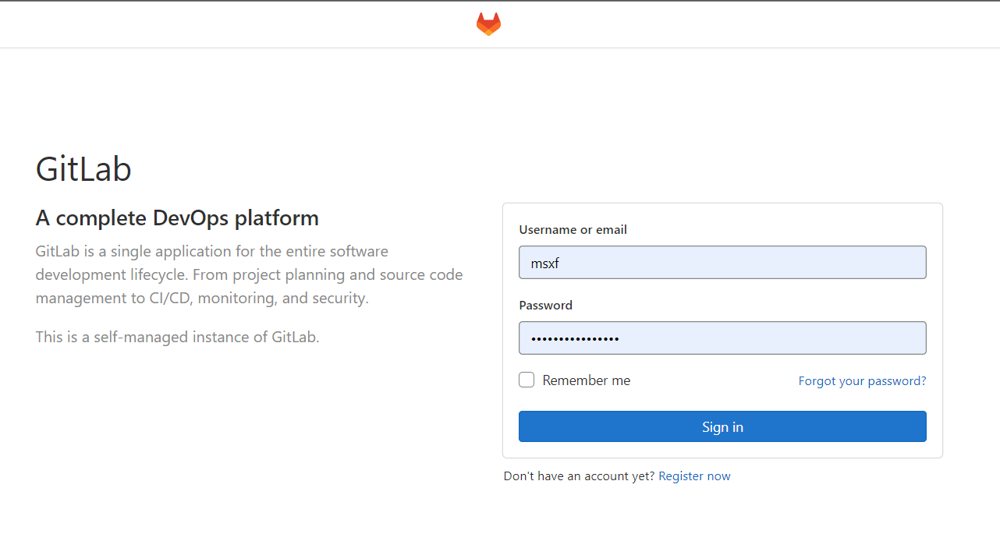

## 搭建私有docker镜像
```bash
docker run -d -p 5000:5000 --restart always --name registry registry:latest
```
### 打标签，push，pull
```bash
sudo docker tag alpine 10.1.0.4:5000/alpine
sudo docker push localhost:5000/alpine

sudo docker pull 10.1.0.4:5000/alpine
curl http://10.1.0.4:5000/v2/_catalog
```

### 遇到问题 http: server gave HTTP response to HTTPS client
修改`/etc/docker/daemon.json` 
```json
{
  "insecure-registries":["10.1.0.4:5000"]
}
```

## 搭建gitlab
```bash
sudo mkdir -p /var/gitlab/etc
sudo mkdir -p /var/gitlab/log
sudo mkdir -p /var/gitlab/data

export GITLAB_HOME=/var/gitlab/

sudo docker run --detach \
  --publish 30443:443 --publish 30080:80 --publish 30022:22 \
  --name gitlab \
  --restart always \
  --volume $GITLAB_HOME/config:/etc/gitlab \
  --volume $GITLAB_HOME/logs:/var/log/gitlab \
  --volume $GITLAB_HOME/data:/var/opt/gitlab \
  --shm-size 128m \
  gitlab/gitlab-ce:latest
```


### 开启虚拟内存，不然gitlab直接死机
1.创建swap文件夹
```bash
dd if=/dev/zero of=/swapfile bs=32M count=128
```
bs=单位体积 count=数量

2.设置为swap分区文件
```bash
mkswap /swapfile
chmod 600 /swapfile
```

3.启用交换区文件
```bash
swapon /swapfile
```