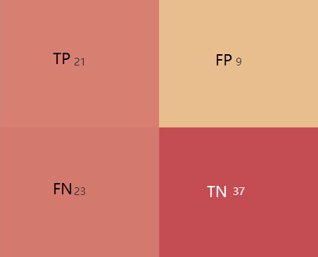
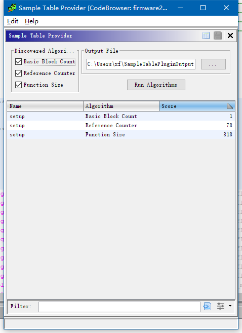

## 检测结果
### good和bad标注针对自身CWE错误没问题, 修复方式有改数据本身(GoodSource), 在调用前加判断(GoodSink)
EG: CWE190_Integer_Overflow__int_fgets_multiply_12
 * BadSource: fgets Read data from the console using fgets()
 * GoodSource: Set data to a small, non-zero number (two)
 * Sinks: multiply
 *    GoodSink: Ensure there will not be an overflow before multiplying data by 2
 *    BadSink : If data is positive, multiply by 2, which can cause an overflow

### fix后的good可能引入新的CWE
EG: 
- CWE-561: Dead Code (CWE415_Double_Free__malloc_free_char_02.c)
  
- CWE-401: Missing Release of Memory after Effective Lifetime (CWE416_Use_After_Free__malloc_free_int_01.c)

### 测试具有随机性，有Flow Variant
EG:
- CWE190_Integer_Overflow__int_fgets_multiply_12.c (globalReturnsTrueOrFalse())

### 不同测试样例的差异性体现在
- 数据类型的变化(包括基本数据类型和指针)
- 替代函数的使用, fgets(), fscanf()
- 判断 if(常量), if(1==1), while-break
- 随机性函数的使用
- source和sink的组合
- linux和win也具有差异性

### 测试结果
TP: 21, FP: 9
FN: 23, TN: 37

426、467检测效果较好，
415、416检测不出来

- FP - CWE190: Potential Integer Overflow due to tainted input from source of fscanf(CWE190_Integer_Overflow__char_fscanf_add_10_good[0, 0, 800317a]) at inside of "CWE190_Integer_Overflow__char_fscanf_add_10_good()" @ 08002042
- TP - CWE426: Relative path "" found for "system()" call @ 08002d94
- TP - CWE190: Potential Integer Overflow due to tainted input from source of fscanf(CWE190_Integer_Overflow__char_fscanf_add_10_bad[0, 0, 800317e]) at inside of "CWE190_Integer_Overflow__char_fscanf_add_10_bad()" @ 08001fc6
- TP - CWE467: Sizeof(ptr) pattern found for "malloc()" call @ 08002e2c
- FP - CWE476: Null pointer dereference Write @ 08004dc4 [ 08004dee (strtol), 08003cf0 (atoi), 080020b8 (CWE190_Integer_Overflow__int_fgets_multiply_05_bad) ]
- TP - CWE467: Sizeof(ptr) pattern found for "malloc()" call @ 08002fa8
- FP - CWE476: Null pointer dereference Write @ 08004dc4 [ 08004dee (strtol), 08003cf0 (atoi), 080020fc (CWE190_Integer_Overflow__int_fgets_multiply_05_good) ]
- TP - CWE676: Use of the dangerous function "strcpy()" @ 08002bc4
- TP - CWE676: Use of the dangerous function "strcpy()" @ 08002cc4
- TP - CWE467: Sizeof(ptr) pattern found for "malloc()" call @ 08002dc0
- TP - CWE467: Sizeof(ptr) pattern found for "malloc()" call @ 080030c0
- TP - CWE426: Relative path "" found for "system()" call @ 08002c06
- TP - CWE190: Potential Integer Overflow due to tainted input from source of fscanf(CWE190_Integer_Overflow__char_fscanf_add_02_bad[0, 0, 8003176]) at inside of "CWE190_Integer_Overflow__char_fscanf_add_02_bad()" @ 08001f6c
- TP - CWE467: Sizeof(ptr) pattern found for "malloc()" call @ 08002eb4
- FP - CWE476: Null pointer dereference Write @ 08004dc4 [ 08004dee (strtol), 08003cf0 (atoi), 08002216 (CWE190_Integer_Overflow__int_fgets_multiply_12_good) ]
- FP - CWE476: Null pointer dereference Write @ 08004dc4 [ 08004dee (strtol), 08003cf0 (atoi), 08002120 (CWE190_Integer_Overflow__int_fgets_multiply_05_good) ]
- TP - CWE467: Sizeof(ptr) pattern found for "malloc()" call @ 0800306a
- TP - CWE467: Sizeof(ptr) pattern found for "malloc()" call @ 08002e82
- FP - CWE787: Stack Out-of-Bound Write @ 08003ee8 [ 080050ba (__swbuf_r), 08004914 (_puts_r), 0800499e (puts) ]
- TP - CWE467: Sizeof(ptr) pattern found for "malloc()" call @ 08002f20
- TP - CWE676: Use of the dangerous function "strcpy()" @ 08002c00
- TP - CWE676: Use of the dangerous function "strcpy()" @ 08002d00
- FP - CWE190: Potential Integer Overflow due to tainted input from source of fscanf(CWE190_Integer_Overflow__char_fscanf_add_10_good[0, 0, 800317a]) at inside of "CWE190_Integer_Overflow__char_fscanf_add_10_good()" @ 08002014
- FP - CWE476: Null pointer dereference Write @ 08004dc4 [ 08004dee (strtol), 08003cf0 (atoi), 080021a4 (CWE190_Integer_Overflow__int_fgets_multiply_12_bad) ]
- TP - CWE676: Use of the dangerous function "strcpy()" @ 08002c3c
- TP - CWE467: Sizeof(ptr) pattern found for "malloc()" call @ 08002ed8
- TP - CWE676: Use of the dangerous function "strcpy()" @ 08002c78
- TP - CWE467: Sizeof(ptr) pattern found for "malloc()" call @ 08002f76
- TP - CWE467: Sizeof(ptr) pattern found for "malloc()" call @ 08003014
- FP - CWE787: Stack Out-of-Bound Write @ 08003ee8 [ 080053b6 (_fflush_r), 08005112 (__swbuf_r), 08004914 (_puts_r) ]

## Sample Table Provider源码分析

主要功能：对basic block, reference, function进行计数

入口类：
- SampleTablePlugin.java

界面类：
- SampleTableProvider.java

整个算法模型：
- SampleTableModel.java

算法的接口：
- FunctionAlgorithm.java

主要的实现在：
- ReferenceFunctionAlgorithm.java
- BasicBlockCounterFunctionAlgorithm.java
- SizeFunctionAlgorithm.java

每行的模型：
- FunctionStatsRowObject.java

ghidra SDK提供的类：

- TaskMonitor：长时间运行显示进度，用户是否取消，提供消息输出

- Function：对代码里方法的抽象，getEntryPoint()，getSignature()，getStackFrame()，getTags()，getParameters()，getLocalVariables()

- ReferenceManager：获取引用

- Program: 整个程序的抽象。This program model divides a program into four major parts: the memory, the symbol table, the equate table, and the listing.

- AddressSetView: 定义地址范围(只读)