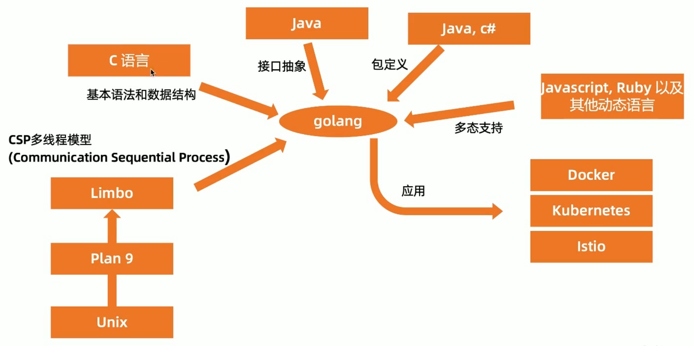
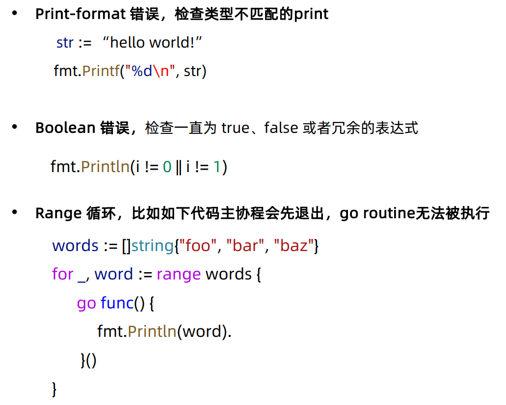
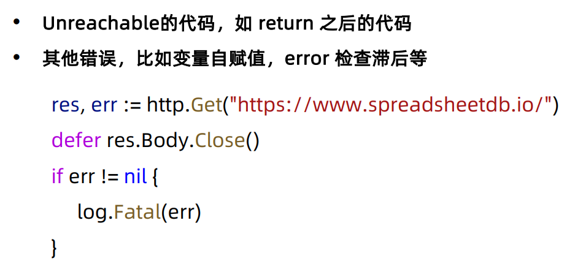
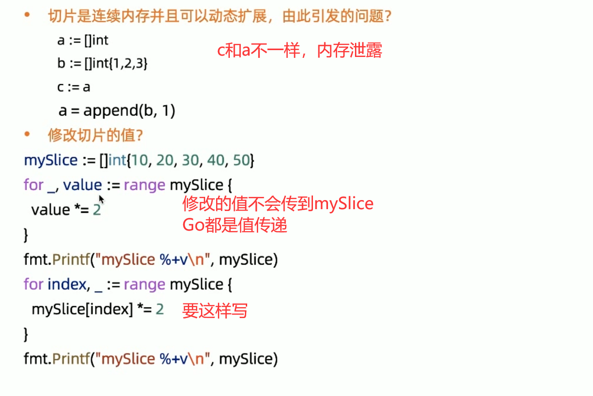

## 微服务统一思想 12 factors
1. 基准代码  一份基准代码，多份部署
2. 依赖  显式声明依赖关系
3. 配置  在环境中存储配置
4. 后端服务  把后端服务当作附加资源
5. 构建，发布，运行  严格分离构建和运行
6. 进程  以一个或多个无状态进程运行应用
7. 端口绑定  通过端口绑定提供服务
8. 并发  通过进程模型进行扩展
9. 易处理  快速启动和优雅终止可最大化健壮性
10. 开发环境与线上环境等价  尽可能的保持开发，预发布，线上环境相同
11. 日志  把日志当作事件流
12. 管理进程  后台管理任务当作一次性进程运行

## Go语言的原则
Less is exponentially more.  Rob Pike, Go Designer
Do L ess, Enable More.  Russ Cox, Go Tech Lead

## 为什么需要Go语言

### 其他编程语言的弊端。
- 硬件发展速度远远超过软件。
- C 语言等原生语言缺乏好的依赖管理 (依赖头文件）。
- Java 和 C++ 等语言过于笨重。
- 系统语言对垃圾回收和并行计算等基础功能缺乏支持。
- 对多核计算机缺乏支持。

### Go 语言是一个可以编译高效，支持高并发的，面向垃圾回收的全新语言。
- 秒级完成大型程序的单节点编译。
- 依赖管理清晰。
- 不支持继承，程序员无需花费精力定义不同类型之间的关系。
- 支持垃圾回收，支持并发执行，支持多线程通讯。
- 对多核计算机支持友好。

## Go 语言不支持的特性
- 不支持函数重载和操作符重载
- 为了避免在 C/C++ 开发中的一些 Bug 和混乱，**不支持隐式转换**
- 支持接口抽象，不支持继承(继承会提升代码复杂度)
- **不支持动态加载代码**
- **不支持动态链接库**
- 通过 recover 和 panic 来替代异常机制
- 不支持断言
- **不支持静态变量**

## Go衍生来源


## Go一些基本命令
- bug  - start a bug report
- **build**  - compile packages and dependencies
- clean  - remove object files and cached files
- doc  - show documentation for package or symbol
- env  - print Go environment information
- fix  - update packages to use new APIs
- **fmt**  - gofmt (reformat) package sources
- generate  - generate Go files by processing source
- **get**  - add dependencies to current module and install them
- **install**  - **compile and install** packages and dependencies
- list  - list packages or modules
- mod  - module maintenance
- run  - compile and run Go program
- test  - test packages
- **tool**  - run specified go tool
- version  - print Go version
- **vet**  - report likely mistakes in packages

## Go test
``` golang
import "testing"

func TestIncrease(t *testing.T) {
    t.Log("Start testing")
    res := increase(1, 2)
    assert.Equal(t, 3, res) //第三方的断言包
}
```

go test ./... -v 运行测试
go test 命令扫描所有*_test.go为结尾的文件，惯例是将测试代码与正式代码放在同目录，如 foo.go 的测试代码一般写在 foo_test.go

## Go vet
代码静态检查，发现可能的 bug 或者可疑的构造，编译可以过去，但是运行时可能会有错误！




## 一些特殊语法
if的简短语句
``` golang
if v:=x - 100; v<0 {
    return v
}
```

switch，每个都有隐含的break
``` golang
switch var1 {
    case val1:
        // do something
    case val2:
        fallthrough //执行下面的val3, 也会执行default
    case val3:
        // do something
    default:
        // do something
}
```

for-range，可以用于数组、切片、字符串、map
``` golang
for i, v := range slice1 {
    fmt.Println(i, v)
}
for key, value := range map1 {
    fmt.Println(key, value)
}
for _, v := range str1 {
    fmt.Println(v)
}
```

args和flag
``` golang
func main() {
    args := os.Args //main函数没有入参
    fmt.Println(args)
    name := flag.String("name", "", "your name")//参数: 名称、默认值、帮助
    flag.Parse() 
    fmt.Println(*name)
}
```

## 变量声明

**函数外，每个语句都必须以关键字开始，如 var、func、const、type。**

因此不可以用:=简短声明。

## 常见问题


## 结构体标签
结构体除了属性名和类型外，还可以有一个可选的标签
    
    ``` golang
    type Person struct {
        TagField string `json:"tag"`
    }
    func main(){
        p := Person{Tag:"tag"}
        myType := reflect.TypeOf(p)
        tagField := myType.Field(0)
        tag := tagField.Tag.Get("json")

    }
    ``` 
tag用空格符来分割键值例如: `key1:"value1" key2:"value2" key3:"value3"`
## 类型重命名
``` golang
type ServiceType string
const(
    ServiceType_A ServiceType = "A"
    ServiceType_B ServiceType = "B"
)
```
防止滥用string出错