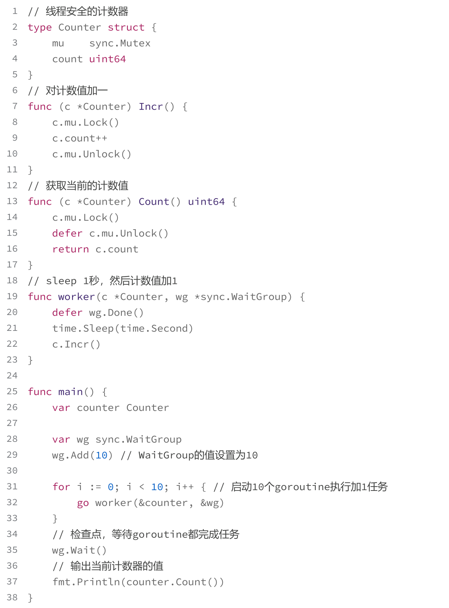
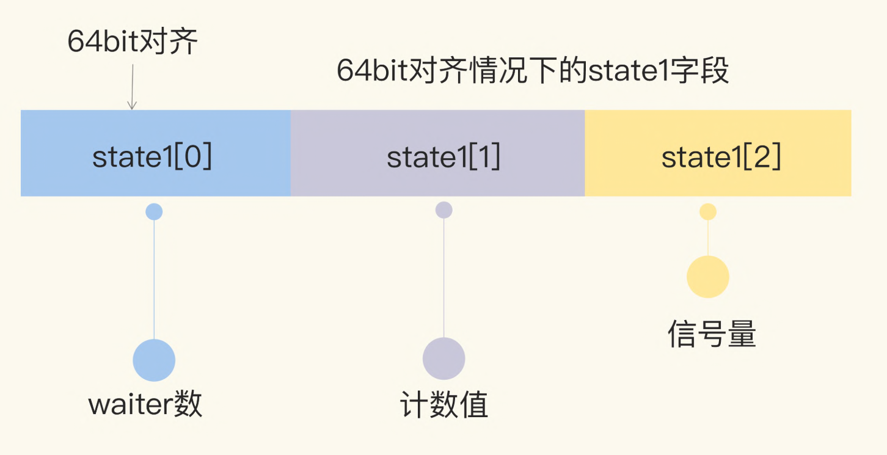

## 什么是WaitGroup
WaitGroup是package sync用来做任务编排的一个并发原语。

它要解决的就是并发-等待的问题：现在有一个goroutine A在检查点（checkpoint）等待一组goroutine全部完成，如果在执行任务的这些goroutine还没全部完成，那么goroutine A就会阻塞在检查点，直到所有goroutine都完成后才能继续执行。

## WaitGroup的基本用法
Go标准库中的WaitGroup提供了三个方法:
``` golang
func (wg *WaitGroup) Add(delta int)
func (wg *WaitGroup) Done()
func (wg *WaitGroup) Wait()
```
- Add，用来设置WaitGroup的计数值；
- Done，用来将WaitGroup的计数值减1，其实就是调用了Add(-1)；
- Wait，调用这个方法的goroutine会一直阻塞，直到WaitGroup的计数值变为0。



## WaitGroup的实现
``` golang
type WaitGroup struct {
    noCopy noCopy
    state1 [3]uint32
}
```

在64位环境下，state1的第一个元素是waiter数，第二个元素是WaitGroup的计数值，第三个元素是信号量。
### Add方法
Add 方法主要操作的是 state 的计数部分，它的实现如下：
``` golang
func (wg *WaitGroup) Add(delta int) {
    statep, semap := wg.state()
    // 高32bit是计数值v，所以把delta左移32，增加到计数上
    state := atomic.AddUint64(statep, uint64(delta)<<32)
    v := int32(state >> 32) // 当前计数值
    w := uint32(state)      // waiter count
    // 如果计数值小于0，或者waiter数为0，直接返回
    if v > 0 || w == 0 { 
        return
    }
    // 如果计数值v为0并且waiter的数量w不为0，那么state的值就是waiter的数量
    *statep = 0
    for ; w != 0; w-- {
        runtime_Semrelease(semap, false, 0)
    }

    func (wg *WaitGroup) Done() {
        wg.Add(-1)
    }
```
### Wait方法
Wait方法的实现逻辑是：不断检查state的值。如果其中的计数值变为了0，那么说明所有的任务已完成，调用者不必再等待，直接返回。如果计数值大于0，说明此时还有任务没完成，那么调用者就变成了等待者，需要加入waiter队列，并且阻塞住自己。

``` golang
func (wg *WaitGroup) Wait() {
    statep, semap := wg.state()
    for {
        state := atomic.LoadUint64(statep)
        v := int32(state >> 32) // 当前计数值
        w := uint32(state)      // waiter count
        // 如果计数值小于0，调用这个方法的goroutine不必再等待
        if v == 0{ 
            return
        }
        // 否则把waiter数量加1。期间可能有并发调用Wait的情况，所以最外层使用了一个for循环
        if atomic.CompareAndSwapUint64(statep, state, state+1) {
            // 阻塞休眠等待
            runtime_Semacquire(semap)
            // 被唤醒，不再阻塞，返回
        }
    }
}
```

## 使用WaitGroup时的常见错误
- 计数器设置为负值
    - 调用 Add 的时候传递一个负数
    - 调用 Done 方法的次数过多，超过了 WaitGroup 的计数值

    (使用 WaitGroup 的正确姿势是，预先确定好 WaitGroup 的计数值，然后调用相同次数 的 Done 完成相应的任务)
- 不期望的Add时机

    (等所有的 Add 方法调用之后再调用Wait)
- 前一个 Wait 还没结束就重用 WaitGroup
    (WaitGroup是可以重用的,只要 WaitGroup 的计数值恢复到零值的状态。如果你在 Wait 还没执行完的时候就调用下一轮 Add 方法，就有可能出现 panic。)