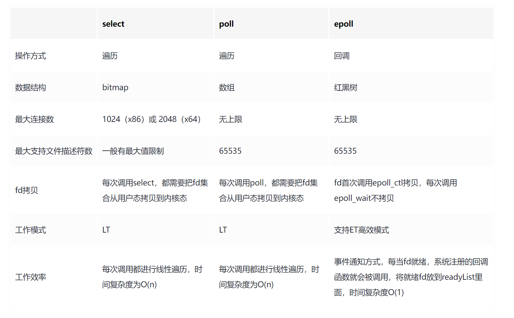

## Go make和new的区别

### new 用来分配内存，并初始化零值，返回**指针** 

编译时有两种情况

- 若该对象申请的空间为 0，则返回表示空指针的**zerobase变量**，这类对象比如：slice, map, channel 以及一些结构体等。

```go
var zerobase uintptr
```

- 其他情况则会使用runtime.newobject函数，调用mallocgc开辟一段内存空间，然后返回那块空间的地址。

### make是用来初始化 map, slice, channel的

编译时，会调用不同runtime函数，makemap、makeslice、makechan

- makemap会初始化hmap，生成哈希种子，计算桶的数量并生成桶。
- makeslice会处理一些边界条件，然后再申请空间
- makechan会根据有无缓冲区，是否包含指针等进行不同内存分配策略，并初始化管道里变量类型、大小等信息

make 相对于new来说，做的事情更多，new 只是开辟了内存空间，make为更加复杂的数据结构开辟内存空间并对一些字段进行初始化

### 可以用 new 去初始化 map, slice 和 channel 吗？

- map 没有初始化桶，**增加键值对会panic**，查询和删除不会报错
- channel 没有进行初始化操作，往里面发送或接受数据**都会panic**
- slice 返回的是nil切片，但是append的时候会新mallocgc一块内存，返回新的切片，可以**正常使用**

### 可以用make初始化其它类型吗？

不可以，make是关键字，没有提供其它类型的底层方法

## IO五种模型

- Blocking IO - 阻塞IO
- NoneBlocking IO - 非阻塞IO
- IO multiplexing - IO多路复用
- signal driven IO - 信号驱动IO
- asynchronous IO - 异步IO


一句话总结：
- 阻塞IO与非阻塞IO：这是最简单的模型，一般配合多线程来实现。
- 多路复用(select/poll/epoll)：一个线程解决多连接的问题
- 信号驱动IO模型：一种同步IO，更加灵活
- 异步IO模型：高效主流的模型，效率很高。

## 什么是IO多路复用
- IO多路复用是一种**同步IO模型**，实现**一个线程可以监视多个文件句柄**；
- 一旦某个文件句柄就绪，就能够通知应用程序进行相应的读写操作；
- 没有文件句柄就绪就会阻塞应用程序，交出CPU。
- 多路是指**网络连接**，复用指的是**同一个线程**。

- select：仅知道有IO发生了，但是需要轮询，才能找出哪个fd就绪，并且长度有限制
- poll：本质无区别，但是fd使用链表存储，没长度限制
- epoll：即**event poll**，每次回返回fd和相应的事件，无需轮询，共享内存



## 进程切换经历哪些过程？
从一个进程的运行转到另一个进程上运行，这个过程中经过下面这些变化：

- 保存处理机上下文，包括程序计数器和其他寄存器。
- 更新PCB信息。
- 把进程的PCB移入相应的队列，如就绪、在某事件阻塞等队列。
- 选择另一个进程执行，并更新其PCB。
- 恢复处理机上下文

## for range 的时候i,v的地址会发生变化么？
答：在 for i,v := range c 遍历中， i和v在内存中只会存在一份，即之后每次循环时遍历到的数据都是以值覆盖的方式赋给i和v，内存地址始终不变。

由于有这个特性，for循环里面如果开协程，不要直接把i和v的地址传给协程

## 多个 defer 的顺序，defer在什么时机会修改返回值？

作用：defer延迟函数，释放资源，收尾工作；如**释放锁**，**关闭文件**，**关闭链接**；**捕获panic**;

多个defer调用顺序是LIFO（后入先出），defer后的操作可以理解为压入栈中

defer，return，return value（函数返回值） 执行顺序：**首先return，其次return value，最后defer**

**无名返回值不能修改，有名返回值可以被修改！！！**
```go
func a() {
    var i
    defer func() {
		i++
	}()
    return i // 0
}
func b() (i int) {
    defer func() {
		i++
	}()
    return i // 1
}
```

**先defer，后panic**，os.Exit(0)不会执行defer

## rune类型是什么？
相当于**int32**！

golang中的字符串底层实现是通过byte数组的，中文字符在unicode下占2个字节，在utf-8编码下占3-4个字节

byte 等同于int8，常用来处理ascii字符

rune 等同于int32,常用来处理unicode或utf-8字符

'len([]rune(str))'