## 什么是BufferPool？
Buffer Pool: 缓冲池，简称BP。其作用是用来缓存表数据与索引数据，减少磁盘I0操作，提升效率

Buffer Pool由缓存**数据页(Page)**和对缓存数据页进行描述的**控制块**组成。控制块中存储着对应缓存页的所属的**表空间、数据页的编号、以及对应缓存页在Buffer Pool中的地址**等信息

Buffer Pool默认大小是128M,以Page页为单位，Page页默认大小16K，所以每次多申请大概6M的空间

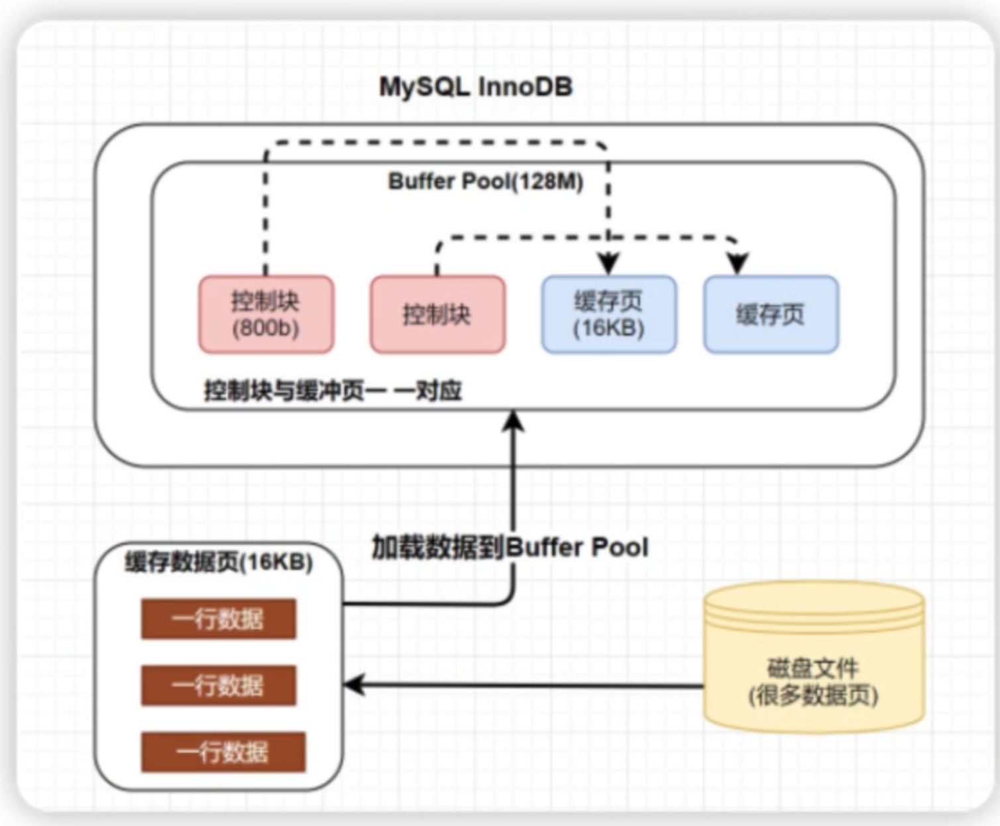

## 如何判断一个页是否在BufferPool中？
MySQI中有一个哈希表数据结构，它使用表空间号+数据页号，作为一个key，然后缓冲页对应的控制块作为value。
**MEMORY**
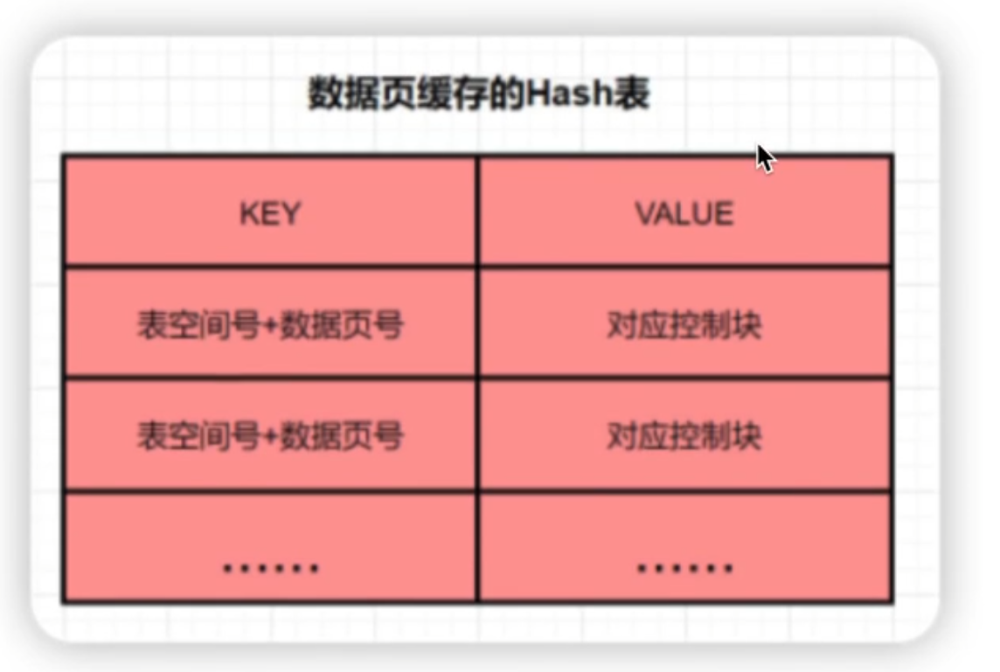

当需要访问某个页的数据时，先从哈希表中根据表空间号+页号看看是否存在对应的缓冲页。

如果有，则直接使用:如果没有，就从free链表中选出一个空闲的缓冲页，然后把磁盘中对应的页加载到该缓冲页的位置

## InnoDB如何管理配置页？
BP的底层采用链表数据结构管理Page。在InnoDB访问表记录和索引时会在Page页中缓存，以后使用可以减少磁盘IO操作，提升效率。
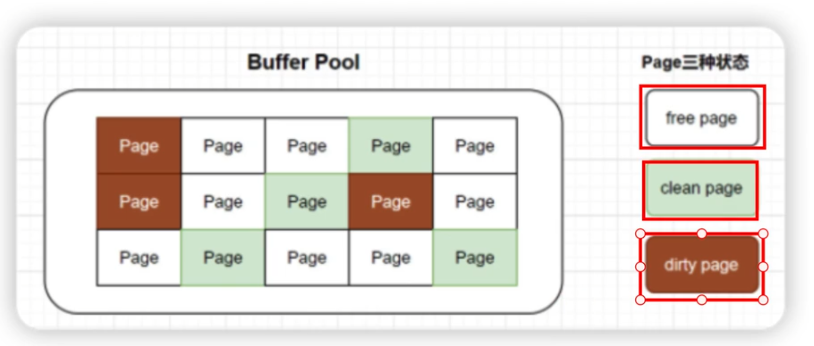

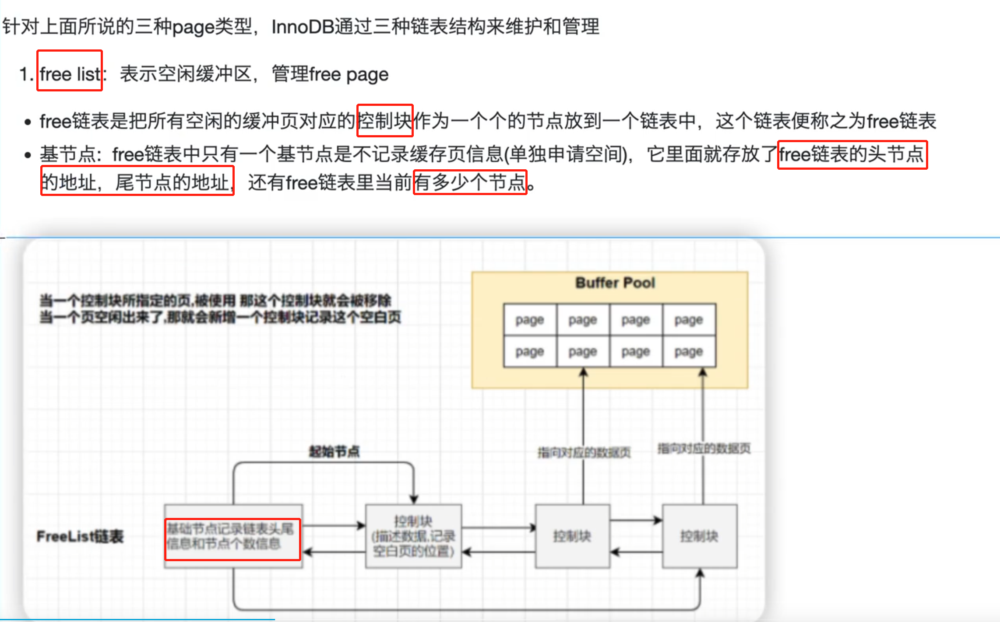

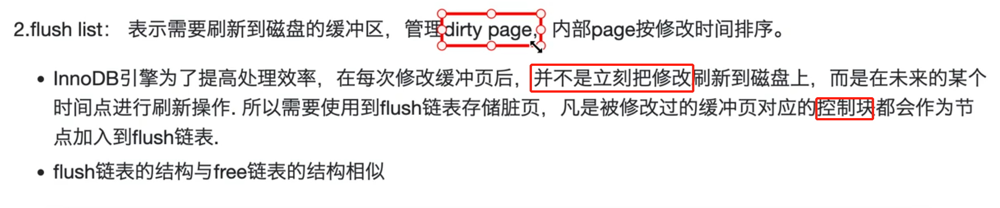

young 占 5/8，数据从midpoint插入数据

## 为什么写缓冲区，仅适用于非唯一普通索引页？
Change Buffer: **写缓冲区是针对二级索引(辅助索引)**页的更新优化措施

作用:在进行变更操作（增删改）时，如果请求的辅助索引(二级索引)**没有在缓冲池中时**，并不会立刻将磁盘页加载到缓冲池，而是在Change Buffer记录缓冲变更，等未来数据被读取时，再将数据合并恢复到Buffer Pool中。

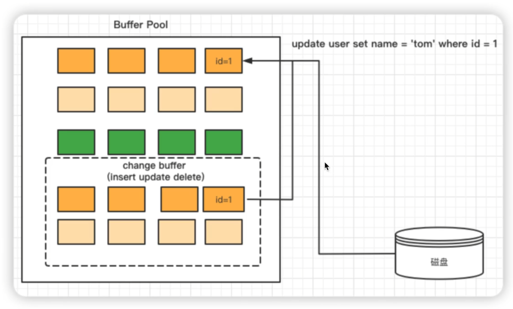

位于Buffer Pool的单独空间，一般占25%，如果读写操作多的话，可以增加。
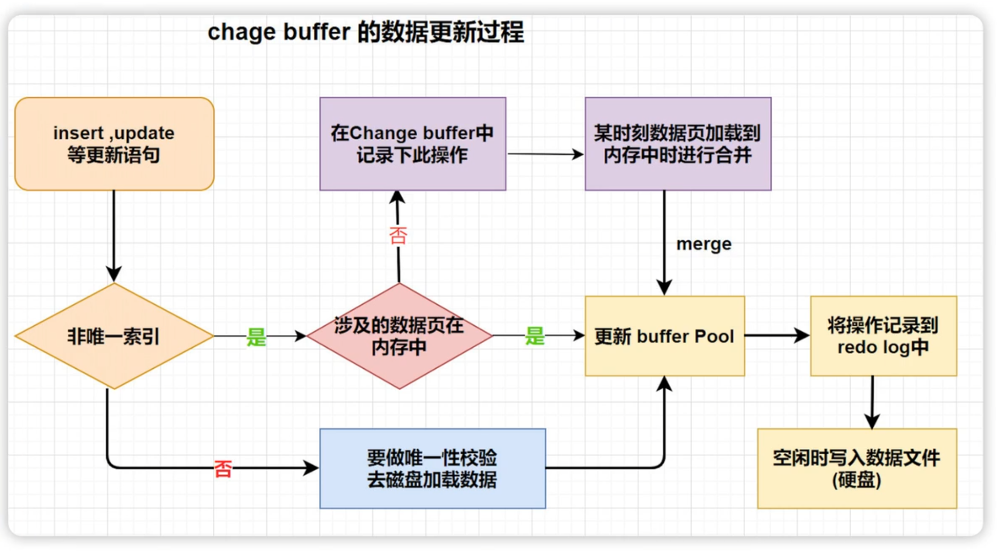
写缓冲区，仅适用于非唯一普通索引页，为什么?

如果在索引设置唯一性，在进行修改时，innoDB必须要做唯一性校验，因此必须查询磁盘，做一次I0操作。会直接将记录查询到BufferPool中，然后在缓冲池修改，不会在ChangeBuffer操作。

## MySQL为什么改进LRU算法？

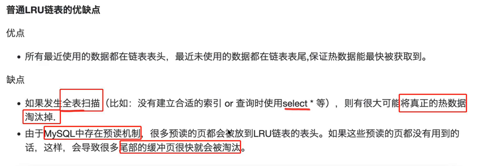

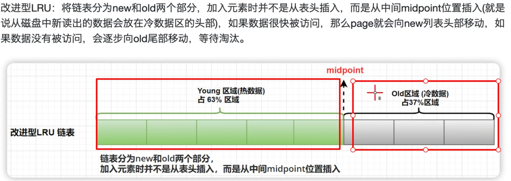

## 冷数据区的数据页什么时候会被转到到热数据区呢?
1. 如果该数据页在LRU链表中存在时间超过1s，就将其移动到链表头部(链表指的是整个LRU链表)
2. 如果该数据页在LRU链表中存在的时间短于1s，其位置不变(由于全表扫描有一个特点，就是它对某个页的频繁访问总耗时会很短)
3. 1s这个时间是由参数 innodb old blocks time **控制的**

## 使用索引一定可以提升效率吗?

索引就是排好序的,帮助我们进行快速查找的数据结构。

简单来讲，索引就是一种将数据库中的记录按照特殊形式存储的数据结构。通过索引，能够显著地提高数据查询的效率，从而提升服务器的性能。（一般而言，不超过五个字段）

优点
- 提高数据检索的效率降低数据库的IO成本
- 通过索引列对数据进行排序降低数据排序的成本降低了CPU的消耗0

缺点
- **创建索引和维护索引要耗费时间**，这种时间随着数据量的增加而增加
- **索引需要占物理空间**，除了数据表占用数据空间之外，每一个索引还要占用一定的物理空间
- 当对表中的数据进行增加、删除和修改的时候，**索引也要动态的维护**，降低了数据的维护速度

### 创建索引的原则
- 在经常需要搜索的列上创建索引，可以加快搜索的速度
- 在作为主键的列上创建索引，强制该列的唯一性和组织表中数据的排列结构;
- 在经常用在连接的列上，这些列主要是一些外键，可以加快连接的速度
- 在经常需要根据范围进行搜索的列上创建索引，因为索引已经排序，其指定的范围是连续的
- 在经常需要排序的列上创建索引，因为索引已经排序，这样查询可以利用索引的排序，加快排序查询时间
- 在经常使用在WHERE子句中的列上面创建索引，加快条件的判断速度。

## 介绍一下Page页的结构?
Page是InnoDB磁盘管理的最小单位，与数据库相关的所有内容都存储在这种Page结构里。

Page分为几种类型，常见的页类型有**数据页 (B+tree Node)、Undo页(Undo Log Page)、系统页 (SystemPage)**等

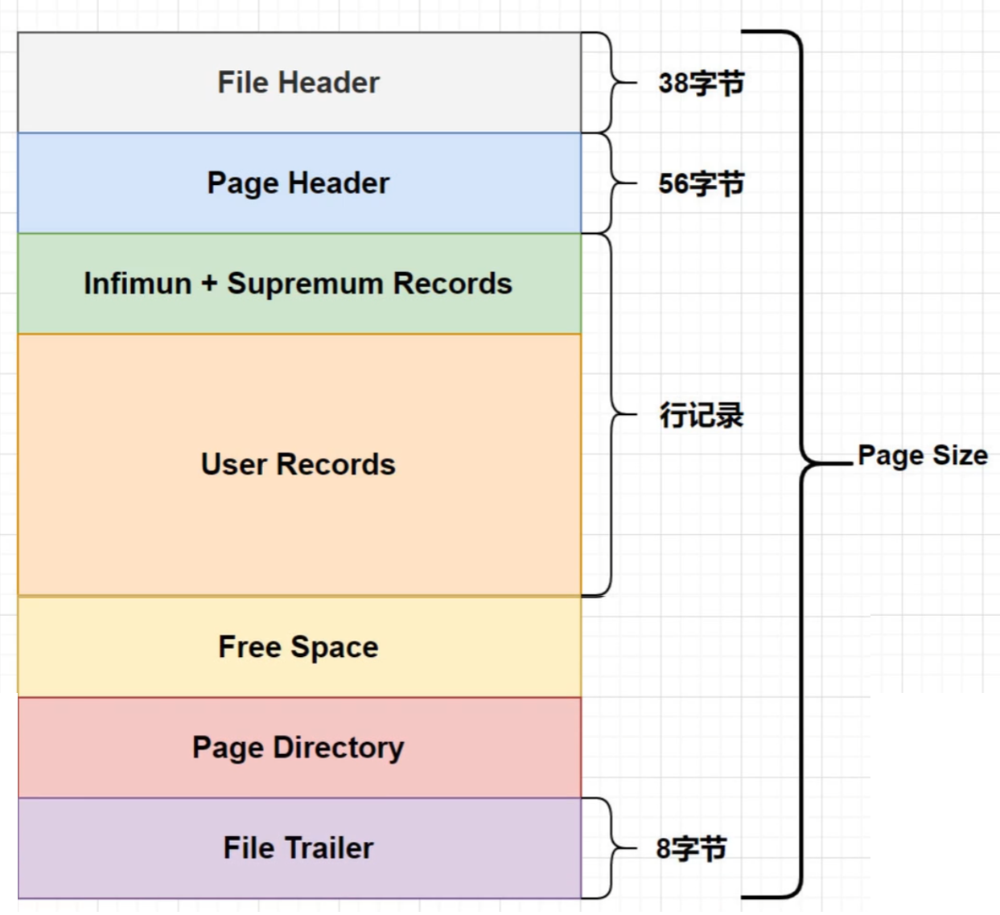

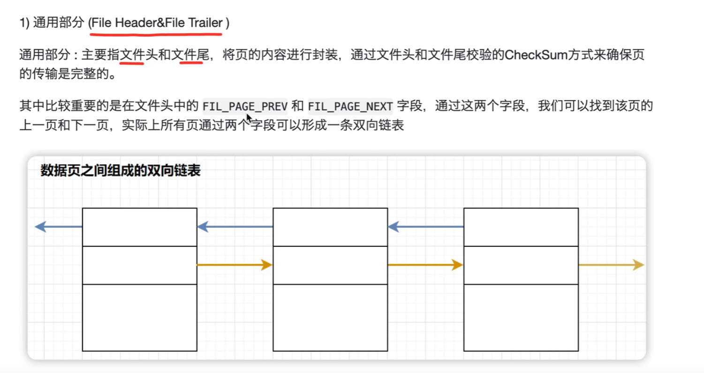

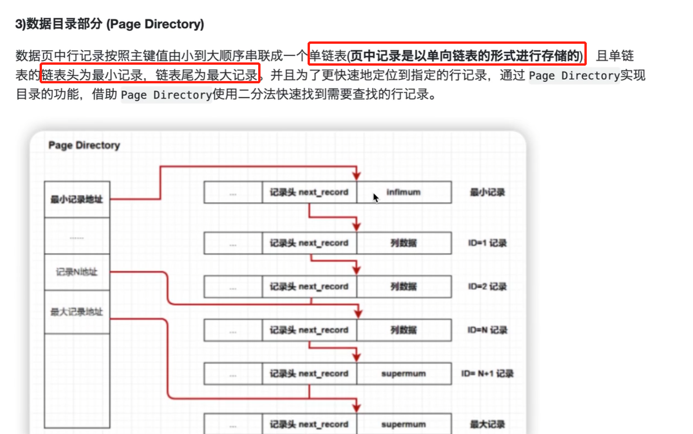

## 说一下聚簇索引与非聚簇索引(辅助索引) ?

聚集索引与非聚集索引的区别是:叶节点是否存放一整行记录

聚簇索引:将数据存储与索引放到了一块索引结构的叶子节点保存了行数据。

非聚簇索引: **将数据与索引分开存储**，索引结构的叶子节点指向了数据对应的位置

InnoDB主键使用的是聚族索引，MyISAM（读my sam，也是B+树） 不管是主键索引，还是二级索引使用的都是非聚族索引。

在InnoDB引擎中，主键索引采用的就是聚族索引结构存储。

聚族索引是一种数据存储方式，lnnoDB的聚族索引就是按照主键顺序构建 B+Tree结构。B+Tree的叶子节点就是行记录，行记录和主键值紧凑地存储在一起。这也意味着InnoDB的主键索引就是数据表本身，它按主键顺序存放了整张表的数据，占用的空间就是整个表数据量的大小。通常说的主键索引就是聚集索引。

InnoDB的表要求必须要有聚簇索引:
如果表定义了主键，则**主键索引**就是聚簇索引
如果表没有定义主键，则第一个**非空unique**列作为聚族索引
否则innoDB会从建一个**隐藏的row-id**作为聚族索引

辅助索引
InnoDB辅助索引，也叫作二级索引，是根据索引列构建B+Tree结构。但在 B+Tree 的叶子节点中只存了**索引列和主键**的信息。二级索引占用的空间会比聚簇索引小很多，通常创建辅助索引就是为了**提升查询效率**。一个表InnoDB只能创建一个聚族索引，但可以创建多个辅助索引。

## 聚族索引的优点
1. 当你需要取出一定范围内的数据时，用聚族索引也比用非聚族索引好。
2. 当通过聚族索引查找目标数据时理论上比非聚族索引要快，因为非聚族索引定位到对应主键时还要多一次目标记录寻址,**即多一次I/O**。

聚簇索引的缺点

1. **插入速度严重依赖于插入顺序**。(页的分裂)
2. **更新主键的代价很高**，因为将会导致被更新的行移动。
3. 二级索引访问需要两次索引查找，第一次找到主键值，第二次根据主键值找到行数据。

## 什么是索引下推？
索引下推 (index condition pushdown) 简称ICP，在Mysql5.6的版本上推出，用于优化查询。

根据最左前缀法则，该语句在搜索索引树的时候，只能匹配到名字第一个字是“张”的记录，之后需要逐个扫描，**回表判断age是不是10**

索引下推优化，可以在索引遍历过程中，对索引中包含的字段先做判断，判断age是否为10，过滤掉不符合条件的记录，减少回表次数。

## 什么是自适应哈希索引？
InnoDB三大特性：BP(Buffer Pool)、双写缓冲区(Doublewrite Buffer)、自适应Hash索引

只能等值查询，内存中使用

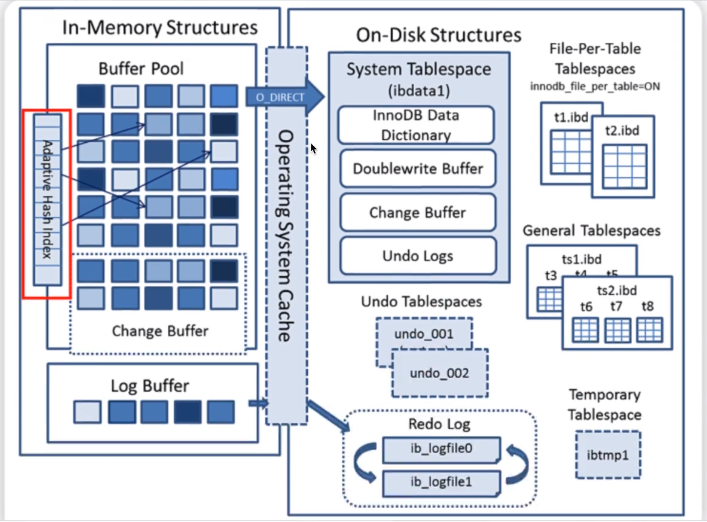

Adaptive Hash lndex是针对B+树Search Path的优化，因此所有会涉及到Search Path的操作，均可使用此Hash索引进行优化