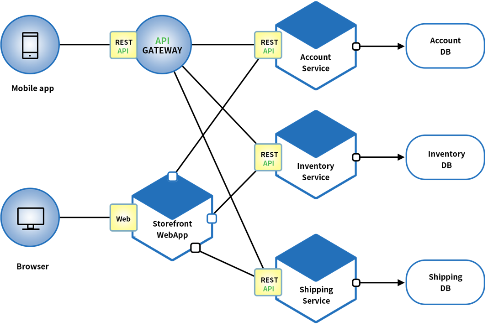
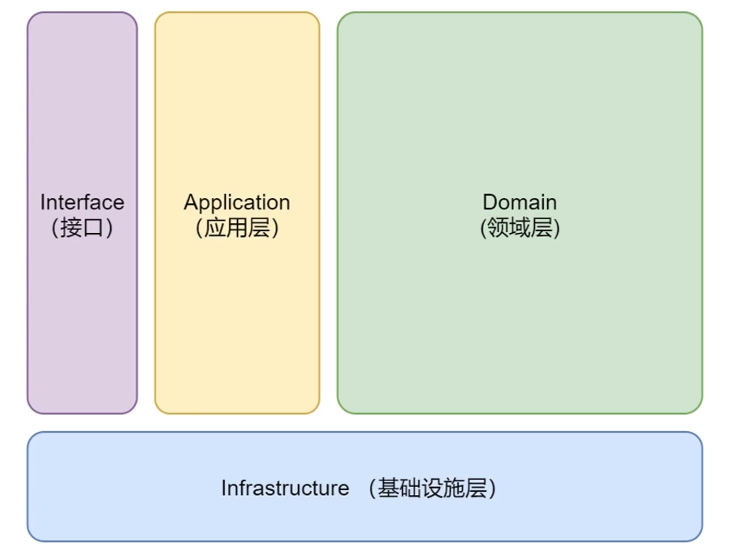
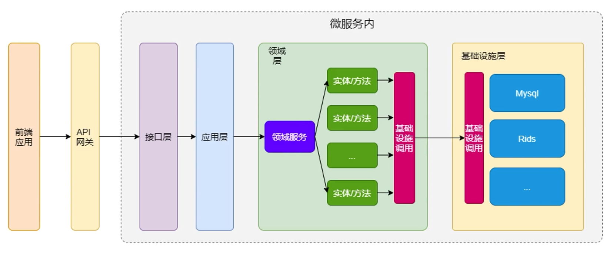

## 什么是微服务？
### 微服务的起源
大家经常谈论的是一个叫 SOA（面向服务的架构模式）**可以把微服务想成是 SOA 的一种实践**

- 小即是美：小的服务代码少，bug 也少，易测试，易维护，也更容易不断迭代完善的精致进而美妙。
- 单一职责：一个服务也只需要做好一件事，专注才能做好。
- 尽可能早地创建原型：尽可能早的提供服务 API，建立服务契约，达成服务间沟通的一致性约定，至于实现和完善可以慢慢再做。
- 可移植性比效率更重要：服务间的轻量级交互协议在效率和可移植性二者间，首要依然考虑兼容性和移植性。

### 微服务的定义
围绕业务功能构建的，服务关注单一业务，服务间采用轻量级的通信机制，可以全自动独立部署，可以使用不同的编程语言和数据存储技术。微服务架构通过业务拆分实现服务组件化，通过组件组合快速开发系统，业务单一的服务组件又可以独立部署，使得整个系统变得清晰灵活

- 是一种架构模式
- 相比较单体架构,微服务架构更独立,能够单独更新和发布
- 微服务里面的服务仅仅用于某一个特定的业务功能

### 特点
- 原子服务
- 独立进程
- 隔离部署
- 去中心化服务治理

- 基础设施的建设、复杂度高
### 为什么需要微服务？
- 逻辑清晰
- 快速迭代
- 多语言灵活组合

### 微服务的不足
- 微服务应用是分布式系统，由此会带来固有的复杂性。**开发者不得不使用 RPC 或者消息传递来实现进程间通信**；此外，必须要写代码来处理**消息传递中速度过慢或者服务不可用**等局部失效问题。
- **分区的数据库架构**，同时更新多个业务主体的事务很普遍。这种事务对于单体式应用来说很容易，因为只有一个数据库。在微服务架构应用中，需要更新不同服务所使用的不同的数据库，从而对开发者提出了更高的要求和挑战。
- **测试**一个基于微服务架构的应用也是很复杂的任务。
- 服务**模块间的依赖**，应用的升级有可能会波及多个服务模块的修改。
- 对**运维基础设施**的挑战比较大。
## 微服务的DDD是什么？
- 领域驱动设计(Domain Driven Design, 简称DDD)，合理的划分微服务
- 康威定律：组织架构决定产品形态

### DDD作用
- 真正决定软件复杂性的是设计方法
- 有助于指导确定系统边界
- 能够聚焦在系统核心元素上
- 能够帮助我们拆分系统

### DDD常用概念
- 领域: 领域是有范围界限的，也可以说是有边界的
- 核心域: 核心域是业务系统的核心价值
- 通用子域: 所有子域的消费者，提供着通用服务(例如短信、邮件)
- 支撑子域: 专注于业务系统的某一重要的业务

- 界限上下文：不在于如何划分边界，而是如何**控制**边界
- 领域模型：领域模型是对我们软件系统中要解决问题的抽象表达
- 领域: 反应的是我们业务上需要解决的问题

### DDD领域微服务四层架构

- interface 用户展示
- application 分配工作
- domain 实现业务规则
- infrastructure 中间件、云设施

### 微服务架构

### 微服务设计原则
- 要领域驱动设计，而不是数据驱动设计(拆数据表)，也不是界面驱动设计
- 边界明确清晰，而不是泥球小单体
- 要职责清晰的分层，而不是什么都放的大箩筐
- 不能过度拆分微服务(排查问题和测试的成本)

### 去中心化
每个服务面临的业务场景不同，可以针对性选择合适的技术解决方案。但也需要避免过度多样化，结合团队实际情况来选择取舍，要是每个服务都用不同的语言的技术栈来实现，维护成本就会很高。
- 数据去中心化
- 治理去中心化
- 技术去中心化

### 按业务组织服务
按业务能力组织服务的意思是服务提供的能力和业务功能对应

大前端（移动/Web） > 网关接入 > 业务服务 > 平台服务 > 基础设施（PaaS/Saas）

开发团队对软件在生产环境的运行负全部责任！

### 基础设施自动化
无自动化不微服务，自动化包括测试和部署。单一进程的传统应用被拆分为一系列的多进程服务后，意味着开发、调试、测试、监控和部署的复杂度都会相应增大，必须要有合适的自动化基础设施来支持微服务架构模式，否则开发、运维成本将大大增加。

- CI/CD：GitLab + GitLab Hooks + Kubernetes
- Testing：测试环境、单元测试、API 自动化测试
- 在线运行时：Kubernetes，以及一系列 Prometheus、ELK、 Control Panel
### 可用性 & 兼容性设计
著名的 Design For Failure 思想，微服务架构采用粗粒度的进程间通信，引入了额外的复杂性和需要处理的新问题，如网络延迟、消息格式、负载均衡和容错，忽略其中任何一点都属于对“分布式计算的误解”。

- 隔离
- 超时控制
- 负载保护 
- 限流
- 降级
- 重试
- 负载均衡

一旦采用了微服务架构模式，那么在服务需要变更时我们要特别小心，服务提供者的变更可能引发服务消费者的兼容性破坏，时刻谨记保持服务契约（接口）的兼容性。

    Be conservative in what you send, be liberal in what you accept.
