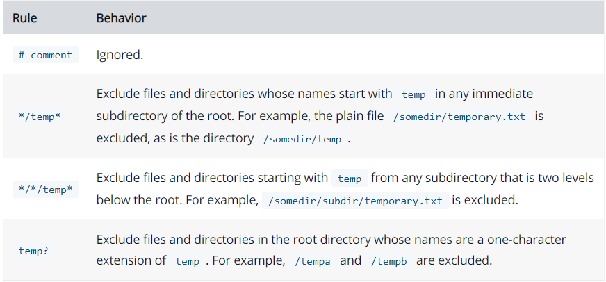
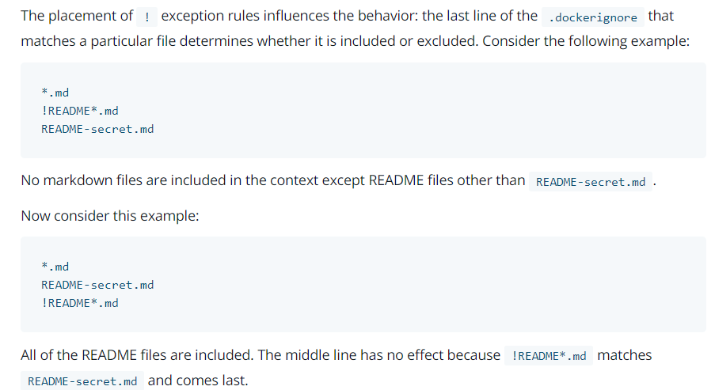

## Usage

The docker build command builds an image from a Dockerfile and a context. The build’s context is the set of files at a specified location PATH or URL. The PATH is a directory on your local filesystem. The URL is a Git repository location.

构建是由Docker守护进程运行的，而不是通过CLI。构建进程所做的第一件事是将整个上下文(递归地)发送给守护进程。在大多数情况下，最好从一个空目录开始作为上下文，并将Dockerfile保存在该目录中。只添加构建Dockerfile所需的文件。

## context
当构建的时候，用户会指定构建镜像上下文的路径，docker build 命令得知这个路径后，会将路径下的所有内容打包，然后上传给 Docker 引擎。这样 Docker 引擎收到这个上下文包后，展开就会获得构建镜像所需的一切文件。

在默认情况下，如果不额外指定 Dockerfile 的话，会将上下文目录下的名为 Dockerfile 的文件作为 Dockerfile。

要提高构建的性能，可以通过在context目录中添加.dockerignore文件来排除文件和目录。

实际上 Dockerfile 的文件名并不要求必须为 Dockerfile，而且并不要求必须位于上下文目录中，比如可以用 -f 参数指定某个文件作为 Dockerfile。

``` bash
docker build -f /path/to/a/Dockerfile .
```

使用-t来打标签
``` bash
docker build -t 1263413xxx/myapp .
```

## Parser directives

## Environment replacement
环境变量(用ENV语句声明)也可以在某些指令中作为Dockerfile解释的变量使用，用$variable_name或${variable_name}表示。

反斜杠表示转义。

``` bash
FROM busybox
ENV FOO=/bar
WORKDIR ${FOO}   # WORKDIR /bar
ADD . $FOO       # ADD . /bar
COPY \$FOO /quux # COPY $FOO /quux
```

## .dockerignore file
在docker CLI将上下文发送给docker守护进程之前，它会在上下文的根目录中查找一个名为.dockerignore的文件。如果这个文件存在，CLI将修改上下文以排除匹配其中模式的文件和目录。这有助于避免不必要地向守护进程发送大的或敏感的文件和目录，并可能使用ADD或COPY将它们添加到映像中。

**工作目录和根目录都被解析为上下文的根目录**
For example, the patterns `/foo/bar` and `foo/bar` both exclude a file or directory named bar in the foo subdirectory of PATH or in the root of the git repository located at URL.

```.dockerignore
# comment
*/temp*
*/*/temp*
temp?
```



```**```表示匹配任意层数的文件夹(包括0层，根目录)

For example, **/*.go will exclude all files that end with .go that are found in all directories, including the root of the build context.

```!```表示排除例外，最后出现的优先级更高


## 注意事项

1. **注意！每条指令都是独立运行的，并且会创建一个新的映像，因此`RUN cd /tmp`不会对下一条指令产生任何影响。**
2. Dockerfile must begin with a FROM instruction
3. 命令大小写均可，习惯性大写
4. \# 是注释

## Dockerfile文档
- https://docs.docker.com/engine/reference/builder/