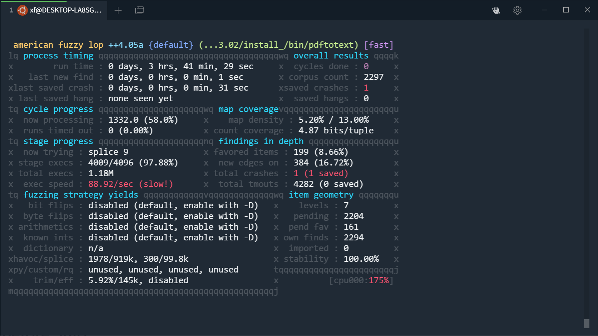
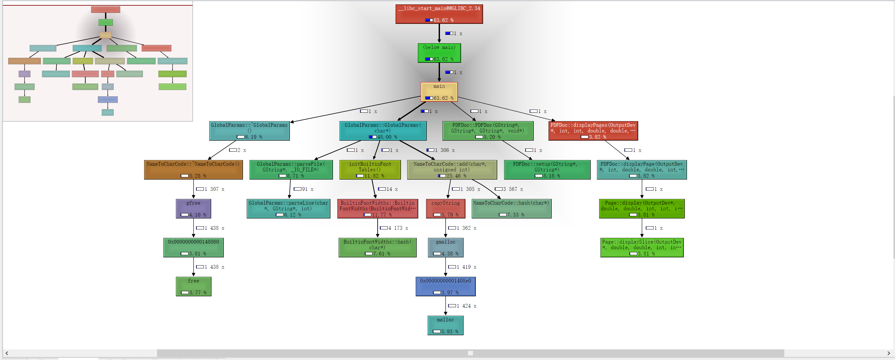
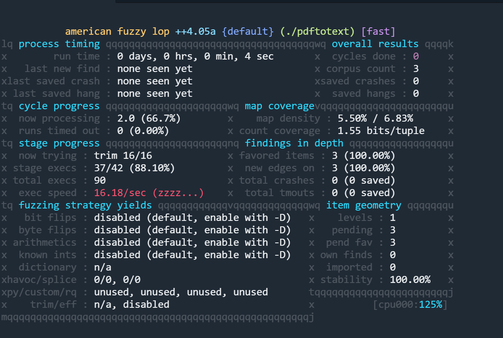
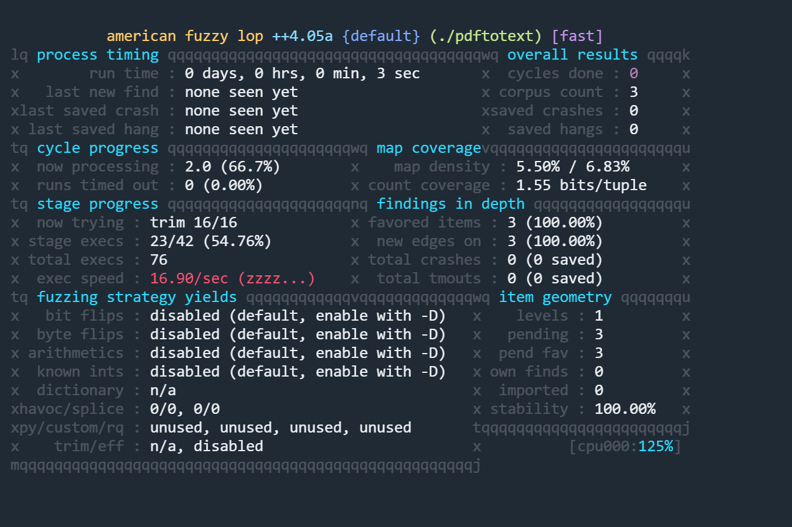

## 创建afl++环境

使用wsl+docker

image: `aflplusplus/aflplusplus`

```bash
docker run -itd --name=aflpp -v /mnt/c/Users/xf/afl:/src aflplusplus/aflplusplus /bin/bash

docker exec -it aflpp /bin/bash
```
每次启动时，先启动docker desktop，再启动wsl。如果没能识别docker环境，可以restart一次。

## Exercise 1 - Xpdf
环境准备
```bash
cd /src
mkdir fuzzing_xpdf && cd fuzzing_xpdf/
apt install build-essential
```

编译xpdf 3.02

之前直接使用网站提供的二级制，会导致缺so，所以需要自己手动去编译一下
```bash
wget https://dl.xpdfreader.com/old/xpdf-3.02.tar.gz
tar -xvzf xpdf-3.02.tar.gz
cd xpdf-3.02
apt update && apt install -y build-essential gcc
./configure --prefix="$(pwd)/install_"
make
make install
```

准备输入样本
```bash
cd /src/fuzzing_xpdf
mkdir pdf_examples && cd pdf_examples
wget https://github.com/mozilla/pdf.js-sample-files/raw/master/helloworld.pdf
wget http://www.africau.edu/images/default/sample.pdf
wget https://www.melbpc.org.au/wp-content/uploads/2017/10/small-example-pdf-file.pdf
```

网络遇到问题需要设置代理时，需要设置：
- http_proxy环境变量
- git的http.proxy配置
- wget -e设置环境变量。

**另外要注意，windows可以直接通过localhost访问wsl的端口；但是wsl需要知道windows虚拟网卡的ip才能访问。**

测试编译
```bash
./xpdf-3.02/install_/bin/pdftotext ./pdf_examples/helloworld.pdf output
cat output
```

重新使用afl-clang-fast编译
```bash
CC=afl-clang-fast CXX=afl-clang-fast++ ./configure --prefix="$(pwd)/install/"
make
make install
```
执行模糊测试
```bash
afl-fuzz -i ./pdf_examples/ -o out -s 123 -- ./xpdf-3.02/install_/bin/pdftotext @@ output
```



## Persistent fuzzing
AFL持久模式基于进程内模糊器:模糊器利用单个进程，将代码注入目标进程并更改内存中的输入值。

持久模式要求可以在一个或多个函数中调用目标，并且它的状态可以完全重置，以便在不泄漏资源的情况下执行多个调用，并且早期的运行不会对未来的运行产生影响。

Persistent Mode在有源码时，需要插入代码

```cpp
#include "what_you_need_for_your_target.h"
__AFL_FUZZ_INIT();
main() {
#ifdef __AFL_HAVE_MANUAL_CONTROL
  __AFL_INIT();
#endif
  unsigned char *buf = __AFL_FUZZ_TESTCASE_BUF;  // must be after __AFL_INIT
                                                 // and before __AFL_LOOP!
  while (__AFL_LOOP(10000)) {
    int len = __AFL_FUZZ_TESTCASE_LEN;  // don't use the macro directly in a
                                        // call!
    if (len < 8) continue;  // check for a required/useful minimum input length
    /* Setup function call, e.g. struct target *tmp = libtarget_init() */
    target_function(buf, len);
    /* Reset state. e.g. libtarget_free(tmp) */
  }
  return 0;
}
```
- #ifdef __AFL_HAVE_MANUAL_CONTROL 判断一下，可以使得正常编译器不报错

- __AFL_FUZZ_TESTCASE_BUF 使用的是共享内存fuzzing

- while (__AFL_LOOP(10000))使用的是Persistent mode


### 二进制Persistent fuzzing
**但是，在只有二进制的情况下，因为不能修改源码，需要执行的是另外的操作。**

[参考文档](https://github.com/AFLplusplus/AFLplusplus/blob/stable/qemu_mode/README.persistent.md)

(Qemu 持久模式目前只适用于x86/x86_64、arm和aarch64目标)

- 设置起始地址AFL_QEMU_PERSISTENT_ADDR，一般设置为某个函数的入口处。

- 设置RET地址，默认情况下可以不需要，AFL_QEMU_PERSISTENT_RET

- OFFSET 没细究，arm不支持

- 重置寄存器状态 AFL_QEMU_PERSISTENT_GPR=1

- 循环次数 AFL_QEMU_PERSISTENT_CNT 默认1000

- A hook for in-memory fuzzing 需要修改源码，[具体例子](https://github.com/AFLplusplus/AFLplusplus/blob/stable/utils/qemu_persistent_hook)

在找AFL_QEMU_PERSISTENT_ADDR时，可以借助工具valgrind
安装
```bash
apt-get install valgrind
```
使用
```bash
valgrind --tool=callgrind target
```
会在目录下生成`callgrind.out`文件，

然后使用kcachegrind可视化的分析输出文件，因为linux上要安装Qt所以直接在windows跑。


I recommend you to look at the count field in kcachegrind to identify functions that only get executed 1 time, and to try to achieve a stability score over 90% in afl-fuzz.

**pdfinfo 需要设置AFL_NO_FORKSRV=1**

没开persistent mode
```bash
AFL_NO_FORKSRV=1 afl-fuzz -Q -m none -i ./pdf_examples/ -o out_qemu -- ./pdftotext @@ output
```



开启persistent mode
```bash
AFL_QEMU_PERSISTENT_GPR=1 AFL_QEMU_PERSISTENT_ADDR=0x3ACC0 AFL_NO_FORKSRV=1 afl-fuzz -Q -m none -i ./pdf_examples/ -o out_qemu -- ./pdftotext @@ output
```


结论： 几乎没区别，可能是因为AFL_NO_FORKSRV=1关掉的原因