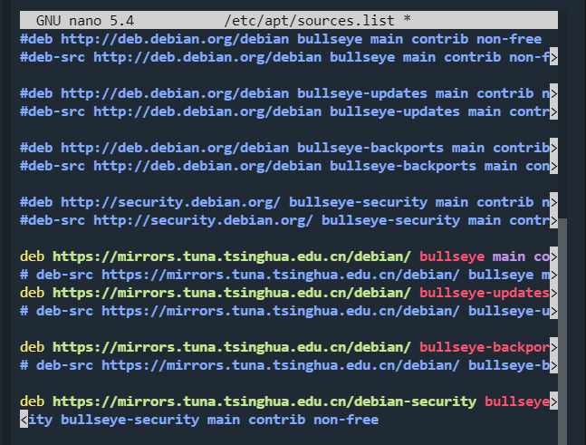
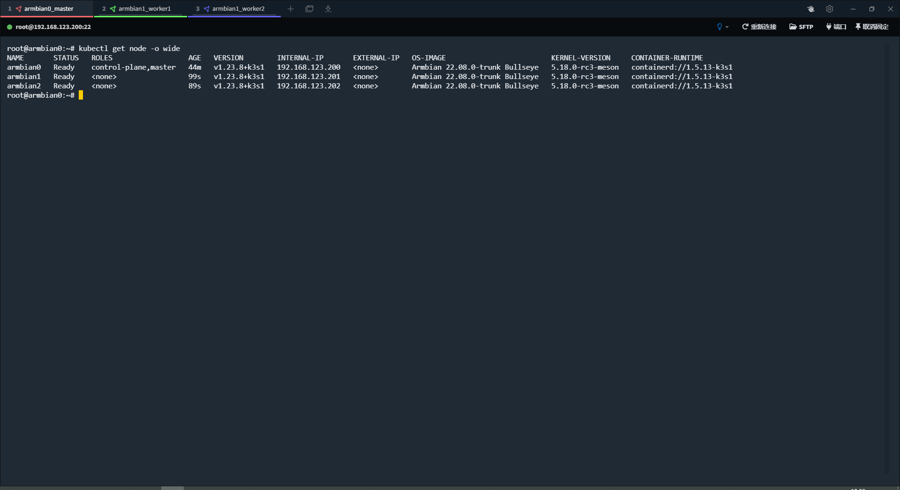

## 设置mac地址
```bash
nano /etc/network/interfaces

内容
auto eth0
iface eth0 inet static
address 192.168.123.201
netmask 255.255.255.0
gateway 192.168.123.1
dns-nameservers 223.5.5.5 223.6.6.6
hwaddress 46:89:E7:35:6E:01
```

## 换源

注意版本是bullseye
``` bash
root@onecloud:~# nano /etc/apt/sources.list
root@onecloud:~# apt update  


# 默认注释了源码镜像以提高 apt update 速度，如有需要可自行取消注释
deb https://mirrors.tuna.tsinghua.edu.cn/debian/ bullseye main contrib non-free
# deb-src https://mirrors.tuna.tsinghua.edu.cn/debian/ bullseye main contrib non-free
deb https://mirrors.tuna.tsinghua.edu.cn/debian/ bullseye-updates main contrib non-free
# deb-src https://mirrors.tuna.tsinghua.edu.cn/debian/ bullseye-updates main contrib non-free

deb https://mirrors.tuna.tsinghua.edu.cn/debian/ bullseye-backports main contrib non-free
# deb-src https://mirrors.tuna.tsinghua.edu.cn/debian/ bullseye-backports main contrib non-free

deb https://mirrors.tuna.tsinghua.edu.cn/debian-security bullseye-security main contrib non-free
# deb-src https://mirrors.tuna.tsinghua.edu.cn/debian-security bullseye-security main contrib non-free
```


如果遇到无法拉取 https 源的情况，请先使用 http 源并安装：
```bash
sudo apt install apt-transport-https ca-certificates
```
再使用 TUNA 的软件源镜像。

## 设置主机名
```bash
hostnamectl set-hostname armbian0
hostnamectl set-hostname armbian1
hostnamectl set-hostname armbian2

root@onecloud:~# nano /etc/hosts
127.0.0.1   localhost armbian0
...
...


```

## 安装docker
```bash
apt install docker.io -y
```

## 安装k3s
由于访问github比较慢，采用离线安装

下载二进制包
https://github.com/k3s-io/k3s/releases

放到目录 ```/usr/local/bin/```

下载安装脚本
https://get.k3s.io，并赋予可执行权限


### 安装server

```bash
export INSTALL_K3S_SKIP_DOWNLOAD=true
export INSTALL_K3S_VERSION=v1.23.8+k3s1
export INSTALL_K3S_EXEC="--write-kubeconfig ~/.kube/config --cluster-cidr  10.72.0.0/16 --service-cidr  10.73.0.0/16"
sh k3s.sh 
```

```bash
[INFO]  Skipping k3s download and verify
[INFO]  Skipping installation of SELinux RPM
[INFO]  Creating /usr/local/bin/kubectl symlink to k3s
[INFO]  Creating /usr/local/bin/crictl symlink to k3s
[INFO]  Skipping /usr/local/bin/ctr symlink to k3s, command exists in PATH at /usr/bin/ctr
[INFO]  Creating killall script /usr/local/bin/k3s-killall.sh
[INFO]  Creating uninstall script /usr/local/bin/k3s-uninstall.sh
[INFO]  env: Creating environment file /etc/systemd/system/k3s.service.env
[INFO]  systemd: Creating service file /etc/systemd/system/k3s.service
[INFO]  systemd: Enabling k3s unit
Created symlink /etc/systemd/system/multi-user.target.wants/k3s.service → /etc/systemd/system/k3s.service.
[INFO]  systemd: Starting k3s
```

查看token
```bash
cat /var/lib/rancher/k3s/server/node-token
```

### 安装agent
```bash
export INSTALL_K3S_SKIP_DOWNLOAD=true
export K3S_URL=https://192.168.123.200:6443
export INSTALL_K3S_VERSION=v1.23.8+k3s1
export K3S_TOKEN=K10882ea2544b3fa962107d4e7dba66975848axxxxxx395f9934939326ecbxxxxxx::server:7610c6e15931f11f85f08a0200xxxxxx
```

